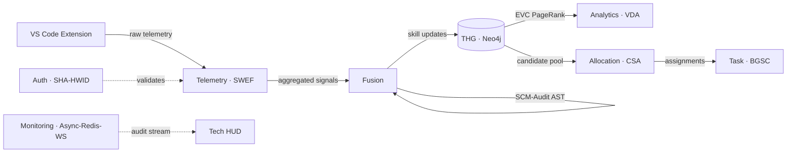

# 10 Pillar Algorithms

> The proprietary stack that makes ADT the most reliable source of truth in engineering leadership. **Each has its own deep note** under [[07 - Algorithms/_MOC|07 — Algorithms]].

| # | Name | Service | Purpose | Deep dive |
|:-:|:-----|:--------|:--------|:----------|
| 1 | **CodeBERT** | [[03 - Microservices/Fusion Service\|Fusion]] | Deep-learning brain understanding semantic code intent during audits. | [[07 - Algorithms/CodeBERT Pipeline]] |
| 2 | **SCM-Audit** | [[03 - Microservices/Fusion Service\|Fusion]] | AST-based parser mapping technical footprints to the THG Skill Taxonomy. | [[07 - Algorithms/SCM-Audit AST]] |
| 3 | **SWEF-Ingestion** | [[03 - Microservices/Telemetry Service\|Telemetry]] | Sliding-window engine turning messy raw streams into productivity metrics. | [[07 - Algorithms/SWEF-Ingestion (Sliding Window)]] |
| 4 | **SHA-HWID Anchor** | [[03 - Microservices/Auth Service\|Auth]] | Cryptographic lock tying an Extension ID to a physical machine. | [[07 - Algorithms/SHA-HWID Anchor]] |
| 5 | **BGSC-Feedback** | [[03 - Microservices/Task Service\|Task]] | Bounded-growth & self-correction; ensures skill changes are incremental & verified. | [[07 - Algorithms/BGSC Feedback]] |
| 6 | **EVC-Influence** | [[03 - Microservices/THG Service\|THG]] | PageRank-based engine identifying "Knowledge Hubs." | [[07 - Algorithms/EVC-Influence (PageRank)]] |
| 7 | **CSA-Matching** | [[03 - Microservices/Task Service\|Task]] / [[03 - Microservices/Allocation Service\|Allocation]] | Multi-dimensional vector engine for mathematically perfect task↔dev fit. | [[07 - Algorithms/CSA-Matching]] |
| 8 | **VDA-Oversight** | [[03 - Microservices/Analytics Service\|Analytics]] | Linear regression predicting burnout and velocity decay. | [[07 - Algorithms/VDA-Oversight]] |
| 9 | **Async-Redis-WS** | [[03 - Microservices/Monitoring Service\|Monitoring]] | Non-blocking event streaming for the Live Audit HUD. | [[07 - Algorithms/Async-Redis-WS]] |
| 10 | **Native Cypher Fallback** | [[03 - Microservices/THG Service\|THG]] | Resilient graph queries when Neo4j GDS plugin is offline. | [[07 - Algorithms/Native Cypher Fallback]] |

## How they compose

## Reading order

If you have 30 minutes, read in this order:

1. [[07 - Algorithms/SHA-HWID Anchor]] — *because nothing else matters if anchoring fails*
2. [[07 - Algorithms/SWEF-Ingestion (Sliding Window)]] — *because that's how data arrives*
3. [[07 - Algorithms/CodeBERT Pipeline]] — *because that's the brain*
4. [[07 - Algorithms/Bayesian Skill Fusion]] — *because that's where signals combine*
5. [[07 - Algorithms/Temporal Decay Model]] — *because skills aren't forever*
6. [[07 - Algorithms/CSA-Matching]] — *because that's where ROI happens*
