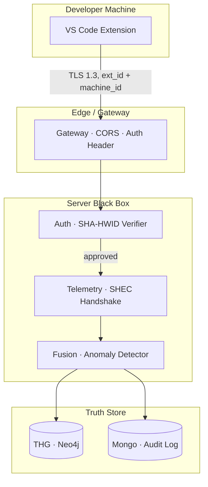

# Zero-Trust Security Perimeter

> No request is trusted by network position. Every layer authenticates the layer below. Every behavioral signal is validated server-side.

## Four enforced principles

### 1. Hardware Anchoring

Every Extension ID is permanently bound to a machine via a SHA hash of stable hardware identifiers (CPU + motherboard fingerprint, surfaced via `vscode.env.machineId`). Reinstalling on a new machine **requires re-issuance from a Tech Admin**.

Deep dive: [[07 - Algorithms/SHA-HWID Anchor]].

### 2. Server-Side Fusion

The "brain" never runs on the developer's machine. All behavioral interpretation happens in [[03 - Microservices/Fusion Service|Fusion]]'s black box. Developers cannot spoof a skill score by editing local code — the score is computed from data the server already received and stored.

### 3. Identity Isolation

Three separate Mongo collections: `users` (developers), `managers`, `tech_staff`. A developer object can never *become* a manager object — they live in physically separate documents. This prevents privilege escalation by mutation. See [[08 - Security & Compliance/Identity Isolation]].

### 4. Single-Attempt Assessments

A verification test is locked to one attempt. The result goes directly into the BGSC feedback loop that mutates the THG. This makes "cheating to look good" structurally pointless — you have one shot, and the result is immutable. See [[07 - Algorithms/BGSC Feedback]].

## What this doesn't yet cover

See [[12 - Expert Review/Security Loopholes]] for the current gap list. Highlights:

- **Transport** — production must enforce TLS 1.3 end-to-end including extension → gateway
- **At-rest** — Mongo + Neo4j credentials must come from a secrets manager, not `.env`
- **Replay attack mitigation** — telemetry requests are not yet nonce-protected
- **JWT rotation** — current session model is Redis-only with no refresh-token mechanism

## Mental model

