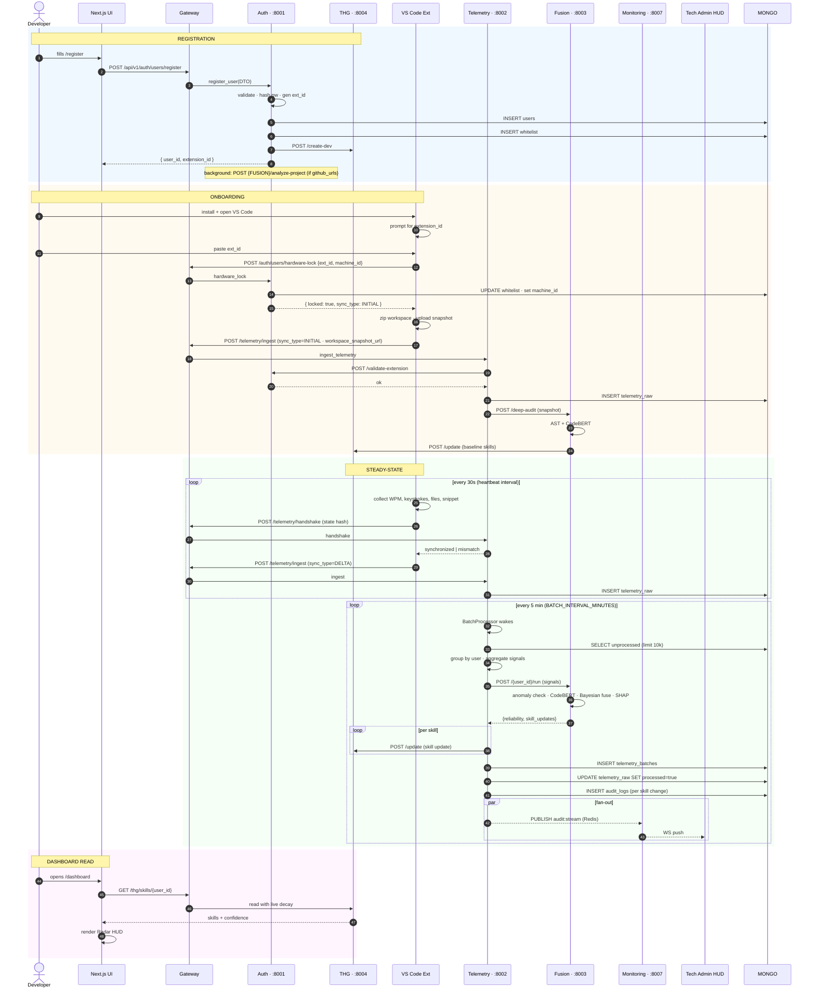

# Data Flow — End to End

One developer's full lifecycle through the system. This is the canonical reference flow.

## Sub-flows (deep dives)

- [[Data Flow - Registration]]
- [[Data Flow - Telemetry Pipeline]]
- [[Data Flow - Skill Update]]
- [[Data Flow - Task Allocation]]
- [[Sequence - Live Audit HUD]]
