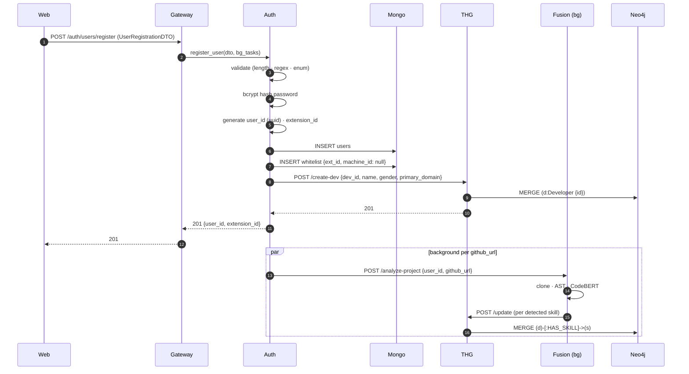

# Data Flow — Registration

## Inputs

- `POST /api/v1/auth/users/register` with [[06 - Data Models/DTO - User Registration|UserRegistrationDTO]] body.

## Outputs

- 201 Created — `{ user_id, extension_id, status: "registered" }`
- Side effects:
  1. `users` doc inserted (Mongo)
  2. `whitelist` row inserted (Mongo) with `machine_id = null` (filled on first hardware lock)
  3. `Developer` node MERGEd in Neo4j
  4. Background: `POST /api/v1/fusion/analyze-project` per GitHub URL

## Sequence

## Failure paths

| Failure | Behavior today | Should be |
|:--------|:---------------|:----------|
| Mongo unreachable | 500 to client; no row inserted | Same |
| THG unreachable | 201 returned but graph node missing → inconsistency | Compensating write or retry queue ([[13 - Yet to Implement/Backend - Auth - Saga for Registration]]) |
| Duplicate username | Pydantic + Mongo unique index → 400 | Same |
| GitHub URL 404 | Background task fails silently | Surface in `users.project_analysis_status` ([[13 - Yet to Implement/Backend - Auth - Project Analysis Status]]) |

## Validation rules

See [[06 - Data Models/DTO - User Registration]] for full schema. Highlights:

- `username` matches `^[a-zA-Z0-9_]+$`
- `password` length 8–128 (hashed before storage)
- `experience_level` enum: Intern / Junior / Mid / Senior / Lead / Principal
- `github_project_urls` ≤ 5

## Audit

This flow emits **two** audit log entries:

1. `action=user_registered`
2. `action=thg_developer_created`

(Currently only #2 is logged — gap in [[12 - Expert Review/Observability Gaps]].)
