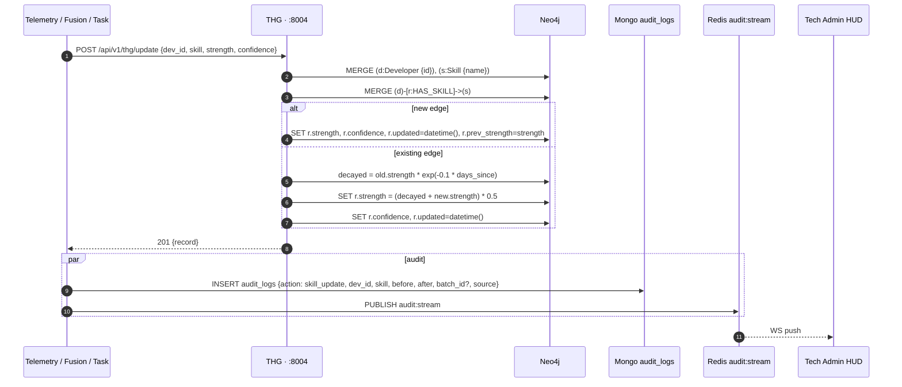

# Data Flow — Skill Update

## One mutation, three side effects



## Update math

The decay-then-blend formula is the **only place** strengths are mutated:

```
days = (now - r.updated).days
decayed = r.strength * exp(-0.1 * days)
r.strength = (decayed + new_strength) * 0.5
r.confidence = new_confidence
r.updated = now
```

See [[07 - Algorithms/Temporal Decay Model]] for derivation and parameter rationale.

## Why blend (not replace)?

Telemetry windows are noisy. Replacing the score would let one bad batch overwrite weeks of evidence. The 50/50 blend treats every new signal as 1 vote among 2 — a strong batch over time still moves the score, but a single outlier doesn't dominate.

## Delta variant

`POST /api/v1/thg/update-skill {dev_id, skill, delta}` — used by assessments (BGSC). Adds `delta` to current `strength` (bounded 0.0–1.0). Bypasses the blend formula because assessment results are explicit signals, not noisy telemetry.

See [[07 - Algorithms/BGSC Feedback]] for guardrails.

## Audit invariant

> Every successful `/update` MUST emit an `audit_logs` entry. Every entry MUST be findable by `(dev_id, ts)` and (when present) `batch_id`.

If this breaks, see [[12 - Expert Review/Data Integrity Gaps]].

## Concurrency

Multiple batch processors could race for the same `(dev_id, skill)`. Today: Neo4j MERGE + Cypher SET is atomic at the per-edge level, so the **last writer wins**. This is acceptable because:

- Decay applied makes it idempotent enough
- Audit log captures every write

If we ever need stronger ordering, add a per-(dev,skill) advisory lock in Redis. Not needed today.
