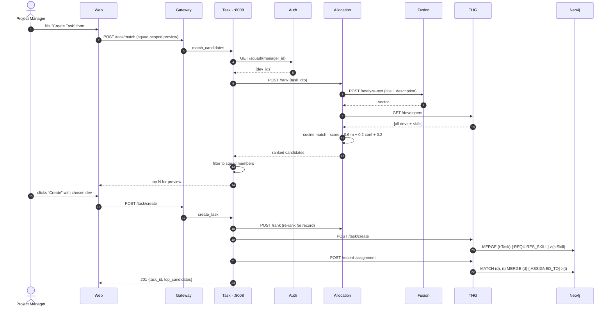

# Data Flow — Task Allocation



## Why squad-scoping?

Cross-squad allocation is a manager-level decision, not algorithmic. The CSA-Matching engine sees the whole org but Task service filters to the requesting manager's squad to prevent accidental "borrowing" of devs from other teams.

For org-wide hiring or rebalancing, HRMs use a different surface (planned: `/api/v1/task/match-org-wide` — see [[13 - Yet to Implement/Backend - Task - Org-wide Matching]]).

## Scoring formula

```
score = 0.6 * cosine_match(task_vector, dev_skill_vector)
      + 0.2 * mean_confidence(dev_skills)
      + 0.2 * baseline (any-skill > 0.0)
```

See [[07 - Algorithms/CSA-Matching]] for derivation.

## Hungarian for `/optimize`

If a PM hands the system *N* tasks and wants all assigned at once, `/optimize` builds an `N × M` match matrix and solves the assignment problem with the Hungarian Algorithm. This is **globally** optimal vs. greedy per-task selection.

See [[07 - Algorithms/CSA-Matching#Hungarian]].

## BGSC guardrail

Once a task is assigned, completion runs through [[07 - Algorithms/BGSC Feedback]] — the skill delta is bounded and verified before THG mutation.

## What's missing

- **No "exclude developer X" capability** — a PM can't manually veto a candidate yet.
- **No skill-stretch flag** — assigning a 0.3-strength dev to a 0.9-required task is a stretch; we don't yet surface this. ([[13 - Yet to Implement/Backend - Task - Stretch Flag]])
- **No reassignment workflow** — once `ASSIGNED_TO`, reassigning requires a manual cypher write today.
