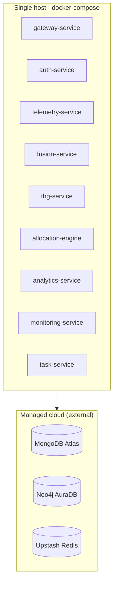
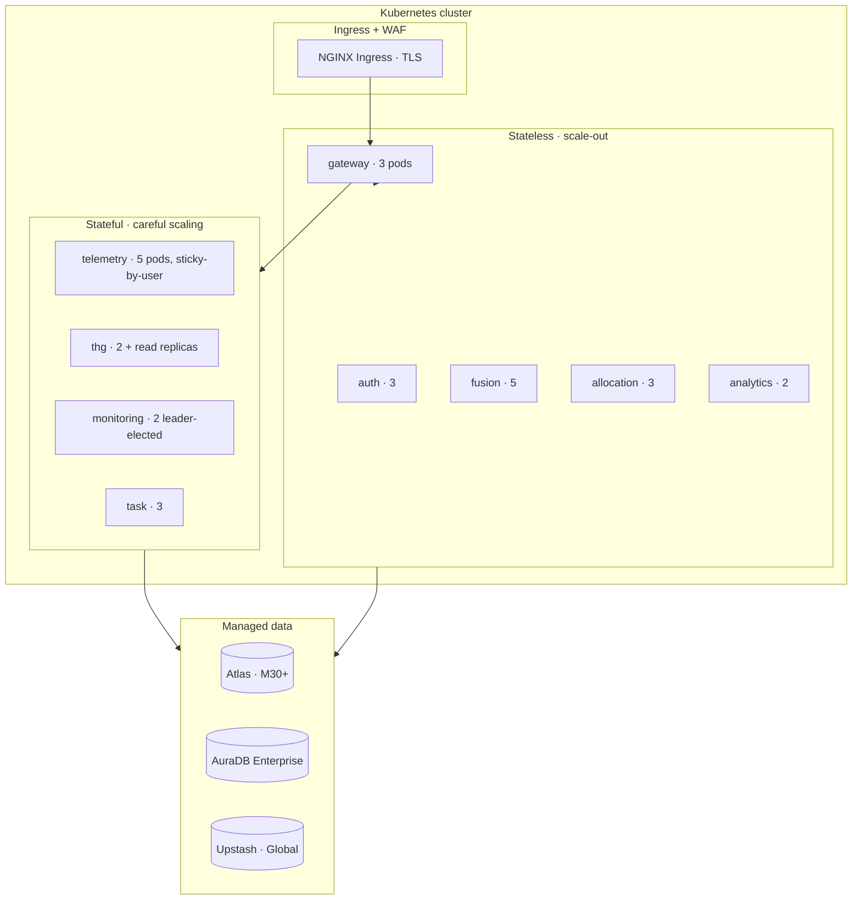

# Deployment Topology

## Today: docker-compose

A single host runs all 9 services + (optionally) Mongo + Neo4j + Redis containers. Source of truth: [[09 - Operations/Docker Compose Stack]].

**Pros**: dead-simple local dev, deterministic seeding via [[09 - Operations/Seeding Production Demo]].
**Cons**: no autoscaling, single point of failure, no rolling deploy.

## Target: Kubernetes

### Replication & autoscaling

| Service | Min | Max | HPA metric |
|:--------|:---:|:---:|:-----------|
| Gateway | 3 | 20 | CPU 70 % |
| Auth | 3 | 10 | RPS 200/pod |
| Telemetry | 5 | 50 | Queue depth or RPS 500/pod |
| Fusion | 5 | 20 | Batch backlog |
| THG | 2 | 4 | (limit by Neo4j cluster size) |
| Allocation | 3 | 10 | CPU |
| Analytics | 2 | 5 | CPU |
| Monitoring | 2 | 2 | leader election |
| Task | 3 | 10 | CPU |

### Why sticky-by-user for Telemetry

Two reasons:

1. **Cache locality** — same user's last-state-hash is hot in the same pod's process cache.
2. **Less contention on raw inserts** — distributing one user's writes across pods doesn't help (Mongo is the bottleneck, not the FastAPI layer).

Use consistent hashing on `extension_id`.

### Why leader election for Monitoring

The Live Audit HUD's WebSocket fan-out should be single-writer to Redis to avoid duplicate events. Leader election via `lease`-based lock in K8s.

## Environment tiers

| Env | URL | Compose / K8s | Data |
|:----|:----|:--------------|:-----|
| `local` | localhost:8000 | docker-compose | Seeded via [[09 - Operations/Seeding Production Demo]] |
| `dev` | dev.adt.internal | K8s `dev` namespace | Persistent staging copy |
| `staging` | staging.adt.example.com | K8s `staging` namespace | Daily clone from prod (PII-scrubbed) |
| `prod` | app.adt.example.com | K8s `prod` namespace | Live data |
| `sim` | demo.adt.example.com | K8s `sim` namespace | [[11 - Simulation Mode/_MOC\|Simulation Mode]] data |

## Disaster recovery

- **Mongo Atlas** — continuous backup, 7-day PITR
- **Neo4j AuraDB** — daily snapshots, 30-day retention
- **Redis** — ephemeral by design; no DR needed for sessions (users re-login). Pub/sub channels are not persisted.

Runbook: [[09 - Operations/Backup & DR]].
