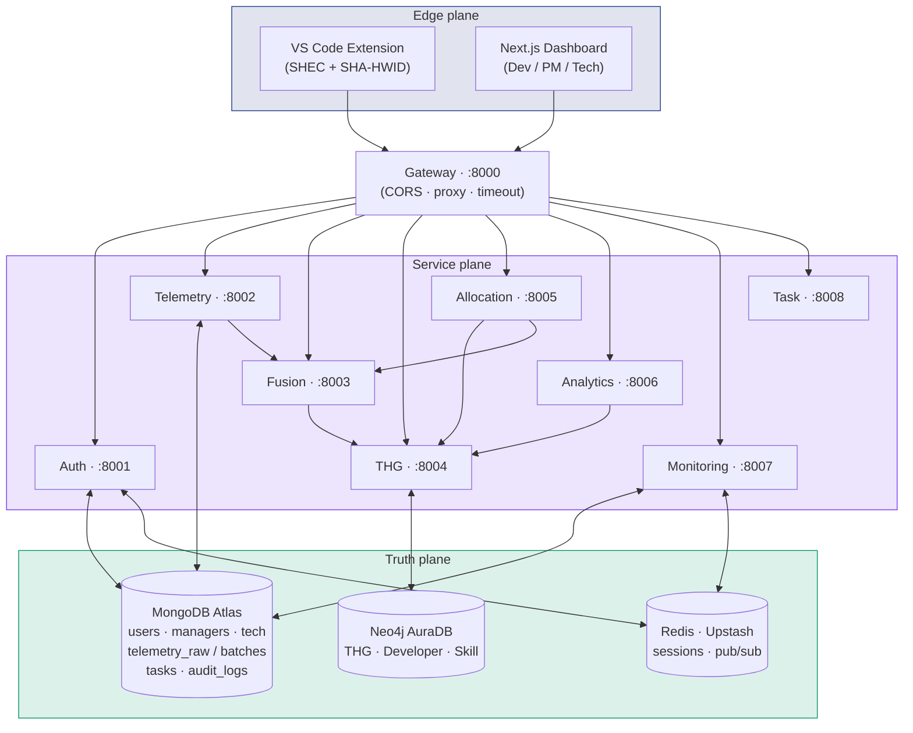

# High-Level Topology

The big picture. Three planes:

1. **Edge plane** — what the developer interacts with (extension + web UI)
2. **Service plane** — the 9 microservices behind the gateway
3. **Truth plane** — the 3 data stores

## Key invariants

1. **Nothing talks to a DB except its owner service.** Telemetry doesn't read THG; THG doesn't read Mongo. If a service needs another's data, it calls that service's API.
2. **All cross-service calls go via service URLs**, never via the gateway. The gateway is for browsers and the extension. Internal services use `*_URL` env vars set in [[09 - Operations/Docker Compose Stack]].
3. **The gateway is stateless.** No DB, no session, no in-memory cache. Kill and restart at will.
4. **All persistence happens in the Truth plane.** No service uses local disk except cache.

## Why microservices?

- **Independent scaling** — telemetry ingest gets hammered; auth doesn't.
- **Failure isolation** — Fusion can be down for 5 min without losing telemetry; batches catch up.
- **Polyglot persistence** — Mongo for raw documents, Neo4j for relationships, Redis for ephemeral state. One service owns each store.

## Trade-offs we accept

- **Operational complexity** — 9 services is a lot for a small team. Mitigation: [[09 - Operations/Docker Compose Stack]] makes local dev one command.
- **Distributed-system bugs** — partial failures, retry storms. Mitigation: [[07 - Algorithms/Async-Redis-WS]] for non-blocking event flow, idempotent writes.
- **Latency** — extra hops vs. monolith. Mitigation: telemetry ingest path is the only one that must be fast; everything else can be async.

## Next

- [[Microservice Map]] — every box, fully labeled
- [[Service Communication Matrix]] — every arrow, fully tabulated
- [[Data Flow - End to End]] — what one developer's day looks like in the system
