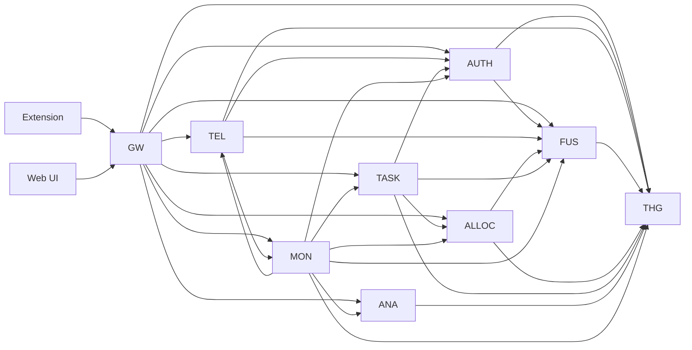

# Microservice Map

> Every service, port, primary store, primary upstream call. Detailed sheets in [[03 - Microservices/_MOC]].

| Port | Service | Container Port | Primary store | Calls outbound to |
|:----:|:--------|:--------------:|:--------------|:------------------|
| 8000 | [[03 - Microservices/Gateway Service\|Gateway]] | 8000 | — | all services (proxy) |
| 8001 | [[03 - Microservices/Auth Service\|Auth]] | 8000 | Mongo + Redis | THG, Fusion |
| 8002 | [[03 - Microservices/Telemetry Service\|Telemetry]] | 8000 | Mongo | Auth, Fusion, THG, Monitoring |
| 8003 | [[03 - Microservices/Fusion Service\|Fusion]] | 8000 | (stateless — calls THG) | THG |
| 8004 | [[03 - Microservices/THG Service\|THG]] | 8000 | Neo4j | — |
| 8005 | [[03 - Microservices/Allocation Service\|Allocation]] | 8000 | (stateless) | Fusion, THG |
| 8006 | [[03 - Microservices/Analytics Service\|Analytics]] | 8000 | Mongo | THG, Fusion |
| 8007 | [[03 - Microservices/Monitoring Service\|Monitoring]] | 8000 | Mongo + Redis | all services (`/health`) |
| 8008 | [[03 - Microservices/Task Service\|Task]] | 8000 | Mongo | Auth, Allocation, THG, Fusion |

> ⚠️ **Port note**: each container internally binds to port `8000`. Host port differs per service (mapped in `docker-compose.yml`). Internal cross-service URLs use container hostnames + port `8000`, **never** host ports.

## Graph of edges (call directions)

## Service responsibilities (one-liners)

| Service | Responsibility |
|:--------|:---------------|
| **Gateway** | CORS, request proxy, timeout normalization, error code mapping |
| **Auth** | Identity (3-collection polymorphic), registration, hardware lock, RBAC source-of-truth |
| **Telemetry** | Raw ingest (`/ingest`), state-hash handshake (`/handshake`), 5-min batch processor |
| **Fusion** | CodeBERT semantic, Bayesian skill fusion, anomaly detection, SHAP explanations, deep audit |
| **THG** | Neo4j ops — devs, skills, managers, tasks, assignments, PageRank, decay queries |
| **Allocation** | Vectorize task → cosine-match against THG candidates → Hungarian optimization |
| **Analytics** | Burnout prediction (VDA), team skill aggregations, leaderboards, weekly reports |
| **Monitoring** | System config (heartbeat, batch interval), audit log API, cross-service `/health` rollup |
| **Task** | Task creation, squad-scoped candidate matching, assignment, weekly verification engine |

## Stateless vs stateful

| Stateful | Stateless |
|:---------|:----------|
| Auth (sessions, users) | Gateway |
| Telemetry (raw + batches) | Fusion |
| THG (graph) | Allocation |
| Monitoring (config, audit) | Analytics |
| Task (task docs) | — |

> Stateless services can be horizontally scaled with `N` replicas trivially. Stateful services need careful read-replica strategy at scale — see [[Deployment Topology]].
