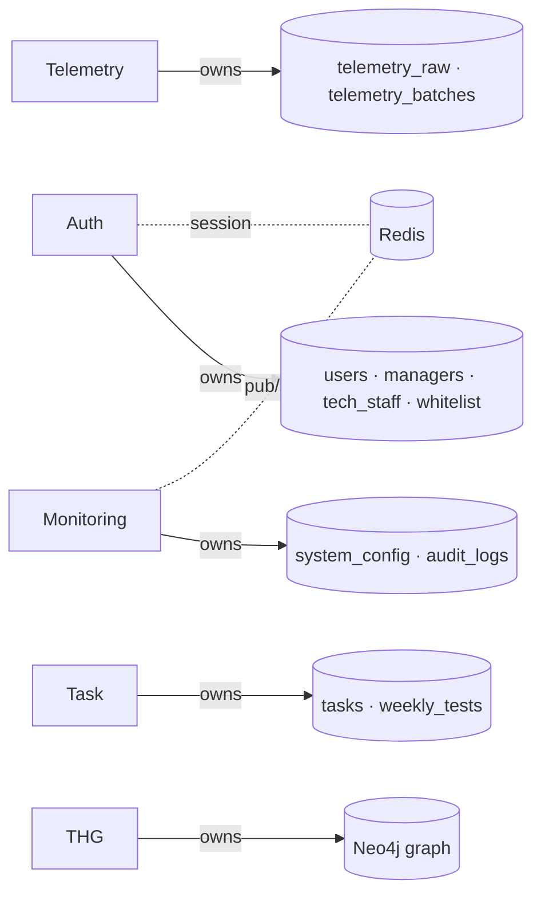

# Persistence Layer

Three stores, three jobs.

## MongoDB Atlas — document store

Owner services: [[03 - Microservices/Auth Service|Auth]], [[03 - Microservices/Telemetry Service|Telemetry]], [[03 - Microservices/Task Service|Task]], [[03 - Microservices/Monitoring Service|Monitoring]], [[03 - Microservices/Analytics Service|Analytics]].

Schema: [[06 - Data Models/MongoDB Schema]].

Collections at a glance:

```
users · managers · tech_staff       (3-collection identity isolation)
whitelist                            (extension_id → machine_id lock)
telemetry_raw                        (30 s pings)
telemetry_batches                    (5 min aggregations)
tasks                                (task metadata)
project_analyses                     (deep audit results)
weekly_tests                         (assessment outcomes)
system_config                        (heartbeat, batch interval)
audit_logs                           (immutable trail)
```

Connection: `shared/database/mongo.py` — pool min 5, max 50. Async via Motor.

## Neo4j AuraDB — graph store

Owner service: [[03 - Microservices/THG Service|THG]] (sole writer).

Schema: [[06 - Data Models/Neo4j (THG) Schema]].

Nodes: `Developer`, `Manager`, `Skill`, `Task`.
Edges: `HAS_SKILL`, `MANAGES`, `ASSIGNED_TO`, `REQUIRES_SKILL`.

> **Invariant**: only the THG service writes to Neo4j. Other services request changes via the THG REST API.

## Redis (Upstash) — ephemeral state + pub/sub

Owner services: [[03 - Microservices/Auth Service|Auth]] (sessions), [[03 - Microservices/Monitoring Service|Monitoring]] (audit pub/sub), [[03 - Microservices/Analytics Service|Analytics]] (cache).

Schema: [[06 - Data Models/Redis Keys]].

Keys:

```
reg_session:{session_id}        TTL 86400s   registration draft state
session:{user_id}               TTL 3600s    active user session (planned)
audit:stream                    channel      live audit publishes
```

## Data ownership



## Why this split?

| Store | Strength | Used for |
|:------|:---------|:---------|
| **Mongo** | Schema flexibility, BSON, async drivers | Mutating documents, time-series telemetry |
| **Neo4j** | Native graph queries, relationship algorithms | Skill relationships, PageRank, multi-hop |
| **Redis** | Sub-ms latency, pub/sub | Sessions, realtime |

## What we don't use (and why not)

| Tech | Why not |
|:-----|:--------|
| **Postgres** | Mongo's flexibility around evolving telemetry shape > strict schema benefit |
| **Kafka** | docker-compose simplicity wins for now; Redis streams cover MVP. Plan to revisit at 100 k devs ([[13 - Yet to Implement/Infra - Kafka for Telemetry]]) |
| **Elasticsearch** | Mongo full-text + Neo4j fulltext indexes cover current search needs |

See [[14 - References/Tech Decisions Log]] for the full ADR list.
