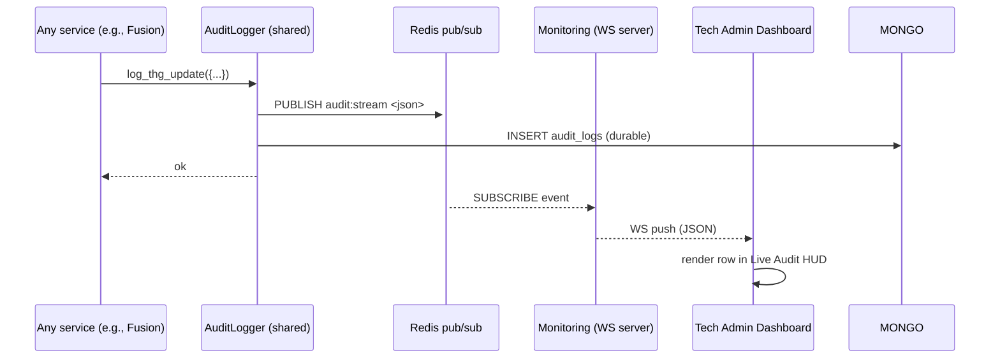

# Realtime Layer (Redis Pub/Sub)

## The job

Stream events from the backend to the **Tech Admin Live Audit HUD** without blocking writers. Pillar #9 — [[07 - Algorithms/Async-Redis-WS]].

## Channels

| Channel | Producer | Consumer | Payload shape |
|:--------|:---------|:---------|:--------------|
| `audit:stream` | All services (via [[shared/services/audit_logger]]) | Monitoring WS | `{ts, user_id, action, before, after, by, batch_id?, source}` |
| `telemetry:ingest` | Telemetry | Monitoring (optional, future) | `{ts, ext_id, sync_type, bytes}` |
| `fusion:batch` | Fusion | Monitoring (optional, future) | `{ts, user_id, batch_id, reliability_score}` |

## Topology

## Guarantees

- **At-most-once delivery** to subscribers (Redis pub/sub). Durability is in Mongo `audit_logs`.
- **Order**: per-publisher process. Not globally ordered across replicas.
- **Backpressure**: subscriber that can't keep up will drop events. **Mitigation**: subscriber must also poll `audit_logs` after reconnect to catch up.

## Why pub/sub and not streams?

- Streams (`XADD`/`XREAD`) give durable, replayable history. We get that from Mongo already.
- Pub/sub is cheaper, lower-latency, and fits the "live HUD" UX exactly.

If durable replay becomes a frontend requirement (e.g., scroll-back the last 24 h of audit events), upgrade to Redis Streams + Mongo for cold storage. Tracked: [[13 - Yet to Implement/Infra - Redis Streams for Audit Replay]].
