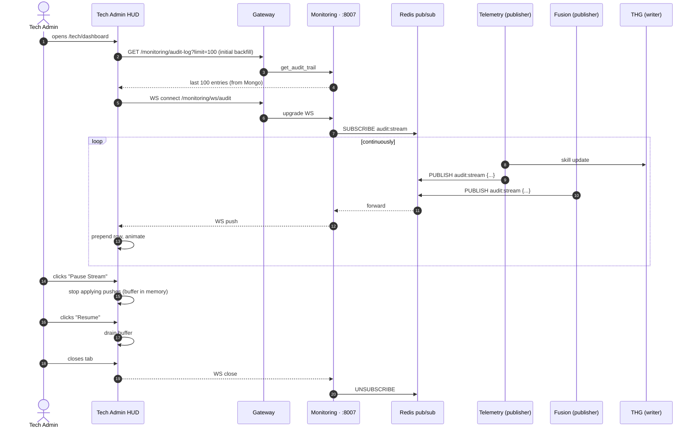

# Sequence — Live Audit HUD

The Tech Admin's realtime stream of every state-mutating event.

## Reconnect handling

If the WS drops:

1. UI shows a yellow "reconnecting" pill in the corner
2. Retries with exponential backoff (1s, 2s, 4s, 8s, max 30s)
3. On reconnect, re-fetches `/audit-log?since=<last_seen_ts>` to fill the gap
4. Resubscribes WS

This is the only place in the app where event delivery is "at-most-once over WS, exactly-once via backfill on reconnect."

> See also: [[10 - UX & UI/Dashboard Layouts - Tech Admin]] for the visual.

## What gets published

Every entry in `audit_logs` mirrors to Redis pub/sub. Categories:

| Action | Source | Fields |
|:-------|:-------|:-------|
| `skill_update` | Telemetry / Task | dev_id, skill, before, after, batch_id |
| `thg_developer_created` | Auth | dev_id, name |
| `thg_manager_linked` | Auth | manager_id, dev_id |
| `task_created` | Task | task_id, by |
| `task_assigned` | Task | task_id, dev_id, by |
| `assessment_completed` | Task | user_id, score |
| `system_config_changed` | Monitoring | key, before, after, by |
| `extension_locked` | Auth | ext_id, machine_id, dev_id |
| `fraud_flag` | Fusion | dev_id, batch_id, reliability_score |

See [[06 - Data Models/DTO - Audit Log]] for the full schema.
