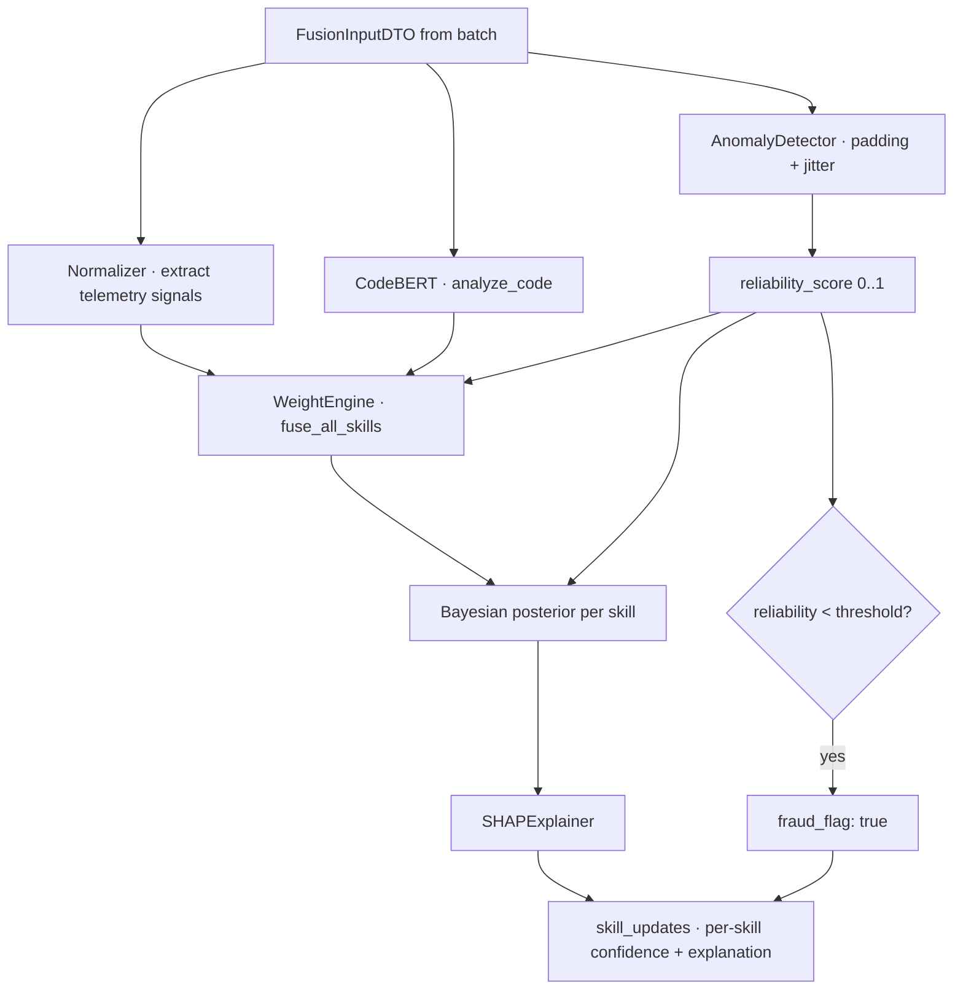

# Fusion Service

## Identity

| | |
|:---|:---|
| Port | `8003` → `8000` |
| Hostname | `fusion-service` |
| Code | `backend/fusion/` |
| Entry | `backend/fusion/app/main.py` |
| Health | `GET /api/v1/fusion/health` |

## Responsibilities

- **CodeBERT semantic analysis** of code snippets
- **Bayesian skill fusion** across telemetry + semantic + project evidence
- **Anomaly detection** (keystroke padding, missing jitter)
- **SHAP explainability** for why a score moved
- **Deep audit** on workspace snapshots (one-shot baseline)
- **Project analysis** on GitHub repos (background, registration-time)

> ⚠️ Many services in this file are **stubs** today — see Known gaps.

## Routes

`prefix /api/v1/fusion/fusion` (yes, doubled — that's literal in the code; consider fixing in [[13 - Yet to Implement/Backend - Fusion - Route Prefix Cleanup]])

| Method | Path | Handler | Purpose |
|:-------|:-----|:--------|:--------|
| POST | `/analyze-text` | `analyze_text({text\|resume})` | Free-text → skill vector (for Allocation) |
| POST | `/analyze-project` | `analyze_project({user_id, github_url})` | Repo-driven skill baseline |
| GET | `/{user_id}/explain` | `explain_user(user_id)` | Plaintext explanation |
| POST | `/{user_id}/run` | `run_fusion(user_id, FusionInputDTO)` | The main fusion pipeline (Telemetry's batch processor calls this) |
| POST | `/deep-audit` | `deep_audit({user_id, workspace_snapshot_url})` | One-shot zip → skills |

## The `/run` pipeline

## Models / DTOs

In `backend/fusion/app/schemas/fusion.py`:

- `SkillUpdateDTO`
- `FusionInputDTO` (aggregated signals shape — mirrors `aggregated_signals`)
- `InvestorAssessmentDTO` — stub

## Services / Business logic

### `CodeBERTAnalyzer` (`app/services/ai_core.py`)

The only fully-implemented brain right now. Singleton, lazy-loaded.

- Model: `microsoft/codebert-base` (768-dim transformer embeddings)
- Maintains **domain centroids** for 8 skills (backend, frontend, neo4j, devops, ml, testing, database, security) — pre-computed from labeled examples
- Methods:
  - `analyze_code(snippet) → Dict[skill, float]` — cosine similarity to each centroid
  - `analyze_resume(text)` — same as code analysis but with 0.7 damping (resume language is less precise than code)
  - `batch_analyze(texts)` — efficient batch path
  - `get_raw_embedding(text)` — for downstream use

### `SHAPExplainer` (`app/services/ai_core.py`)

- `explain_score(skill, sources) → {primary_driver, impact, secondary_driver, contributions: {source: weight}, reasoning}`
- `explain_batch(skills)` — N-skill explanation in one call

### Stubs (TODO)

| File | Class | Status |
|:-----|:------|:-------|
| `app/services/anomaly_detector.py` | `AnomalyDetector` | empty — must implement `analyze_batch`, `check_human_jitter` |
| `app/services/normalizer.py` | `Normalizer` | empty — must implement `extract_telemetry_signals` |
| `app/services/weight_engine.py` | `WeightEngine` | empty — must implement `fuse_all_skills` |
| `app/services/bayesian_fusion.py` | `BayesianFuser` | empty — must implement `calculate_posterior_confidence` |
| `app/services/online_learner.py` | `OnlineLearner` | empty |
| `app/services/project_analyzer.py` | `ProjectAnalyzer` | empty — must implement `analyze_github_repo` |

These are the **single biggest gap** in the system. Tracked: [[13 - Yet to Implement/Backend - Fusion - Real ML Pipeline]].

## Database

Stateless. Doesn't own any collection. Writes to THG via REST.

## Env vars

| Name | Default | Purpose |
|:-----|:--------|:--------|
| `THG_URL` | `http://thg-service:8000` | skill writes |

## Outbound calls

| To | Endpoint | When |
|:---|:---------|:-----|
| THG | `POST /update` | from `/analyze-project` and `/deep-audit` |

(Note: `/run` returns skill_updates but doesn't write THG itself — the Telemetry batch processor does. Intentional separation.)

## Background tasks

None today (project analyzer is invoked from Auth as a background task).

## Known gaps

- **Stubbed core logic** — see table above. **Highest priority work in the entire codebase.**
- **CodeBERT model cold-start** — first call after restart takes ~6 s. Need warm-load on app start ([[13 - Yet to Implement/Backend - Fusion - Model Warm-up]]).
- **No GPU support** — CPU-only inference is slow at scale. ([[13 - Yet to Implement/Backend - Fusion - GPU + Triton]])
- **No model versioning** — `engine_version: "v2.0-top-tier"` is hardcoded in the response, not tracked per-batch.
- **No batch-mode CodeBERT** — every snippet is a separate forward pass.

## Why this service matters most

Fusion is where the platform's claim ("hardware-anchored, server-fused, tamper-proof") becomes real. Without working anomaly detection, the SHA-HWID anchor is the only protection — and that's necessary but not sufficient. **Stand up the stubs before going to production.**
