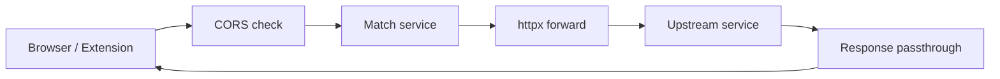

# Gateway Service

## Identity

| | |
|:---|:---|
| Port | `8000` host → `8000` container |
| Hostname | `gateway-service` |
| Code | `backend/gateway/` |
| Entry | `backend/gateway/app/main.py` |
| Health | `GET /health` |

## Responsibilities

- **Single edge entry point** for browsers + extensions.
- **CORS enforcement** (configurable via `CORS_ORIGINS`).
- **Reverse proxy** to all 8 microservices.
- **Timeout normalization** — 30 s upstream cap → `504 Gateway Timeout`.
- **Error code mapping** — upstream `RequestError` → 502.

Explicitly **not** responsible for: auth, rate limiting (yet), caching, request shaping.

## Routes

| Method | Path | Handler | Purpose |
|:-------|:-----|:--------|:--------|
| GET/POST/PUT/DELETE | `/api/v1/{service}/{path:path}` | proxy | Forward to matching `SERVICE_URLS[service]` |
| GET | `/health` | health | Static `{status: "ok"}` |

`SERVICE_URLS` dict: `auth, telemetry, fusion, thg, allocation, task, analytics, monitoring`.

## Models / DTOs

None — the gateway is body-agnostic. It forwards `bytes` upstream.

## Services / Business logic

- **httpx.AsyncClient** singleton — created on startup, closed on shutdown, 30 s timeout.
- **Logging** — every request with status `≥ 400` logged at ERROR, else INFO.
- **Header passthrough** — strips `host`, preserves all others (including `X-User-Role` used by RBAC dependencies downstream).

## Database

None.

## Env vars

| Name | Default | Purpose |
|:-----|:--------|:--------|
| `AUTH_URL` | `http://auth-service:8000` | upstream |
| `TELEMETRY_URL` | `http://telemetry-service:8000` | upstream |
| `FUSION_URL` | `http://fusion-service:8000` | upstream |
| `THG_URL` | `http://thg-service:8000` | upstream |
| `ALLOCATION_URL` | `http://allocation-engine:8000` | upstream |
| `TASK_URL` | `http://task-service:8000` | upstream |
| `ANALYTICS_URL` | `http://analytics-service:8000` | upstream |
| `MONITORING_URL` | `http://monitoring-service:8000` | upstream |
| `CORS_ORIGINS` | localhost variants | comma-separated origin allowlist |

## Outbound calls

All services (as proxy target).

## Background tasks

None.

## Known gaps

- **No rate limiting** — see [[13 - Yet to Implement/Backend - Gateway - Rate Limiting]].
- **No auth enforcement** — JWT/session check should happen here as defense in depth. ([[13 - Yet to Implement/Backend - Gateway - JWT Verification Edge]])
- **No request size cap** — large workspace snapshots can DoS. ([[13 - Yet to Implement/Backend - Gateway - Body Size Limits]])
- **No tracing** — should inject `X-Request-ID` if absent. ([[13 - Yet to Implement/Backend - All - Structured Logs + TraceID]])

## Hot path

For every API call from the browser or extension. Optimization here pays dividends. Today: minimal overhead (~3 ms p99 added). Future: add edge cache for THG `GET /skills/{user_id}` (TTL 5 s) and gateway-level circuit breakers.

