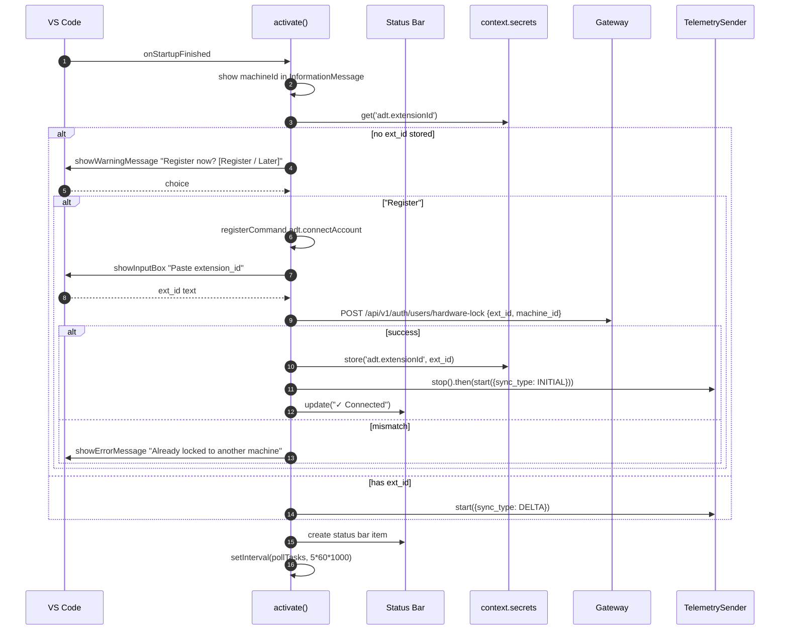

# Activation Flow

`extension/src/extension.ts` — what happens when VS Code opens.

## Sequence



## Code skeleton (annotated)

```ts
export async function activate(ctx: vscode.ExtensionContext) {
  const machineId = vscode.env.machineId;
  vscode.window.showInformationMessage(`ADT machine: ${machineId.slice(0,8)}…`);

  const gw = vscode.workspace.getConfiguration('adt').get<string>('gatewayUrl')!;
  const extId = await ctx.secrets.get('adt.extensionId');

  const sender = new TelemetrySender(gw, machineId);
  const sb = vscode.window.createStatusBarItem(vscode.StatusBarAlignment.Right, 100);

  if (!extId) {
    const choice = await vscode.window.showWarningMessage(
      "ADT: not connected — register now?", "Register", "Later"
    );
    if (choice === "Register") {
      ctx.subscriptions.push(
        vscode.commands.registerCommand("adt.connectAccount", async () => {
          const input = await vscode.window.showInputBox({ prompt: "Paste your extension_id" });
          if (!input) return;
          try {
            await axios.post(`${gw}/api/v1/auth/users/hardware-lock`, {
              extension_id: input, machine_id: machineId
            });
            await ctx.secrets.store("adt.extensionId", input);
            await sender.stop();
            await sender.start({ sync_type: "INITIAL", extensionId: input });
            sb.text = "$(check) ADT";
          } catch (e: any) {
            vscode.window.showErrorMessage(`Hardware lock failed: ${e?.response?.data?.detail ?? e.message}`);
          }
        })
      );
    }
  } else {
    await sender.start({ sync_type: "DELTA", extensionId: extId });
    sb.text = "$(pulse) ADT";
  }

  ctx.subscriptions.push(sb);
  sb.show();

  // task poller
  const taskPoll = setInterval(async () => {
    const eid = await ctx.secrets.get("adt.extensionId");
    if (!eid) return;
    try {
      const { data } = await axios.get(`${gw}/api/v1/task/tasks/user-by-extension/${eid}`);
      if (data?.open?.length > 0) {
        vscode.window.showInformationMessage(`You have ${data.open.length} open task(s).`);
      }
    } catch { /* swallow */ }
  }, 5 * 60 * 1000);
  ctx.subscriptions.push({ dispose: () => clearInterval(taskPoll) });
}

export async function deactivate() {
  // send FINAL sync best-effort
  await sender?.sendFinalSync();
}
```

## State machine

| State | Trigger | Action |
|:------|:--------|:-------|
| NEW | first activate | prompt registration |
| LOCKED | hardware-lock OK | start sender |
| BROKEN | hardware-lock 403 mismatch | red status bar + retry button |
| STREAMING | sender running | normal operation |
| SHUTTING_DOWN | deactivate | FINAL sync |

## Known gaps

- **No offline buffer** — if gateway is unreachable, telemetry is **dropped**. P1 — see [[13 - Yet to Implement/Extension - Offline Buffer]].
- **No exponential backoff** on send failures — tight loop on network errors.
- **No "Disconnect" command** — once locked, the only way to switch machines is to ask a Tech Admin.
- **Secrets stored in VS Code's secret storage** which is OS keychain-backed. Good. Not encrypted at rest in the extension's own format.
