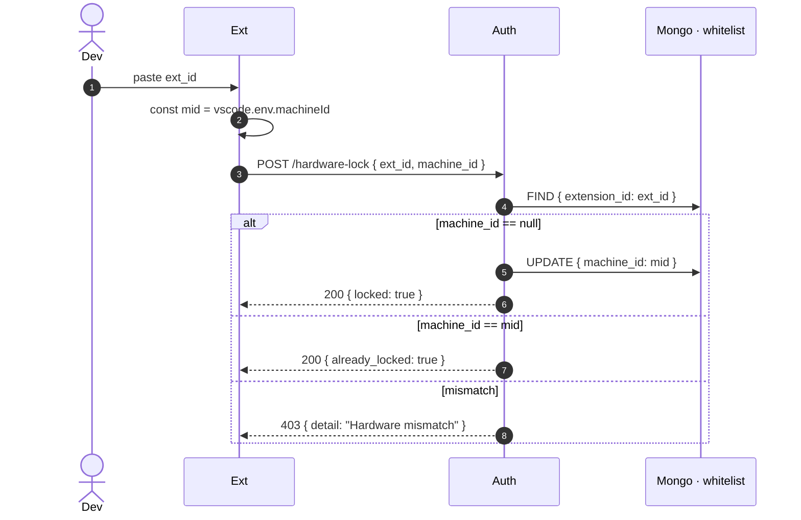

# Hardware Lock — SHA-HWID

The thing that makes telemetry tamper-resistant. Detailed algorithm: [[07 - Algorithms/SHA-HWID Anchor]].

## What it does, briefly

When a developer first installs the extension:

1. Paste `extension_id` → click Connect
2. Extension reads `vscode.env.machineId` (an SHA-256 of CPU + motherboard data)
3. `POST /api/v1/auth/users/hardware-lock {extension_id, machine_id}`
4. Server writes `whitelist.{extension_id}.machine_id = machine_id` if currently `null`
5. Future telemetry from a *different* `machine_id` for the same `extension_id` → **403 Hardware Mismatch**

## Why `vscode.env.machineId` (not `node-machine-id`)

`vscode.env.machineId` is **stable** across the same user-install-on-same-machine, and **changes** when:

- VS Code is reinstalled with new identity (rare)
- The user explicitly resets the telemetry-uuid
- The OS-level hardware UUID changes (very rare)

`node-machine-id` reads `/sys/class/dmi/id/product_uuid` (Linux) or registry (Windows). It's more "physical hardware" but requires elevated permissions and is brittle in VMs. For our purpose — proving "the same install on the same OS on the same machine" — VS Code's machineId is sufficient.

We ship `node-machine-id` as a dep for future "extra-strong" mode that combines both.

## Unlock procedure (legitimate)

1. Developer gets a new machine.
2. Asks Tech Admin to unlock via the [[03 - Microservices/Auth Service|Auth Data Explorer]] or `/api/v1/auth/admin/...` (route TBD).
3. Tech Admin clears `whitelist.{ext_id}.machine_id = null`.
4. Developer installs extension on new machine, pastes ext_id, re-locks.
5. **Audit log entry** records the unlock + who did it + when.

This is the **only** way to migrate — explicitly preventing a developer from silently swapping machines.

## Threats this defeats

| Threat | Defeated? |
|:-------|:----------|
| Sharing one ext_id between devs ("just collect on my account") | ✓ — second machine fails on first ping |
| Generating fake telemetry from a script | ✓ — script doesn't have the right `machine_id` |
| Reinstalling extension to wipe state | ✓ — server-side state persists |

## Threats it does NOT defeat

| Threat | Mitigation |
|:-------|:-----------|
| Stealing both ext_id + machine_id | Possible if attacker has shell on the dev machine — but at that point the threat model is broken anyway |
| Running ADT in a VM and cloning the VM | Possible — `machineId` survives clones. Mitigation: server-side jitter & anomaly detection. |
| Tampering with `vscode.env.machineId` via prototype patching | Extensions in same process can theoretically patch. We'd need to bind to native hardware UUID for prod-grade. Tracked: [[13 - Yet to Implement/Extension - Native HWID]]. |
