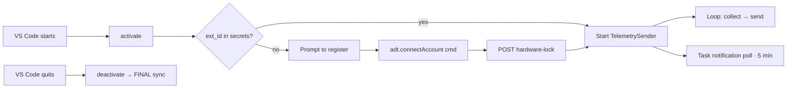

# Extension Overview

## Identity

| | |
|:---|:---|
| Name | `adt-extension` |
| Display | Adaptive Developer Twin (ADT) |
| Version | 1.1.0 |
| Publisher | PurpleDrip |
| Engine | `^1.80.0` |
| Activation | `onStartupFinished` |
| Entry | `./out/extension.js` |
| VSIX | `extension/adt-extension-1.1.0.vsix` |

## What it does



## Contributes

### Commands

- `adt.register` — "ADT: Register Developer"
- `adt.status` — "ADT: View My Stats"
- `adt.connectAccount` — (registered at runtime in `activate`) — paste an `extension_id` and lock to this machine

### Settings (workspace + user)

- `adt.gatewayUrl` (string, default `http://127.0.0.1:8000`) — backend gateway
- `adt.extensionId` (string, default `""`) — developer's ext_id (stored in secrets for prod; setting for dev visibility)

## Dependencies

| Package | Purpose |
|:--------|:--------|
| `axios` | HTTP to gateway |
| `adm-zip` | Workspace snapshot |
| `node-machine-id` | (optional) stable machine identifier (we currently use `vscode.env.machineId`, which is enough) |

## Build & package

```powershell
cd extension
npm install
npm run compile
# package
npx vsce package
# install local
code --install-extension adt-extension-1.1.0.vsix
```

## Distribution (planned)

- Publish to the VS Code Marketplace under publisher `PurpleDrip`
- Mirror to Open VSX
- For enterprise: side-load via `code --install-extension`
