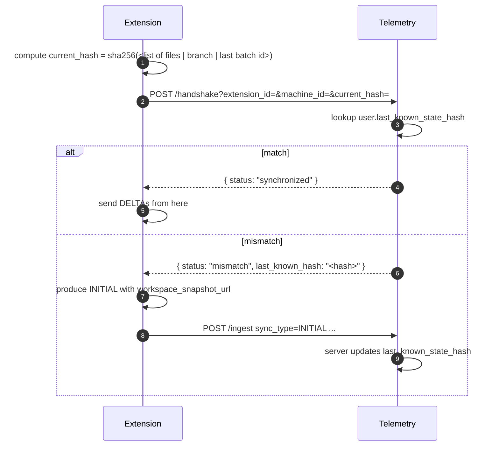

# SHEC Sync Protocol

> **State Hash & Extension Check.** A lightweight handshake before ingest that detects drift between the extension and the server.

## Purpose

Without SHEC, the server can't tell:

- "extension was offline 3 days — fresh INITIAL needed"
- "extension reinstalled — local state lost"
- "extension is on a different machine — even if `machine_id` somehow matches"

from a normal DELTA sync. SHEC makes drift explicit.

## Protocol



## What goes into the state hash?

```
sha256(
  sorted(top-level files in workspace, lowercase) ||
  current git branch ||
  last successful batch_id ||
  ext_version
)
```

Things to NOT include:

- Cursor position (changes too often)
- Open file list (changes too often)
- Time (would break the equality test)

## State hash storage

Server-side: `users.last_known_state_hash` — updated after every successful INITIAL ingest.

Client-side: optional cache to avoid recomputing for unchanged workspaces.

## Edge cases

| Case | Behavior |
|:-----|:---------|
| First-time install | server has `last_known_state_hash = null` → response forces INITIAL |
| Branch change | hash changes → forces re-sync |
| File rename / new top-level file | hash changes → forces re-sync |
| Renaming on disk only (no checkout) | hash changes → forces re-sync (desired) |
| User reinstalls VS Code | client hash null → forces re-sync |

## Why hash and not full snapshot

A full snapshot is expensive (zip + upload). SHEC's purpose is **detection**: cheap roundtrip → only upload zip when needed.

## Audit

Every mismatch handshake emits an audit log entry: `action=handshake_mismatch`, used for forensics and to spot users whose machines are unstable.
