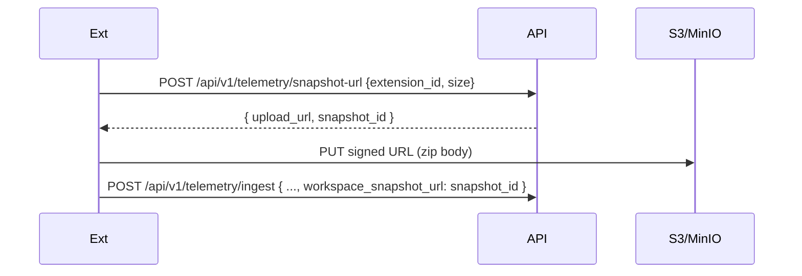

# Snapshotter

`extension/src/telemetry/snapshotter.ts` — captures and uploads workspace snapshots for **INITIAL** and **FINAL** syncs.

## What it does

1. Walks the open workspace folder
2. Excludes `.git/`, `node_modules/`, `.venv/`, `dist/`, `out/`, `.next/`, `coverage/`, glob patterns from `.adt/ignore`
3. Excludes files matching secret patterns (`.env*`, `*.pem`, `*.key`, `*.crt`, `id_rsa*`, `*credential*`)
4. Caps total size at **50 MB** (configurable)
5. Builds a zip via `adm-zip`
6. Uploads to a server-issued signed URL — **NOT** base64-encoded in the payload

## Upload protocol

> ⚠️ The current code uploads via base64 in the request body. **This is wrong for prod** — see [[13 - Yet to Implement/Backend - Telemetry - Snapshot Storage]].

## Snapshot lifecycle

| State | Where | TTL |
|:------|:------|:----|
| Just uploaded | Object storage (S3 / MinIO) | 7 days |
| Referenced by `project_analyses` | DB row | indefinite (audit) |
| Tombstoned (GDPR erase) | Both deleted | 0 |

## Security

- **Encryption at rest** — server-side via storage's KMS (S3-SSE / equivalent). The extension does NOT need to manage keys.
- **Access control** — only Fusion can `GET` the snapshot via a service token; the developer cannot retrieve their own (raw) snapshot by design (it's the *evidence* used to score them — exposing it to them defeats the integrity claim).
- **Provenance** — the upload is tied to `extension_id` server-side; the URL alone proves nothing.

## Known gaps

- **No partial uploads** — a 50 MB zip on a flaky network fails atomically
- **No secret scanner** before zipping — same gap as [[Telemetry Collector]]
- **No diff-snapshot** — every INITIAL/FINAL re-uploads the whole zip. Eventually want a "files-changed-since-last-snapshot" delta.
- **No content hash check** — server doesn't verify the zip is intact / scan-clean

Tracked: [[13 - Yet to Implement/Backend - Telemetry - Snapshot Encryption]]
