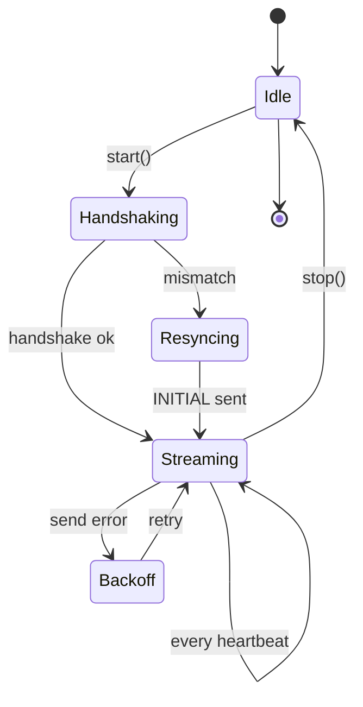

# Telemetry Sender

`extension/src/telemetry/sender.ts` — the loop that ships [[Telemetry Collector|collected]] windows to the gateway.

## Lifecycle



## Loop

```ts
class TelemetrySender {
  private timer: NodeJS.Timeout | null = null;
  private heartbeatMs = 30_000;  // pulled from /system-config on start
  private lastHash: string | null = null;
  private collector = new TelemetryCollector();

  async start(opts: { sync_type: SyncType; extensionId: string }) {
    // 1. Handshake
    const ok = await this.handshake(opts.extensionId);

    // 2. If mismatch — send a fresh INITIAL with snapshot
    if (!ok || opts.sync_type === "INITIAL") {
      await this.sendInitial(opts.extensionId);
    }

    // 3. Loop
    this.timer = setInterval(() => this.tick(opts.extensionId), this.heartbeatMs);
  }

  async stop() {
    if (this.timer) clearInterval(this.timer);
    this.timer = null;
  }

  async sendFinalSync() {
    await this.send({ sync_type: "FINAL", ...this.collector.collect() });
  }

  private async tick(extId: string) {
    const data = this.collector.collect();
    const hash = stableHash(data);
    if (hash === this.lastHash) return;       // diff-payload optimization
    this.lastHash = hash;
    await this.send({ sync_type: "DELTA", extension_id: extId, machine_id: this.machineId, ...data });
  }

  private async send(payload: any) {
    try {
      await axios.post(`${this.gw}/api/v1/telemetry/ingest`, payload, { timeout: 5_000 });
    } catch (e) {
      // TODO: offline buffer (see Yet-To-Implement)
    }
  }

  private async handshake(extId: string): Promise<boolean> {
    const { data } = await axios.post(
      `${this.gw}/api/v1/telemetry/handshake?extension_id=${extId}&machine_id=${this.machineId}&current_hash=${this.lastHash}`
    );
    return data.status === "synchronized";
  }

  private async sendInitial(extId: string) {
    const url = await new Snapshotter().createAndUpload();
    const data = this.collector.collect();
    await this.send({ sync_type: "INITIAL", extension_id: extId, workspace_snapshot_url: url, ...data });
  }
}
```

## Diff-payload optimization

The sender computes a stable hash of the current window's content. If the new window hashes identical to the previous, **the send is skipped**.

This is the `diff_payload` mechanism described in [[06 - Data Models/DTO - Telemetry Raw#diff_payload]]: same hash → no DB write.

Trade-off: longer idle periods (cursor at rest, no file open) compress to zero traffic. Good for cost, but means the server can't tell "the user is idle" from "the extension is dead." Mitigated by the FINAL sync on deactivate and the 30 s heartbeat-of-life.

## Heartbeat interval is server-controlled

On each `start()`, the sender pulls `/monitoring/system-config` and uses `heartbeat_interval_seconds`. Updates take effect on next restart of the sender, not mid-loop. (Future: hot-reload — [[13 - Yet to Implement/Extension - Hot Heartbeat Reload]].)

## Known gaps

- **No offline buffer** — sends are best-effort. Drop on error. **P0 for compliance** (can't claim "no data loss").
- **No backoff** — a 500 from the server is retried on the next heartbeat (acceptable) but bursts on network restoration spike.
- **No batching** — every 30 s window is one POST. For 10 k devs that's ~333 req/s. Manageable today; will need batching at 100 k.
