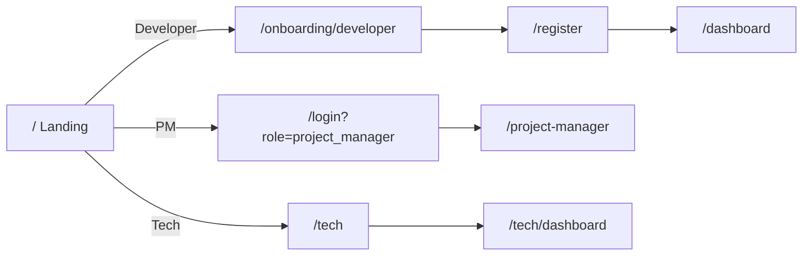

# Next.js App

## Identity

| | |
|:---|:---|
| Path | `frontend-nextjs/` |
| Framework | Next.js 16.2.4 (App Router) |
| React | 19.2.4 |
| Styling | Tailwind CSS |
| Charts | Recharts |
| Graph viz | xyflow |
| Icons | lucide-react |
| HTTP | axios |

## Scripts

```bash
npm run dev     # next dev (port 3000)
npm run build   # next build
npm run start   # next start
npm run lint    # eslint
```

## Top-level layout

```
frontend-nextjs/
├── src/
│   ├── app/
│   │   ├── layout.tsx               # root layout (theme, fonts, providers)
│   │   ├── page.tsx                 # / landing — role chooser
│   │   ├── login/page.tsx           # /login (role-aware via ?role=)
│   │   ├── register/page.tsx        # /register
│   │   ├── onboarding/
│   │   │   └── developer/page.tsx   # /onboarding/developer
│   │   ├── dashboard/               # Developer scope
│   │   │   ├── layout.tsx
│   │   │   └── page.tsx
│   │   ├── project-manager/         # PM scope
│   │   │   ├── layout.tsx
│   │   │   └── page.tsx
│   │   └── tech/                    # Tech Admin scope
│   │       ├── page.tsx
│   │       └── dashboard/page.tsx
│   ├── components/
│   │   ├── RoleCard.tsx
│   │   ├── registration/
│   │   │   ├── AnalysisHUD.tsx
│   │   │   ├── SuccessStep.tsx
│   │   │   └── ValidationIcon.tsx
│   │   ├── tech/
│   │   │   ├── DataExplorer.tsx     # universal Mongo browser
│   │   │   └── LiveAuditHUD.tsx     # WS audit stream UI
│   │   └── ui/
│   │       └── LoadingScreen.tsx
│   ├── lib/
│   │   ├── api/
│   │   │   ├── auth.ts
│   │   │   └── index.ts             # axios instance + interceptors
│   │   └── utils/
│   │       └── validation.ts
│   └── middleware.ts                # request middleware (stub)
└── public/
```

## Routing model



## Build

```bash
cd frontend-nextjs
npm install
npm run build
npm run start  # serves on :3000
```

For static deploy via CDN, prefer `next export` only if no server-rendered routes are dynamic. Today, most routes need SSR / RSC for role gating, so deploy as a Node server (Vercel / Fly.io / Docker).

## Why Next.js 16 + App Router

- **RSC for role-gated layouts** — `/project-manager/layout.tsx` can check role server-side before hydrating the client tree (currently this is done client-side; needs to move server-side — see [[13 - Yet to Implement/Frontend - Role Gating Server-Side]])
- **Streaming** — skill radar shimmers in while data arrives
- **Suspense for HUDs** — clean fallback states without spinner hell

## Known gaps

- **Role gating is client-side** — `useEffect(checkRole)` happens after hydration → flicker. Move to middleware + Server Components.
- **No optimistic UI** for assignments — clicking "Assign" waits for the full Allocation → THG round trip (~2 s). Should optimistically render then reconcile.
- **No WS reconnect logic** in `LiveAuditHUD` — see [[13 - Yet to Implement/Frontend - WebSocket Reconnect]].
- **No error boundaries** at route level — uncaught render errors blank the whole tab.
