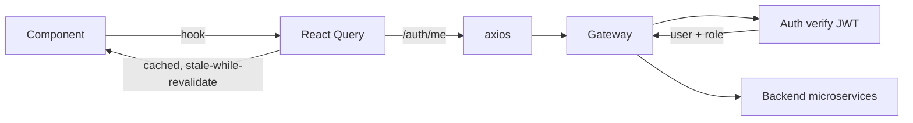

# State & API Client

## Current state

`src/lib/api/index.ts` — axios singleton:

```ts
const api = axios.create({
  baseURL: process.env.NEXT_PUBLIC_GATEWAY_URL || "http://localhost:8000",
  timeout: 30_000,
});

api.interceptors.request.use((cfg) => {
  const role = localStorage.getItem("role");
  if (role) cfg.headers["X-User-Role"] = role;
  return cfg;
});

api.interceptors.response.use(undefined, (e) => {
  if (e.response?.status === 401) {
    // redirect to login
  }
  return Promise.reject(e);
});

export default api;
```

`src/lib/api/auth.ts` — typed wrappers:

```ts
export const login = (dto: LoginDTO) =>
  api.post("/api/v1/auth/users/login", dto);
export const register = (dto: UserRegistrationDTO) =>
  api.post("/api/v1/auth/users/register", dto);
// ...
```

## Why interceptors set `X-User-Role`

The current backend uses `X-User-Role` from the request header for RBAC ([[shared/auth/rbac]]). This is **insecure** — a user can edit localStorage and become a tech admin. Mitigation in [[13 - Yet to Implement/Backend - All - RBAC Signed]] (sign the role via JWT, verify at gateway).

## Local storage usage today

| Key | What it holds | Risk |
|:----|:--------------|:-----|
| `user_id` | dev's UUID | low |
| `username` | display | low |
| `role` | role string | **high** — RBAC dependent |
| `extension_id` | (dev only) one-time during reg | low (UI only — server has truth) |

Move all of these to httpOnly cookie + JWT.

## Target state



- **React Query** (`@tanstack/react-query`) for cache, refetch, optimistic updates
- **JWT in httpOnly cookie** — set by `/login`, refreshed by `/refresh`
- **Per-route prefetch** in Server Components (App Router)
- **WebSocket hook** for the audit HUD (`useAuditStream`)

## WebSocket client (planned)

```ts
function useAuditStream(opts: { filter?: AuditFilter } = {}) {
  const [events, setEvents] = useState<AuditEntry[]>([]);
  const [status, setStatus] = useState<"connecting"|"open"|"closed"|"backoff">("connecting");

  useEffect(() => {
    let ws: WebSocket | null = null;
    let backoff = 1000;
    const connect = () => {
      ws = new WebSocket(`${WS_BASE}/monitoring/ws/audit`);
      ws.onopen = () => { setStatus("open"); backoff = 1000; };
      ws.onmessage = (e) => setEvents((evs) => [JSON.parse(e.data), ...evs].slice(0, 500));
      ws.onclose = () => {
        setStatus("backoff");
        setTimeout(connect, Math.min(backoff *= 2, 30_000));
      };
    };
    connect();
    return () => { ws?.close(); setStatus("closed"); };
  }, []);

  return { events, status };
}
```

Tracked: [[13 - Yet to Implement/Frontend - WebSocket Reconnect]].
