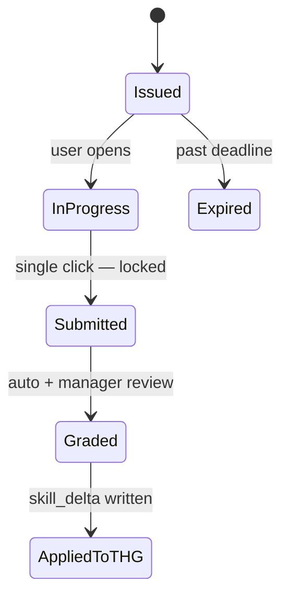

# DTO — Assessment

> Implementation pending — current shape is **design intent**, not running code. Tracked: [[13 - Yet to Implement/Backend - Task - Assessment Engine]].

## AssessmentCreateDTO

```json
{
  "user_id": "uuid",
  "skill_targeted": "backend",
  "difficulty": "easy | medium | hard",
  "issued_by": "manager_id",
  "deadline_at": "ISO",
  "questions": [
    {
      "qid": "uuid",
      "type": "code-write | mcq | code-review",
      "prompt": "...",
      "expected_difficulty": 0.7
    }
  ]
}
```

## AssessmentSubmissionDTO

```json
{
  "assessment_id": "uuid",
  "user_id": "uuid",
  "answers": [
    { "qid": "uuid", "answer": "..." }
  ],
  "submitted_at": "ISO",
  "wall_clock_ms": 1234567
}
```

## AssessmentResultDTO

```json
{
  "assessment_id": "uuid",
  "user_id": "uuid",
  "score": 0.74,
  "per_question_scores": [{ "qid": "...", "score": 0.8 }],
  "verdict": "pass | fail | partial",
  "skill_delta": { "backend": 0.04 },
  "graded_at": "ISO",
  "graded_by": "auto | manager_id"
}
```

## Lifecycle



## Single-attempt enforcement

The "single attempt" guarantee is **cryptographic**, not UI:

1. The frontend issues the assessment with an opaque token
2. On submit, the backend verifies the token and **deletes it**
3. Any subsequent attempt with the same `assessment_id` returns 410 Gone

This makes "F5 to retry" structurally impossible — see [[07 - Algorithms/BGSC Feedback#Single-attempt]].
