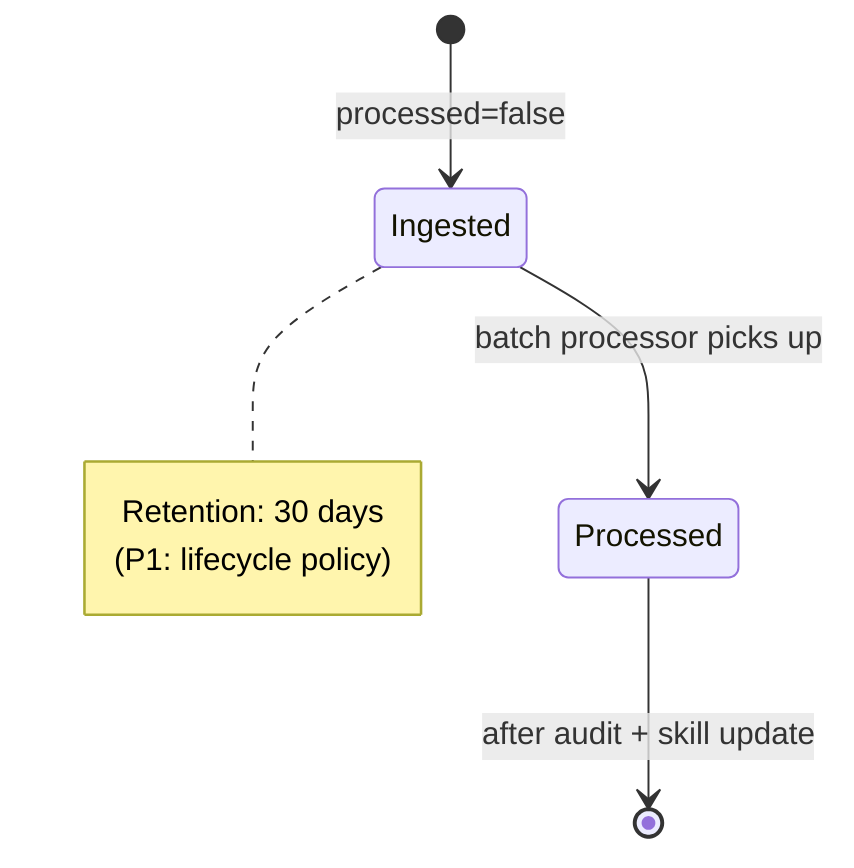

# DTO — Telemetry Raw

`shared/models/telemetry.py :: TelemetryIngestDTO` (wire) → `TelemetryRawDocument` (Mongo).

## Wire shape (DTO)

```json
{
  "extension_id": "string (1..255)",
  "machine_id": "string (1..255)",
  "sync_type": "INITIAL | DELTA | FINAL",
  "active_file": "string?",
  "diff_payload": "string?",
  "workspace_snapshot_url": "string?",
  "timestamp": "ISO 8601 (default: now)",
  "wpm": "number (0..300)",
  "keystrokes": "int (>=0)",
  "commands_executed": "int (>=0)",
  "idle_seconds": "int (>=0)",
  "git_branch": "string (default 'main')",
  "code_snippet": "string?",
  "languages_used": { "python": 12, "yaml": 3 }
}
```

## Stored shape (Mongo)

`TelemetryRawDocument.create(...)` adds:

```json
{
  ...wire fields...,
  "processed": false,
  "ingested_at": "ISO (now())",
  "batch_id": null     // set when batch processor picks this up
}
```

## Field reference

| Field | Type | Notes |
|:------|:-----|:------|
| `extension_id` | str | Identifies the dev (joined via `whitelist`) |
| `machine_id` | str | MUST match locked machine_id (SHA-HWID enforcement) |
| `sync_type` | enum | INITIAL: full snapshot; DELTA: regular ping; FINAL: shutdown |
| `active_file` | str? | Repo-relative path of the currently focused file |
| `diff_payload` | str? | Unified diff of the active window since last send |
| `workspace_snapshot_url` | str? | Set on INITIAL — points at the zip in object storage |
| `timestamp` | ISO | When the *collector* produced this record |
| `wpm` | num | Capped 200 client-side; 300 here as defense |
| `keystrokes` | int | Raw count this window |
| `commands_executed` | int | VS Code commands fired |
| `idle_seconds` | int | Seconds with no input |
| `git_branch` | str | Default `"main"` |
| `code_snippet` | str? | ±10 lines around cursor (4 KB cap, sanitized) |
| `languages_used` | dict | `{langId: seconds spent}` |

## Indexes

| Index | Purpose |
|:------|:--------|
| `(user_id, timestamp)` | Per-dev timeline (analytics, dashboards) |
| `extension_id` | `validate-extension` joins |
| `processed` | Batch processor query |
| `batch_id` sparse | Trace from batch to raw rows |

## Lifecycle



> No retention policy is enforced today. After 30 days, processed=true rows should be archived to cold storage and dropped from the hot collection. Tracked: [[13 - Yet to Implement/Backend - Telemetry - Retention Policy]].
