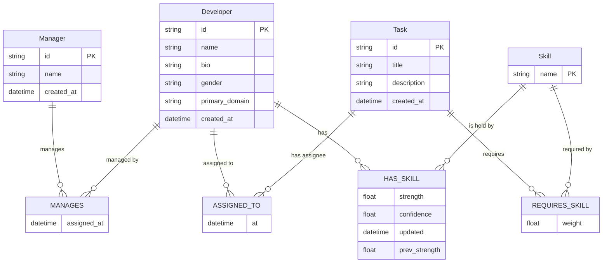

# Neo4j (THG) Schema

> Owner: [[03 - Microservices/THG Service|THG service]] (sole writer).

## ER (graph)



## Indexes & constraints (recommended)

```cypher
CREATE CONSTRAINT developer_id IF NOT EXISTS
  FOR (d:Developer) REQUIRE d.id IS UNIQUE;

CREATE CONSTRAINT manager_id IF NOT EXISTS
  FOR (m:Manager) REQUIRE m.id IS UNIQUE;

CREATE CONSTRAINT skill_name IF NOT EXISTS
  FOR (s:Skill) REQUIRE s.name IS UNIQUE;

CREATE CONSTRAINT task_id IF NOT EXISTS
  FOR (t:Task) REQUIRE t.id IS UNIQUE;

CREATE INDEX dev_primary_domain IF NOT EXISTS
  FOR (d:Developer) ON (d.primary_domain);

CREATE INDEX has_skill_strength IF NOT EXISTS
  FOR ()-[r:HAS_SKILL]-() ON (r.strength);
```

## Canonical writes

### Skill update (decay + blend)

See [[02 - System Architecture/Data Flow - Skill Update]] for the full Cypher.

### Assignment (idempotent)

```cypher
MATCH (d:Developer {id: $dev_id}), (t:Task {id: $task_id})
OPTIONAL MATCH (d)-[old:ASSIGNED_TO]->(t)
DELETE old
MERGE (d)-[r:ASSIGNED_TO]->(t)
SET r.at = datetime()
RETURN r
```

### Manager link

```cypher
MATCH (m:Manager {id: $manager_id}), (d:Developer {id: $dev_id})
MERGE (m)-[r:MANAGES]->(d)
SET r.assigned_at = datetime()
RETURN r
```

## Canonical reads

### Developer's live-decayed skills

```cypher
MATCH (d:Developer {id: $dev_id})
OPTIONAL MATCH (d)-[r:HAS_SKILL]->(s:Skill)
WITH d, r, s, duration.inDays(date(r.updated), date()).days AS days
RETURN s.name AS name,
       r.strength * exp(-0.1 * coalesce(days, 0)) AS strength,
       r.confidence AS confidence,
       r.updated AS updated
ORDER BY strength DESC
```

### Top 10 by skill (leaderboard)

```cypher
MATCH (d:Developer)-[r:HAS_SKILL]->(s:Skill {name: $skill_name})
WITH d, r, duration.inDays(date(r.updated), date()).days AS days
WITH d, r.strength * exp(-0.1 * days) AS live_strength, r.confidence AS confidence
ORDER BY live_strength DESC
LIMIT 10
RETURN d.id AS dev_id, d.name AS name, live_strength AS strength, confidence
```

### PageRank (GDS) with fallback

GDS path:

```cypher
CALL gds.pageRank.stream({
  nodeProjection: 'Developer',
  relationshipProjection: {
    HAS_SKILL: {orientation: 'UNDIRECTED', properties: 'strength'}
  },
  relationshipWeightProperty: 'strength'
})
YIELD nodeId, score
RETURN gds.util.asNode(nodeId).id AS dev_id, score
ORDER BY score DESC LIMIT 50
```

Native fallback (skill density):

```cypher
MATCH (d:Developer)-[r:HAS_SKILL]->(:Skill)
WITH d, sum(r.strength * r.confidence) AS influence
RETURN d.id AS dev_id, d.name AS name, influence
ORDER BY influence DESC LIMIT 50
```

See [[07 - Algorithms/Native Cypher Fallback]] for the rationale.

## Why no `Squad` node?

We model the squad as the **set of developers MANAGES-linked to a manager**. Adding a `Squad` node would duplicate state. Trade-off: querying "who's in squad X" requires a 1-hop traversal, which is fast in Neo4j.

If squads grow attributes (color, mission, mandate), promote to a `Team` node — but only then.
