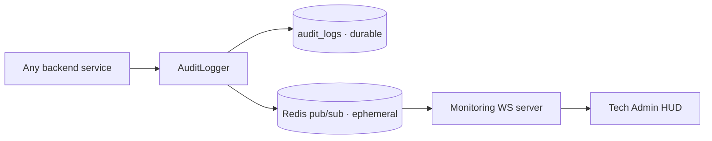

# Async-Redis-WS (Pillar #9)

> Non-blocking event streaming — backend writes never block on UI delivery.

See also: [[02 - System Architecture/Realtime Layer (Redis Pub Sub)]] and [[02 - System Architecture/Sequence - Live Audit HUD]].

## The shape



Two writes, one source. The Mongo write is the durable trail; the Redis publish is the live HUD.

## Why pub/sub (not request/response)

- **Decoupling**: writers don't know or care who's listening. Tomorrow's mobile app subscribes without code change.
- **Latency**: pub/sub is sub-ms. WS delivery to UI is ~50 ms median.
- **Backpressure**: pub/sub drops if a subscriber can't keep up. The UI's job to reconnect + backfill from Mongo.

## Code shape

```python
# AuditLogger (shared/services/audit_logger.py)
class AuditLogger:
    def __init__(self, mongo, redis):
        self.mongo = mongo
        self.redis = redis

    async def log(self, entry: dict):
        # 1. durable
        await self.mongo["audit_logs"].insert_one(entry)
        # 2. realtime fanout (fire & forget)
        try:
            await self.redis.publish("audit:stream", json.dumps(entry))
        except Exception:
            pass  # Redis is not critical-path
```

Mongo failure → exception bubbles up (call fails). Redis failure → swallowed (write still durable).

## WS server (planned in Monitoring)

```python
@app.websocket("/monitoring/ws/audit")
async def audit_ws(ws: WebSocket):
    await ws.accept()
    pubsub = redis.pubsub()
    await pubsub.subscribe("audit:stream")
    try:
        async for msg in pubsub.listen():
            if msg["type"] == "message":
                await ws.send_text(msg["data"])
    except WebSocketDisconnect:
        await pubsub.unsubscribe()
```

## Delivery semantics

| Layer | Semantics |
|:------|:----------|
| Mongo `audit_logs` | At-least-once (durable, ordered per writer) |
| Redis pub/sub | At-most-once (lossy under subscriber backpressure) |
| WebSocket → UI | At-most-once (lossy on disconnect) |

The end-to-end story is **exactly-once for durability** (Mongo), **best-effort for realtime** (Redis + WS), with UI-driven backfill on reconnect filling the gap.

## Failure modes

| Failure | Effect | Mitigation |
|:--------|:-------|:-----------|
| Redis down | UI shows "reconnecting"; writes still durable | Mongo backfill |
| WS dropped | UI sees gap | Backoff + `/audit-log?since=<last_seen>` on reconnect |
| Subscriber slow | Events dropped at Redis | Mongo backfill |
| Mongo down | **Writes fail** | This is the critical path — alert via [[09 - Operations/Runbook - DB Outage]] |
