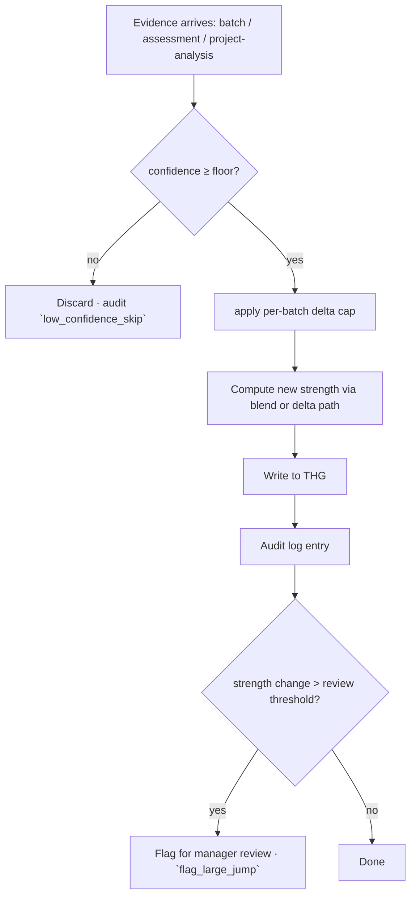

# BGSC Feedback (Pillar #5)

> "Bounded Growth & Self-Correction" — guardrails that ensure skill changes are incremental, verified, and reversible.

## The principle

Skill scores must change for **good reasons**:

1. Telemetry-driven changes are bounded by **how much one batch can move a score**.
2. Discrete jumps (assessments, completed tasks) must be **verified**.
3. Every change is **logged**, so any later audit can roll back a bad signal.

## Three guardrails

### Guardrail 1 — Per-batch delta cap

```python
delta = abs(new_strength - prev_strength)
if delta > MAX_PER_BATCH_DELTA:  # e.g. 0.10
    new_strength = prev_strength + sign(delta) * MAX_PER_BATCH_DELTA
```

Prevents one outlier batch from massively reshaping the twin.

### Guardrail 2 — Single-attempt assessments

When a manager issues an assessment, the result either passes or fails — **once**. The result writes a bounded `skill_delta` (e.g., `+0.04` for pass, `-0.01` for fail).

```
INSERT INTO weekly_tests { ..., attempts: 1 }
POST {THG}/update-skill { dev_id, skill_name, delta: 0.04 }
DELETE assessment_token  # prevents retake
```

Cryptographic single-attempt described in [[06 - Data Models/DTO - Assessment#Single-attempt enforcement]].

### Guardrail 3 — Confidence-modulated weight

A new evidence's impact is multiplied by its confidence:

```python
effective_delta = raw_delta * fusion_confidence
```

A low-confidence batch (e.g., reliability_score 0.4) impacts the score 0.4× as much as a high-confidence batch.

## Lifecycle of a skill mutation



## Why this matters

Without BGSC:

- A bad anomaly-detector false positive could spike `fraud_flag` and zero out a dev's score.
- A flaky network on the dev's side could send 10 INITIAL syncs in a row, each writing a strong baseline.
- A malicious manager could issue 50 assessments in a row to game a junior's score up artificially.

With BGSC, **none of these can move the twin more than X per day**, where X is the system-config bound.

## Configurable bounds

In `system_config`:

```json
{
  "bgsc": {
    "max_per_batch_delta": 0.10,
    "max_per_day_delta": 0.20,
    "min_confidence_floor": 0.20,
    "review_threshold": 0.15
  }
}
```

Today: hardcoded. Tracked: [[13 - Yet to Implement/Backend - Task - BGSC Config]].

## Reversibility

Every BGSC mutation logs `before` AND `after`. To roll back:

1. Find the audit entries to revert (`action=skill_update`, time range)
2. Compose a `revert` action that sets `strength = before`
3. Update THG with `delta = (before - current)`
4. Audit the revert with `by: tech_admin:<id>`, `reason: "..."`

Tracked: [[13 - Yet to Implement/Backend - THG - Revert Endpoint]].
