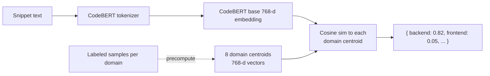

# CodeBERT Pipeline (Pillar #1)

> Microsoft's `microsoft/codebert-base` — the semantic brain that decides "what kind of code is this?"

## What it does

Maps a **code snippet** (or free text) to a probability distribution across our 8 skill domains:

```
backend, frontend, devops, ml, neo4j, testing, database, security
```

Used by:

- [[03 - Microservices/Fusion Service]] in the per-batch `/run` pipeline
- [[03 - Microservices/Allocation Service]] for `/analyze-text` task vectorization
- Deep audit on workspace snapshots

## Architecture



## Domain centroids

For each of 8 domains, we have a hand-curated set of canonical code samples. At service startup:

1. Embed each sample with CodeBERT → 768-d vector
2. Take the mean → that domain's **centroid**
3. Store all 8 centroids in memory

This is a **one-time** cost at startup (~6 s). Per-snippet inference at runtime is just an embedding + 8 dot products.

## Inference math

```python
def analyze_code(snippet: str) -> dict[str, float]:
    emb = encoder.embed(snippet)  # 768-d vector
    scores = {
        skill: float(cosine_sim(emb, centroid))
        for skill, centroid in domain_centroids.items()
    }
    # Optional softmax for probability shape:
    # scores = softmax(scores, temperature=1.0)
    return scores
```

For resumes (free text, not code) we damp the result by 0.7 — resume language is less precise than code.

## Why this approach

Compared to alternatives:

| Approach | Pros | Cons |
|:---------|:-----|:-----|
| **Fine-tuned classifier** | best accuracy | needs labels, retraining, model versioning |
| **Centroid + cosine** (ours) | zero training, deterministic, fast | tied to labeled sample quality |
| **LLM call per snippet** | flexible | $$$$, slow, non-deterministic |
| **Keyword grep** | fast, cheap | brittle, no semantic understanding |

The centroid approach is the **sweet spot for V1**. We can swap to a fine-tuned head when we have labeled data at scale.

## Performance

| Operation | Latency (CPU) |
|:----------|:--------------|
| Cold-start (load model + centroids) | ~6 s |
| Single snippet embed | ~50 ms |
| Batch of 10 snippets | ~120 ms |
| Cosine vs 8 centroids | <1 ms |

GPU would drop single-snippet to ~5 ms. See [[13 - Yet to Implement/Backend - Fusion - GPU + Triton]].

## Code location

- `backend/fusion/app/services/ai_core.py :: CodeBERTAnalyzer`
- Model files: downloaded at first run via `backend/fusion/download_model.py`
- Thread-safe singleton with lazy load

## Edge cases

- **Empty snippet** → return uniform distribution + low confidence flag
- **Non-code text** (e.g., comments only) → still gets a score; damped via the resume path
- **Very large snippet** → truncate to 512 tokens (CodeBERT's max) — currently no overlap windowing (P2)
- **Mixed-language file** → embedding is one-shot; for true multilingual files, segment first (P2)

## Known gaps

- **Centroid samples may be biased** — initial seeds were small. Need an active-learning loop to refine. ([[13 - Yet to Implement/Backend - Fusion - Active Learning]])
- **No batch CodeBERT mode** — every snippet is a separate forward pass. Batch endpoint exists but isn't used by `/run`.
- **Hard-coded 8 domains** — adding `mobile` or `cloud-native` requires code + samples + retrain centroids.
