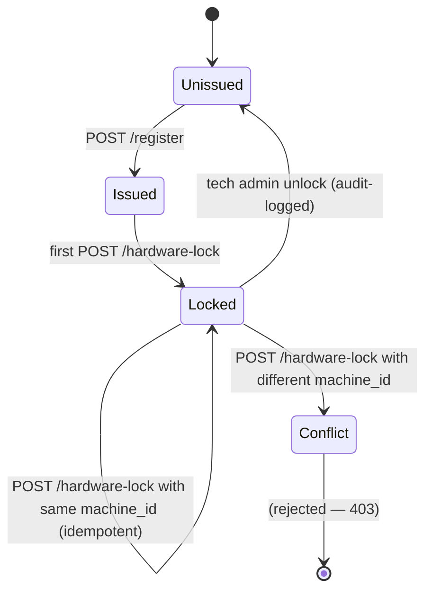

# SHA-HWID Anchor (Pillar #4)

> The cryptographic lock that binds an `extension_id` to a single machine. Defeats account-sharing telemetry.

## The mechanism

1. Each developer registers → receives a unique `extension_id`.
2. On first install, the extension reads `vscode.env.machineId` (an SHA-256 derived from CPU + motherboard data).
3. The extension POSTs `(extension_id, machine_id)` to `/hardware-lock`.
4. Server stores `whitelist[extension_id].machine_id = machine_id` if currently `null`.
5. Every subsequent `/ingest` validates via `/validate-extension`. Mismatch → 403.

See [[04 - VS Code Extension/Hardware Lock (SHA-HWID)]] for the UX side.

## Why "SHA"

The `vscode.env.machineId` itself is already an SHA-256 of multiple stable hardware identifiers (CPU ID, MAC of primary NIC, etc.). The platform adds the hashing — we just consume it.

For "extra strong" mode (P2), we hash again with a server-issued salt:

```
anchor_hash = SHA-256(machine_id || ext_id || server_salt)
```

This binds *both* identifiers cryptographically, so even leaking `machine_id` alone doesn't help an attacker.

## Lock state machine



## Threats it defeats

| Threat | Defeat? |
|:-------|:-------:|
| Sharing one `extension_id` across team | ✓ |
| Running telemetry from a fake script (no real VS Code) | partial (script needs same machine_id) |
| Reinstalling VS Code to wipe state | ✓ — server holds the lock |
| Cloning the VS Code config to a colleague's laptop | ✓ — different machine_id |

## Threats it does NOT defeat

| Threat | Mitigation |
|:-------|:-----------|
| Attacker with shell on dev machine | Out of scope — threat model is broken |
| Running ADT in a VM and copying the VM | Possible — `machineId` survives VM clones. Mitigate via server-side anomaly detection ([[Anomaly Detection]]) |
| Tampering with `vscode.env.machineId` in a malicious extension | Possible — VS Code APIs are JS, theoretically patchable. Mitigation: bind to native HWID via `node-machine-id` ([[13 - Yet to Implement/Extension - Native HWID]]) |

## Audit trail

Every lock event writes to `audit_logs`:

- `action: "extension_locked"` — first-time lock
- `action: "extension_unlocked"` — tech admin clears the lock
- `action: "extension_lock_conflict"` — second machine attempted

Tech Admins should review unlocks weekly.

## Migration / re-lock procedure

The **only** legitimate way to switch machines:

1. Developer notifies their tech admin
2. Tech admin clears `whitelist.{ext_id}.machine_id` via Data Explorer (or dedicated `/admin/unlock` endpoint — [[13 - Yet to Implement/Backend - Auth - Unlock Endpoint]])
3. Developer installs on new machine, pastes ext_id, re-locks
4. Audit log captures the whole sequence with `by: tech_admin:<id>`

## Code location

- Extension: `extension/src/extension.ts` (in `activate`)
- Auth: `backend/auth/app/routers/users.py :: hardware_lock`
- Telemetry validation: `backend/auth/app/routers/users.py :: validate_extension`
