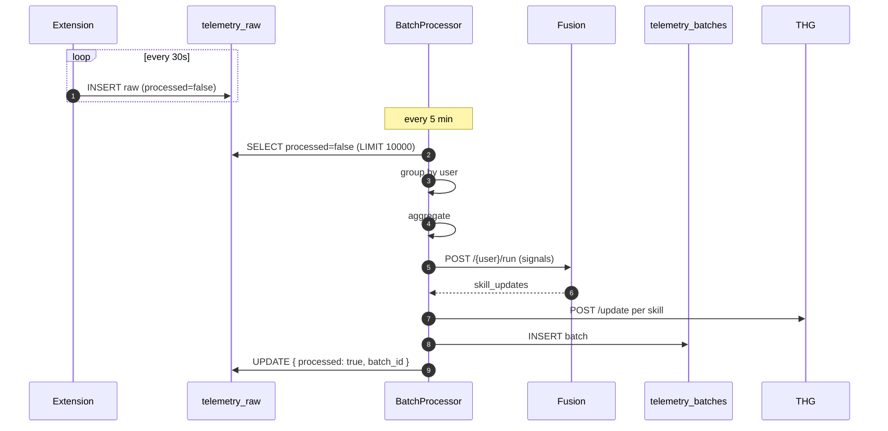

# SWEF-Ingestion (Pillar #3)

> "Sliding Window Event Fusion" — turn a stream of 30 s pings into one meaningful 5-minute aggregate.

## Why a window

Raw 30 s pings are too noisy to act on:

- WPM jitters wildly with bursts and pauses
- One file gets `active_file` for one ping (didn't really "work" on it)
- A single keystroke spike isn't activity, it's a typo or backspace

The **window** (default 5 min) smooths these out into signals you can score.

## The window contract

| Property | Value |
|:---------|:------|
| Default size | **5 minutes** (`BATCH_INTERVAL_MINUTES=5`) |
| Live-configurable | yes — via Monitoring `/system-config` |
| Tumbling or sliding? | **Tumbling** (non-overlapping) today |
| Aligned to clock? | no — to ingest time |
| Per-user? | yes — windows are per `user_id` |

> ⚠️ "Sliding" is in the name but we currently do **tumbling**. Sliding (overlapping) would give smoother trends but multi-write the same raw record. Tracked: [[13 - Yet to Implement/Backend - Telemetry - Sliding Mode]].

## Aggregation rules

See [[06 - Data Models/DTO - Telemetry Batch#Aggregation rules]] for the per-field rules. Highlights:

- `avg_wpm` excludes zero-WPM pings (idle) — prevents idle drag
- `top_files` is merged by time-spent, sorted desc, capped 20
- `language_distribution` is normalized to sum 1.0
- `code_snippets` capped at 10 to bound CodeBERT cost

## Why `avg_wpm` excludes zeros

A developer idle 4 minutes out of 5 isn't a "slow typer" — they're thinking, reading, debugging. Including the zeros would average their WPM toward zero unfairly.

The **idle signal** is preserved separately as `total_idle_seconds` and used by [[VDA-Oversight]] for burnout prediction. Two signals, two purposes — don't collapse them.

## The fairness lens

Each aggregation choice is a fairness choice. Examples:

- Excluding idle pings from WPM → values "high focus" sessions over "many short tasks." May undervalue a dev who context-switches.
- Counting commits → values **shipping**. May undervalue a dev on a refactor branch with no merges this week.
- `top_files` capped at 20 → loses long-tail file visits.

**None** of these are "wrong." But the team should re-audit them quarterly. Tracked: [[13 - Yet to Implement/Backend - Telemetry - Aggregation Fairness Review]].

## Lifecycle of a window

## Edge cases

- **No data for a user this window** — skip; no empty batch created
- **More than 10 k raw records** — only first 10 k processed; rest deferred to next tick. At 10 k devs × 30 s = ~333/s → 100 k in 5 min. **Limit too tight at scale.** ([[13 - Yet to Implement/Backend - Telemetry - Lift Batch Limit]])
- **Crashed mid-batch** — raw records not marked processed; replayed next tick (idempotent). But the batch doc may be missing or in `pending` state.
