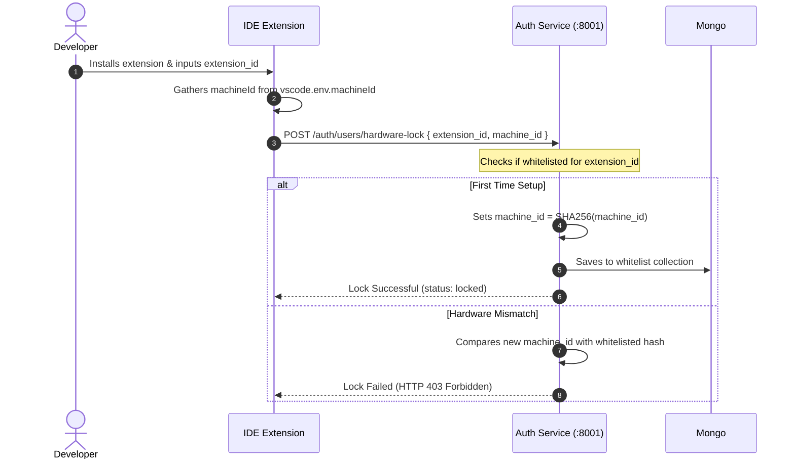

# Hardware Anchoring Protocol

Hardware Anchoring ensures that an `extension_id` cannot be hijacked and executed on multiple client machines. Every developer's telemetry stream must originate from their whitelisted hardware.

## Under the Hood: SHA-HWID

When the VS Code extension initializes, it retrieves the client machine identifier:

```typescript
// extension/src/telemetry/collector.ts
const machineId = vscode.env.machineId; // Cryptographically salted OS hardware fingerprint
```

The extension hashes this fingerprint along with the whitelisted `extension_id` and registers it on onboarding:

```
SHA256(extension_id + "_" + vscode.env.machineId) === SHA-HWID
```



## Security Loophole & Tier-1 Fixes

### ⚠️ Current Loopholes:
- **`vscode.env.machineId` spoofability**: If a user runs VS Code inside a virtual machine or modifies their local VS Code environment variables, they can spoof their `machineId`.
- **Admin Lock Reset**: Whitelist changes are currently done manually by DB edits without full validation of credentials.

### Tier-1 Hardening Actions:
1. **Multi-Factor Fingerprinting**: Incorporate multiple hardware endpoints (motherboard UUID, CPU serials, MAC address) using a native node utility within the extension bundle, rather than relying solely on VS Code variables.
2. **Re-Verification Nonce**: Force re-validation of hardware during each `/handshake` step.
