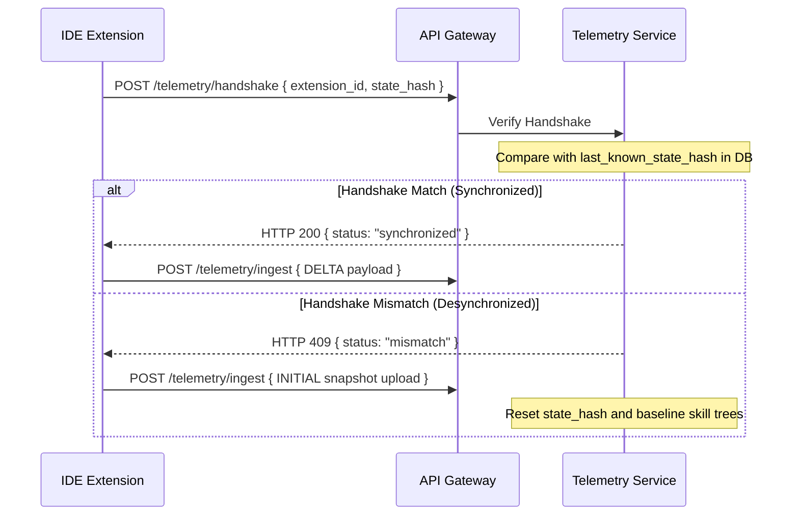

# SHEC Encryption Protocol

**SHEC (State Hash & Extension Check)** is a proprietary transport-level protocol designed to prevent tampering with developer telemetry records in-transit.

## State Hash Generation

Before transmitting any telemetry packet, the extension computes a cryptographic hash of its internal telemetry state:

```
StateHash = SHA256(last_known_hash + cursor_delta + keystrokes_count + current_branch + file_modifications)
```

## Flow Sequence



## Anti-Tampering Properties
- **Zero-knowledge on Client**: The state hash is calculated on both the client and server. An attacker injecting a raw JSON payload directly to the `/ingest` route will fail because their telemetry delta does not produce the expected `StateHash` chain in the Telemetry database.
- **Strict Ordering**: If packets are intercepted, reordered, or deleted, the hash sequence breaks instantly, forcing a full `mismatch` reset.
