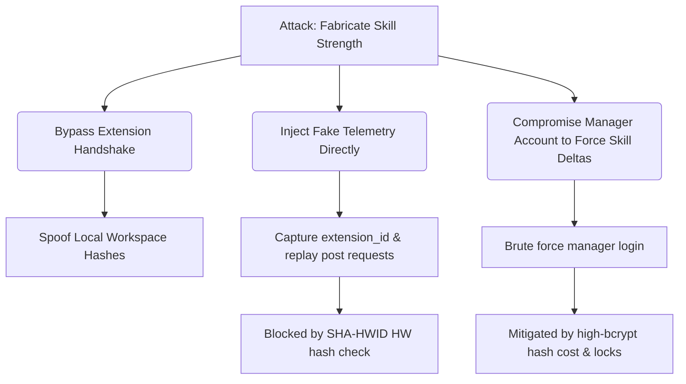

# Threat Model

ADT is a high-value target inside an organization. Malicious developers might attempt to game their productivity metrics, spoof their skills, or escalate roles to view other developers' private profiles. Externally, attackers could attempt to hijack the telemetry feed or extract proprietary intellectual property from code scans.

## STRIDE Threat Matrix

| Threat Type | Description | Target | Mitigation Status | Reference |
|:---|:---|:---|:---|:---|
| **Spoofing** | Developer logs in from a standard machine and clones an `extension_id` from a high-performer. | Telemetry / Auth | Cryptographically prevented via [[Hardware Anchoring Protocol]] | [[07 - Algorithms/SHA-HWID Anchor]] |
| **Tampering** | Man-in-the-middle modification of telemetry JSON payloads to fake high velocity. | Telemetry Ingest | Prevents tampering with [[SHEC Encryption]] and HTTPS TLS requirements | [[04 - VS Code Extension/SHEC Sync Protocol]] |
| **Repudiation** | PM denies assigning a task; Developer denies failing an assessment. | Task Service | Immutable audit trail stored in Mongo `audit_logs` and broadcasted via Redis | [[02 - System Architecture/Realtime Layer (Redis Pub Sub)]] |
| **Information Disclosure** | Developer extracts raw workspace code snippets of another team member. | Frontend / API | API-level tenant-scoping and MongoDB collection physical isolation | [[Polymorphic RBAC]] |
| **Denial of Service** | Dev floods `/api/v1/telemetry/ingest` with dummy payloads to crash server. | Gateway / Ingest | **LOOPHOLE**: Missing rate limits. Standard Gateway setup. | [[12 - Expert Review/Security Vulnerability Analysis]] |
| **Elevation of Privilege** | Developer changes role to Manager by intercepting the database or using REST calls. | Auth Service | Enforced physically through 3 separate database silos | [[Polymorphic RBAC]] |

## Attack Trees

### Attack 1: Fabricating Skills & Velocity

### Mitigation Strategy & Tier-1 Hardening
1. **Network Layer Isolation**: Enforce TLS 1.3 everywhere. Drop support for anything older.
2. **Replay Protections**: Every telemetry handshake must issue a single-use crypto-nonce. Telemetry uploads must include the signed hash of this nonce.
3. **Database Audit Trails**: Use MongoDB Atlas Database Auditing + Neo4j enterprise audit logs to track direct administrator database access.
