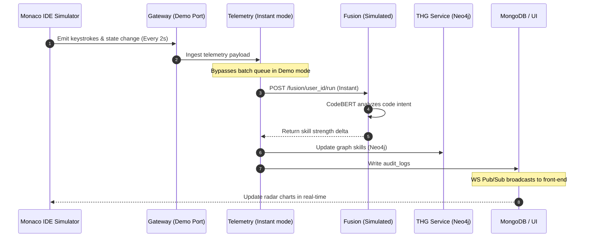

# Data Pipeline Simulation

Behind the scenes of Simulation Mode, a mock telemetry loop is triggered to bypass the normal 5-minute batch intervals, ensuring real-time responsiveness.

## Pipeline Blueprint

## Special Sim Parameters
- **Batch Interval override**: Changed from `5 minutes` to `2 seconds` to make animations responsive.
- **Complexity booster**: In Sim mode, each line of code parsed contributes a multiplier to the CodeBERT weight engine to illustrate instant capability increases.
