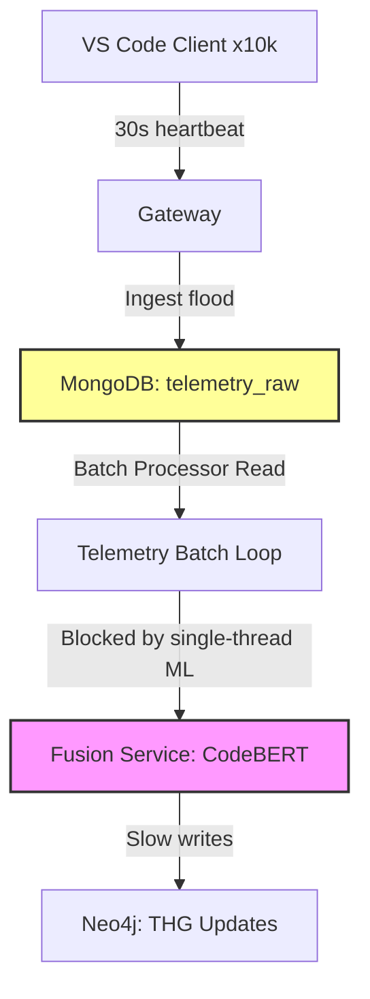

# Architectural Bottlenecks

ADT must scale to support environments with 10k+ developers writing code concurrently. The current v1 architecture has several latency hotspots and memory limitations.

## Core Performance Bottlenecks

### 1. MongoDB `telemetry_raw` Write Pressure
With 10,000 active IDE extensions reporting every 30 seconds, the Telemetry service receives **333 requests per second**. If Mongo indexing is misconfigured, index locks will quickly crash the Telemetry API.
- **Current status**: Missing partitioned compound indexes on `(extension_id, timestamp)`.

### 2. Synchronous CodeBERT Processing
The Fusion Service runs CodeBERT semantic scans within a synchronous Python FastAPI lifecycle. 
- **Current status**: If a deep audit is requested on onboarding, the Fusion service blocks its thread pool, causing incoming delta evaluations to hang.

### 3. Neo4j Single-Threaded Write Locks
Neo4j transactional locks occur if multiple delta processors attempt to update the same skill node concurrently.
- **Current status**: Idempotent blend formula does not handle concurrency exceptions.
