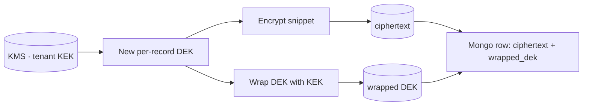

# Encryption at Rest & Transit

## In transit

| Hop | Today | Target |
|:----|:------|:-------|
| Browser ↔ Gateway | HTTP | **TLS 1.3 only**, HSTS, OCSP stapling |
| Extension ↔ Gateway | HTTP | TLS 1.3 only, cert pinning client-side |
| Gateway ↔ Service | HTTP | mTLS or service-mesh sidecar (Linkerd / Istio) |
| Service ↔ Mongo Atlas | TLS 1.2 (Atlas default) | TLS 1.3 once supported by driver |
| Service ↔ Neo4j AuraDB | TLS (`neo4j+s://`) | Same |
| Service ↔ Redis Upstash | `rediss://` TLS | Same |
| Service ↔ Object Storage | HTTPS | Same + SigV4 |

## At rest

| Asset | Today | Target |
|:------|:------|:-------|
| Mongo (Atlas) | Provider-side AES-256 (always-on) | Same + customer-managed keys (CMK) for sensitive collections |
| Neo4j (AuraDB) | Provider-side encryption | Same |
| Redis (Upstash) | Provider-side encryption | Same |
| Snapshots in object storage | Default | SSE-KMS with per-tenant key |
| Backups | Provider | Encrypted at the volume layer; KMS-controlled key |
| `code_snippet` column | Plaintext | **Envelope encryption** — each cell has a per-record DEK encrypted by a tenant KEK |
| Logs (CloudWatch / Loki) | Provider | Same — verify enabled |

## Envelope encryption pattern (for snippets)

Read path: load wrapped DEK from row → ask KMS to unwrap → use DEK to decrypt snippet.

Why this beats naive "just encrypt with one key":

- Per-record DEK = compromise of a row's ciphertext + wrapped DEK without KMS access yields nothing
- Rotating KEK doesn't require re-encrypting petabytes — just re-wrapping DEKs
- Audit log of every KMS unwrap = visibility into snippet reads

## Key rotation

- **JWT signing key**: rotate every 30 days; old keys honored for 7 days for grace
- **Tenant KEK**: rotate every 90 days
- **DB credentials**: rotate every 30 days (Vault-managed)
- **Service-to-service tokens**: rotate every 30 days

## Tracked

- [[13 - Yet to Implement/Infra - TLS Everywhere]]
- [[13 - Yet to Implement/Backend - Telemetry - Snippet Envelope Encryption]]
- [[13 - Yet to Implement/Infra - KMS Setup]]
