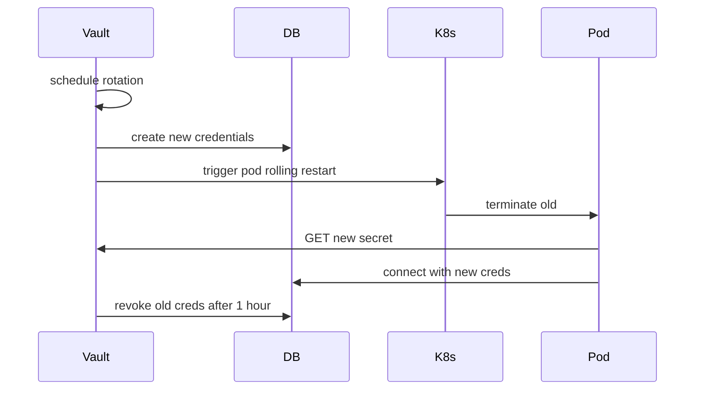

# Secrets Management

## Today

- `.env` files in each service folder (in `.gitignore`, but on disk in containers)
- `docker-compose.yml` injects env vars from a top-level `.env`
- Connection strings (Mongo, Neo4j, Redis) are plaintext in env

**This is fine for dev, broken for prod.**

## Target

| Tier | Where secrets live | Rotation |
|:-----|:-------------------|:---------|
| Local dev | `.env` (gitignored) | manual |
| Staging | HashiCorp Vault / AWS Secrets Manager / Doppler | 30 days |
| Production | Same + KMS-encrypted at rest, audit-logged retrieval | 90 days, automated |

## What counts as a secret

- DB connection strings (Mongo, Neo4j, Redis)
- JWT signing keys (private side)
- Object storage credentials (S3/MinIO)
- Service-to-service tokens
- bcrypt cost (config, not secret per se)
- Webhook signing keys
- Any 3rd-party API keys

## Rotation strategy



## Pre-commit secret scanning

`pre-commit` hook running `detect-secrets`:

```yaml
- repo: https://github.com/Yelp/detect-secrets
  rev: v1.4.0
  hooks:
    - id: detect-secrets
      args: ['--baseline', '.secrets.baseline']
```

This catches: API keys, JWT, private keys, password-shaped strings.

Tracked: [[13 - Yet to Implement/Infra - Pre-Commit Secret Scan]].

## CI scanning

Every PR runs `gitleaks` against the full history of the branch:

```yaml
- uses: gitleaks/gitleaks-action@v2
```

## Recovery from leaked secret

1. Rotate the leaked credential immediately in Vault
2. Trigger pod restarts
3. Audit downstream: was the secret used while leaked?
4. If yes — assume the worst, rotate everything that secret could reach
5. Write a post-incident report in [[09 - Operations/Runbook - Incident Response]]
