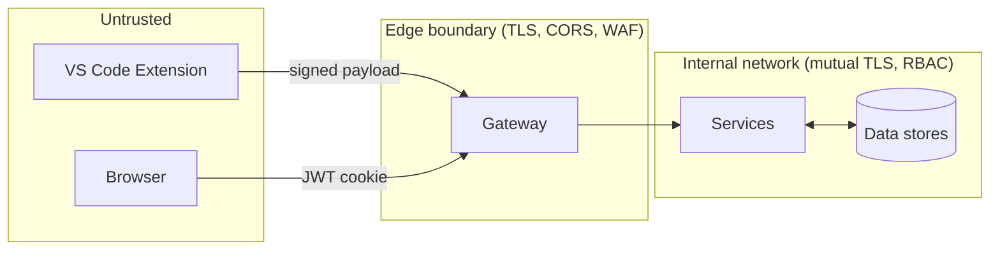

# Threat Model

> A telemetry product that judges developers needs a stronger threat model than most B2B SaaS. Bad actors include: developers gaming their own scores, managers manipulating reports, attackers stealing the IP, the platform itself misbehaving.

## Assets (what we protect)

| Asset | Sensitivity | Why |
|:------|:------------|:----|
| Skill scores in THG | High | The product's value claim |
| Telemetry raw (snippets, file paths) | **Very High** | Contains real code; potentially secrets |
| Workspace snapshots | **Very High** | Full source code zips |
| User PII (email, phone) | High | Regulatory |
| Audit log | High | Tampering destroys all defenses |
| `system_config` | Medium | Mis-config can blind detection |
| Hardware lock (`whitelist`) | High | Bypass = full spoofing |

## Adversaries

| Actor | Capability | Motivation |
|:------|:-----------|:-----------|
| **Self-promoting developer** | Their VS Code; their machine | Inflate own scores |
| **Lazy-paste developer** | Same | Same |
| **Disgruntled developer** | Same + may share creds | Damage colleague / org |
| **External attacker** | Network access only | Exfiltrate code / PII |
| **External attacker w/ creds** | API key or session | Same + lateral movement |
| **Hostile manager** | Logged-in PM account | Game the algorithm against a dev |
| **Hostile tech admin** | Highest privilege | Hide tracks / manipulate THG |
| **Curious insider** | Read-only DB access | View other devs' code |

## STRIDE per service (high-level)

| Threat | Auth | Telemetry | Fusion | THG | Allocation | Task | Monitoring | Gateway |
|:-------|:----:|:---------:|:------:|:---:|:----------:|:----:|:----------:|:-------:|
| **S**poofing | H | H | M | M | L | M | L | H |
| **T**ampering | M | H | M | H | M | M | H | L |
| **R**epudiation | M | H | L | H | L | M | H | L |
| **I**nfo disclosure | H | **H** | M | M | M | M | M | M |
| **D**oS | M | **H** | M | M | M | M | L | **H** |
| **E**oP | **H** | L | L | M | L | M | M | M |

Highlights ("H"):

- **Telemetry** + Spoofing → mitigated by [[Hardware Anchoring]]
- **Telemetry** + InfoDisclosure → snapshots contain source. Encryption + access control critical.
- **Telemetry** + DoS → flood vector. Rate limiting at gateway is P0.
- **Auth** + EoP → RBAC header today is **trivially spoofable**. P0.
- **Gateway** + DoS → external surface. WAF + rate limit P0.

## Trust boundaries

Today's reality: **everything between the gateway and the services is unauthenticated.** A compromised pod can call any other service freely. This is fine in dev, **broken** in prod.

P0 mitigation: signed service-to-service tokens or mTLS. Tracked: [[13 - Yet to Implement/Backend - All - Service-to-Service Auth]].

## Top risks (this section's purpose)

See [[12 - Expert Review/Top Risks (Ranked)]] for the ranked list.
