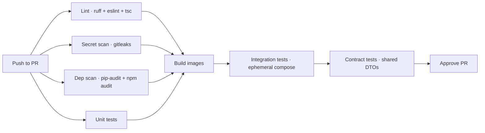
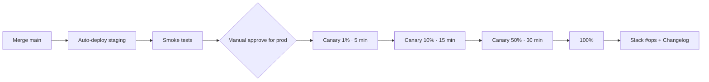

# CI/CD Pipeline

## Today

- No CI configured. Manual builds, manual deploys.

## Target

### CI per push to PR



### CD per merge to main



### Tools

| Concern | Tool |
|:--------|:-----|
| CI runner | GitHub Actions / GitLab CI / Buildkite |
| Lint Python | ruff |
| Lint TS | eslint + tsc |
| Format | black + prettier |
| Secret scan | gitleaks |
| Dep scan | Dependabot + Snyk |
| Container scan | Trivy |
| Unit tests | pytest, vitest |
| Integration | pytest + testcontainers |
| Contract | Pact or schema diff |
| Registry | GHCR / Harbor / ECR |
| Deploy target | K8s (helm) |

### GitHub Actions example (per-service)

```yaml
name: backend-telemetry
on:
  pull_request:
    paths: ['backend/telemetry/**', 'shared/**']
  push:
    branches: [main]
    paths: ['backend/telemetry/**', 'shared/**']
jobs:
  test:
    runs-on: ubuntu-latest
    steps:
      - uses: actions/checkout@v4
      - uses: actions/setup-python@v5
        with: { python-version: '3.11' }
      - run: pip install -r backend/telemetry/requirements.txt -r shared/requirements.txt
      - run: ruff check backend/telemetry
      - run: pytest backend/telemetry/tests -v
      - run: docker build -f backend/telemetry/Dockerfile -t telemetry:${{ github.sha }} .
      - uses: aquasecurity/trivy-action@master
        with: { image-ref: 'telemetry:${{ github.sha }}' }
```

### Branch protection

`main` requires:

- 1 approving review
- All CI checks passing
- No merge commits (linear history)
- Up-to-date with main

Tracked: [[13 - Yet to Implement/Infra - CI Pipeline]].
