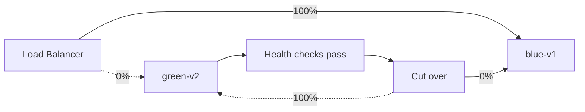

# Deployment Strategies

## Today

`docker compose up --build -d` on a single host. **No** rolling deploy. **No** rollback. **No** health gating.

## Target

### Blue/Green per service



### Canary for stateless services

| Stage | Traffic % | Promotion gate |
|:------|:---------:|:---------------|
| 1 | 1% | 5 min · no SLO breach |
| 2 | 10% | 15 min |
| 3 | 50% | 30 min |
| 4 | 100% | – |

Promotion gates check the SLOs in [[SLOs & SLIs]]. If any breach → automatic rollback.

### Stateful service caution

Telemetry, THG, Task — these have ongoing work (batch processor, etc.). Use:

- **Drain on shutdown** — service refuses new work, finishes in-flight
- **K8s `preStop` lifecycle hook** — wait 30s before SIGTERM
- **Graceful FastAPI shutdown** — done via Lifespan context

### Database migrations

Two-phase always:

1. **Expand** (forward-compat): add new field/index/etc. — both old and new code work
2. Deploy new code
3. **Contract** (backward-incompat): remove old field/index — only new code works

Never run "deploy + breaking migration" in one step.

Tracked: [[13 - Yet to Implement/Infra - Migration Framework]].

### Feature flags

Use a flag service (LaunchDarkly / Flagsmith / Unleash) for:

- Per-tenant rollout of new fusion engine versions
- Killswitch on `Data Explorer` per environment
- Beta routes (Simulation Mode, new dashboards)

### Rollback procedure

```bash
# Cut traffic back
kubectl rollout undo deployment/fusion-service

# Verify
kubectl rollout status deployment/fusion-service
curl https://gateway/api/v1/fusion/health
```

For DB migrations:

```bash
# Reversible migration
make migrate-down VERSION=20260524_001
```

Migrations must be **reversible by design**. Document the down-path with every up-path.
