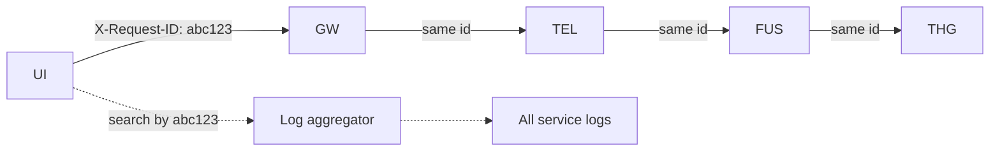

# Observability Stack

## The three pillars

| Pillar | Today | Target |
|:-------|:------|:-------|
| **Logs** | `print()` and `logger.info` to stdout | Structured JSON → Loki / CloudWatch |
| **Metrics** | None | Prometheus + Grafana |
| **Traces** | None | OpenTelemetry → Tempo / Jaeger |

## Trace IDs end-to-end

Every request carries `X-Request-ID` (generated at gateway if absent). Every log entry includes it. Every cross-service call propagates it.

This is **non-negotiable** for prod. Without it, debugging an ingest issue means tail-following 4 services manually.

Tracked: [[13 - Yet to Implement/Backend - All - Structured Logs + TraceID]].

## Metrics to emit per service (P1)

| Metric | Type | Labels |
|:-------|:-----|:-------|
| `http_requests_total` | counter | service, method, path, status |
| `http_request_duration_seconds` | histogram | service, method, path |
| `outbound_requests_total` | counter | service, target, status |
| `outbound_request_duration_seconds` | histogram | service, target |
| `db_query_duration_seconds` | histogram | service, db, collection_or_label, op |
| `mongo_pool_size` | gauge | service |
| `neo4j_session_active` | gauge | service |
| `redis_publish_total` | counter | channel |
| `audit_log_entries_total` | counter | action, source |

Service-specific:

| Service | Metric |
|:--------|:-------|
| Telemetry | `batch_processor_lag_seconds`, `unprocessed_raw_count`, `batch_duration_seconds` |
| Fusion | `codebert_inference_duration_seconds`, `reliability_score_bucket` |
| THG | `gds_fallback_used_total`, `cypher_query_duration_seconds` |
| Allocation | `match_score_distribution`, `hungarian_solve_duration_seconds` |

## Grafana dashboards (P1)

- **System overview**: `up{}` per service, request rate, error rate
- **Telemetry pipeline**: ingest rate, batch lag, fusion duration, THG write rate
- **Fusion deep dive**: CodeBERT latency, reliability score histogram, fraud_flag rate
- **Per-tenant** (if multi-tenant): RED metrics per tenant_id
- **SLO board**: error budget burn rate per SLO

## Alerts (P1)

| Alert | Condition | Severity |
|:------|:----------|:--------:|
| Ingest down | `up{service="telemetry"} == 0` for 1m | P0 |
| Auth down | `up{service="auth"} == 0` for 1m | P0 |
| Batch lag high | `batch_processor_lag_seconds > 600` | P1 |
| Unprocessed pile-up | `unprocessed_raw_count > 50_000` | P1 |
| Fusion 5xx spike | `rate(http_requests{service="fusion", status=~"5.."}[5m]) > 0.05` | P1 |
| Fraud flag spike | `rate(reliability_score < 0.5) > 10× baseline` | P2 |
| GDS fallback in use | `gds_fallback_used_total > 0 for 5m` | P3 |
| Cert expiring | `< 14 days` | P2 |
