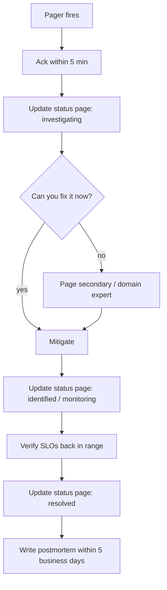

# On-Call Playbook

## Rotation

- 1-week shifts, follow-the-sun (2 regions ideally)
- Secondary on-call paired for handoff overlap
- No solo on-call for the first 3 months of a new joiner

## Tools

- **Pager**: PagerDuty / Opsgenie
- **Comms**: dedicated Slack channel `#ops-pager`
- **Status page**: statuspage.io / Atlassian Status
- **Postmortem template**: in `docs/postmortems/template.md`

## Severities

| Sev | Definition | Page? | Response time |
|:---:|:-----------|:-----:|:--------------|
| P0 | Customer-facing outage (ingest down, login down) | ✓ 24/7 | 5 min |
| P1 | Partial degradation (one feature broken, batch lag >1h) | ✓ business hours | 15 min |
| P2 | Single-customer issue or minor bug | ticket | next business day |
| P3 | Observation / cleanup | ticket | within sprint |

## Incident steps

## Mitigations cheatsheet

| Symptom | Try first |
|:--------|:----------|
| Service 5xx spike | `kubectl rollout undo deploy/<svc>` |
| Batch processor lagging | scale telemetry-service pods × 2; check Fusion latency |
| Fusion 5xx | restart fusion pods (CodeBERT cold-start can wedge memory) |
| Auth login latency | check Mongo Atlas page; verify bcrypt cost not raised accidentally |
| THG slow | check Neo4j Aura console; switch to fallback Cypher if GDS errors |
| WS audit HUD dead | Redis up? leader election healthy? |
| 502 from gateway | Check `*_URL` env vars resolved correctly |

## What to capture during incident

1. Pager fired at: T
2. Acknowledged at: T+
3. First impact metric (5xx rate, latency, etc.)
4. Likely cause within 15 min (revert? scale? config?)
5. Mitigation applied at: T+
6. Service restored at: T+
7. Full root cause (after the fact): file

## After: postmortem

Within 5 business days. Template covers:

- Timeline (millisecond precision where possible)
- Impact (users affected, dollar cost)
- Root cause (5-whys)
- What went well
- What went poorly
- Action items (each tracked in [[13 - Yet to Implement/_MOC]])

**Blameless** by policy. The mistake is the bug; the bug is the system's fault for letting the mistake be possible.
