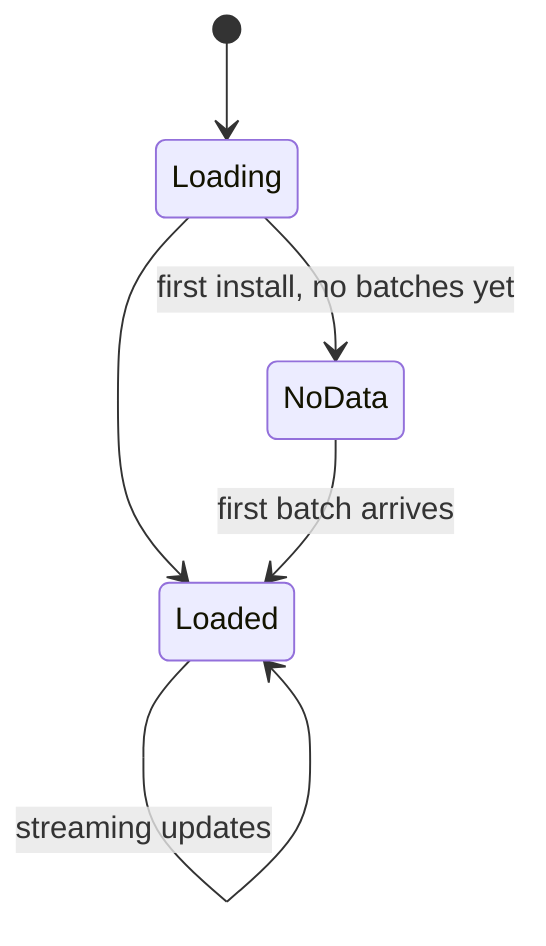

# Dashboard Layouts — Developer

## Goal

Show the dev *their own* Twin clearly + nudge growth. Never feel like surveillance.

## Layout (1280 px)

```
┌──────────────────────────────────────────────────────────────────────┐
│  ADT · alice                              [extension ●]  [⋮ Menu]    │
├──────────────────────────────────────────────────────────────────────┤
│ ┌────────────────────────────┐  ┌─────────────────────────────────┐  │
│ │                            │  │ Trend · 14 days                 │  │
│ │   ⟨ 8-axis radar ⟩         │  │ ████▆▆▅▅▆▇█  backend  +0.04    │  │
│ │   (live decay applied)     │  │ ▆▆▅▅▅▄▄▄▄▃  database +0.01    │  │
│ │                            │  │ ▃▃▄▄▅▅▅▆▆▇  ml      +0.08    │  │
│ │   strongest: backend 0.82  │  │ ...                            │  │
│ └────────────────────────────┘  └─────────────────────────────────┘  │
│                                                                      │
│ ┌── Open tasks ──┐ ┌── Org rank ─────┐ ┌── Assessments ───────────┐  │
│ │ task-1023 backend│ │ #7 of 23 in BE │ │ Backend mid-week         │  │
│ │ task-1029 db    │ │ ↑2 this week    │ │ scheduled · May 28       │  │
│ │ + Show all      │ │                 │ │ [Open]                   │  │
│ └─────────────────┘ └─────────────────┘ └──────────────────────────┘  │
│                                                                      │
│ ┌── What changed today (audit) ─────────────────────────────────────┐│
│ │ 12:04  backend  0.78 → 0.82  +0.04  (batch 12:00–12:05)           ││
│ │        primary: telemetry · secondary: semantic snippets          ││
│ │ 11:31  ml       0.34 → 0.36  +0.02                                ││
│ │ 09:15  testing  0.55 → 0.53  −0.02  (low recent activity)         ││
│ │ [See history]                                                     ││
│ └───────────────────────────────────────────────────────────────────┘│
└──────────────────────────────────────────────────────────────────────┘
```

## Sections

### Header strip

- Brand, user name
- Extension status dot (green/amber/red — see [[04 - VS Code Extension/Commands & Status Bar]])
- Menu (Settings, Export my data, Pause telemetry, Sign out)

### Skill radar

- 8 axes, [[Color System|colored per skill]]
- Live decay applied at render
- Hover any axis → strength, confidence, last update timestamp, SHAP rationale
- Compare mode (planned) → overlay against `org_median`

### Trend

- 14-day sparkline per skill, sorted by recent movement
- Right-side delta `+0.04` colored by sign
- Click → expand to full trend chart

### Open tasks

- Cards: title, primary skill, due
- Empty state: "No tasks assigned. Manager can assign one for you."

### Org rank

- Position within `primary_domain`
- Trend arrow this week
- Click → full leaderboard (anonymized initials by default)

### Assessments

- Pending (single-attempt) and recent results
- Click → assessment runner ([[11 - Simulation Mode/Sim Mode - Embedded IDE Panel|sim]] uses similar UI)

### What changed today

- Last 5 audit entries scoped to this user
- Each row: time, skill, before → after, delta, rationale snippet
- Click → expand for full SHAP attribution

## What this view does NOT show

- Other devs' code, scores, or names by default (only positions in leaderboard)
- Your own raw telemetry pings (available in Settings → My Data)
- Manager opinions / notes (those exist in the PM view, with the dev's awareness when appropriate)

## States



NoData state copy: "Telemetry begins after your first 5-minute window. Hold tight."
