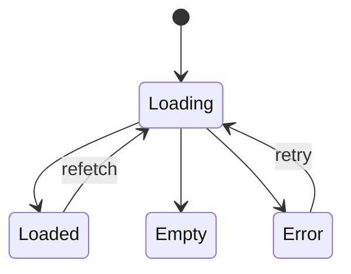

# Motion & Animation

> Motion communicates causality. A change that "just appears" is invisible; a change that **moves** is read.

## Principles

1. **Motion must explain.** If you can't say what the motion is teaching, don't animate.
2. **Cap durations.** Most transitions ≤ `200ms` (token: `base`). Anything longer needs justification.
3. **No bounce, no overshoot.** This isn't a consumer app.
4. **Sim Mode is the exception.** Theatrical pacing there. See [[11 - Simulation Mode/Sim Mode - Screen Choreography]].
5. **Respect `prefers-reduced-motion`.** Disable everything non-essential.

## Patterns

### Skill radar morph

When a new fusion result arrives, the radar tweens to the new shape over `350ms` (token: `calm`). A tiny annotation `+0.03` floats above the touched axis, fades after `1200ms`.

### Audit HUD row insertion

New row slides in from top with `150ms` ease-out; older rows shift down. After the buffer fills, older rows fade off the bottom at `200ms`.

### Streaming dashboard data

Use **skeleton → real** (no spinner blur). Skeleton shimmer at `1500ms` cycle, low contrast (only barely perceptible). Skeleton stays until first byte; once data arrives, replace with `120ms` fade.

### Mode switch (Real ↔ Sim)

Full-screen fade `600ms` plus a one-time pulse of the brand color. Don't reuse this for anything else.

## Anti-patterns

| Don't | Why |
|:------|:----|
| Bounce on form submit | Trivializes the action |
| Confetti on positive metric change | This product judges people; celebratory feels wrong |
| Spinner that never times out | Make all spinners have a deadline + fallback |
| Cross-fade between two info panels | Use slide + parallax instead — clearer causality |
| Auto-scrolling tables | Disorienting; let the user scroll |

## Mermaid for state transitions in UI

State transitions in components are documented in their notes as Mermaid:

