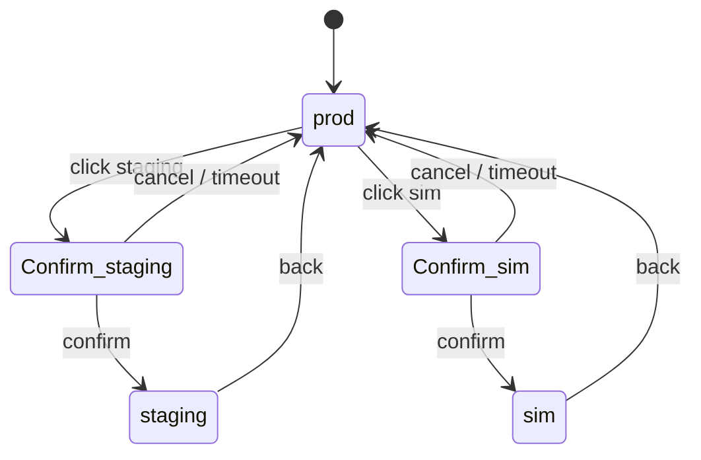

# Mode Switcher Design

## Where

Top-right of the Tech Admin dashboard:

```
[ prod ▾ ]  ← clicking opens the switcher
```

Submenu:

```
┌─────────────────────────────┐
│  Environment                │
├─────────────────────────────┤
│  ● prod                     │
│  ○ staging                  │
│  ○ sim   (investor demo)    │
└─────────────────────────────┘
```

Other roles **do not see** the switcher. Developers and PMs only see their assigned env.

## Constraints

1. **Switching takes 5 seconds with a full-screen confirmation.** No accidental clicks.
2. **The confirmation explicitly states which environment you're entering.**
3. **The page chrome color changes** so the user *cannot* forget which mode they're in:
   - prod → neutral
   - staging → orange top border, "STAGING" badge
   - sim → indigo/pink gradient border, "SIM MODE" badge ([[Color System#Sim Mode accent]])
4. **An audit entry is written** every mode switch (`action: mode_switched`).

## State machine



## Implementation

```ts
const [mode, setMode] = useState<"prod"|"staging"|"sim">("prod");

async function switchMode(target: typeof mode) {
  const confirmed = await showFullscreenConfirm({
    title: `Switch to ${target.toUpperCase()}?`,
    body: target === "sim"
      ? "Sim Mode is for demos. Telemetry is synthetic. Dashboards reflect a sandboxed copy."
      : "Staging is a real environment with PII-scrubbed data.",
    confirmText: `I understand · switch to ${target}`,
    holdMs: 5000,  // require 5s hold on confirm button
  });
  if (!confirmed) return;
  await api.post("/admin/mode-switch", { target });
  // Audit emitted server-side
  setMode(target);
}
```

The `holdMs: 5000` forces the user to **hold** the button — no quick double-click.

## URL design

- prod: `https://app.adt.example.com`
- staging: `https://staging.adt.example.com`
- sim: `https://demo.adt.example.com`

Separate subdomains = different cookies = no accidental cross-env auth.

## What the dev sees

If a developer is in the sim env (via a magic link the demo presenter shared), their dashboard shows a **persistent banner**:

```
You are viewing the SIM environment. Data is synthetic.
```

Banner is unmissable; sticky; full width; semantic-warning color.

Tracked: [[13 - Yet to Implement/Frontend - Mode Switcher]].
