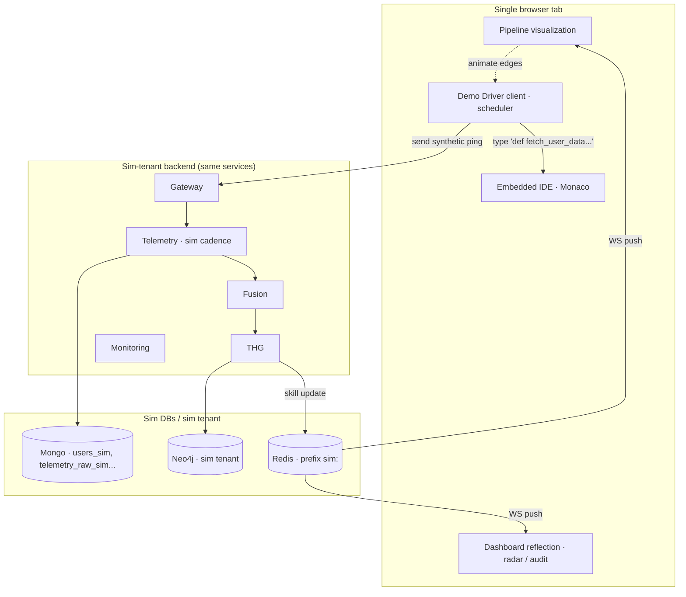
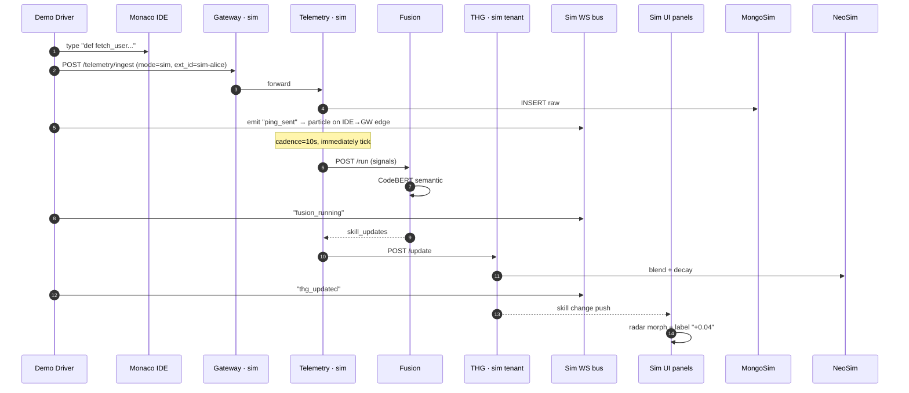

# Sim Mode — Architecture

## High-level



## Key components

### Demo Driver (client-side)

A scripted state machine that:

1. Picks a step from a recipe (e.g., "Alice types backend code")
2. Types into the Monaco editor (visible char-by-char) at a configurable WPM
3. Triggers synthetic telemetry POSTs at the matching cadence
4. Drives the screen choreography (highlight pipeline stages as they "activate")

### Embedded IDE

Monaco editor instance, themed dark, full syntax highlighting. **No real file system** — purely virtual content.

### Pipeline visualization

A live Mermaid-ish flowchart (built with xyflow / custom SVG) showing the path:

```
IDE ─ping→ Gateway ─→ Telemetry ─batch→ Fusion ─update→ THG ─reflect→ Dashboard
```

As each stage activates, the node pulses with the brand color. As events flow through, particles travel along the edges.

### Dashboard reflection

A miniaturized version of the [[Dashboard Layouts - Developer|Developer dashboard]] for the persona being demoed. Updates in real time as Fusion + THG fire.

## Same services, different cadence

Sim Mode does NOT spin up separate services. It uses **the same backend** with:

- `BATCH_INTERVAL_MINUTES` overridden to 10/60 = 0.16 min via env `SIM_BATCH_INTERVAL_SECONDS=10`
- `HEARTBEAT_INTERVAL_SECONDS=1` (instead of 30)
- A short-circuit `if mode == "sim": tenant = "sim"` at the auth layer

All other code paths are identical. **The Twin you watch evolve in sim is computed by the same Fusion engine that computes prod twins.**

## Data flow



## What's faked

| Element | Real | Faked |
|:--------|:-----|:------|
| Backend service code paths | ✓ | – |
| CodeBERT inference | ✓ | – |
| THG decay + blend math | ✓ | – |
| The dev typing | – | ✓ — Demo Driver scripts |
| Heartbeat cadence | – | ✓ — sped up |
| Pipeline visualization | – | ✓ — entirely synthetic UI |
| Particles on edges | – | ✓ — visual flourish |

## Telemetry input source

Sim never reads `prod.telemetry_raw`. The Demo Driver constructs each ping payload at typing time from the IDE's actual contents:

```ts
const snippet = monacoEditor.getValue();
const ping = {
  extension_id: "sim-alice",
  machine_id: "sim-machine-001",
  sync_type: "DELTA",
  wpm: 45,
  keystrokes: 23,
  commands_executed: 1,
  idle_seconds: 0,
  active_file: "scripts/api.py",
  languages_used: { "python": 30 },
  code_snippet: snippet,
  timestamp: new Date().toISOString(),
};
await api.post("/telemetry/ingest", ping);
```

So the dashboard radar reflects **the actual code typed in the embedded IDE**. That's the cinematic part.
