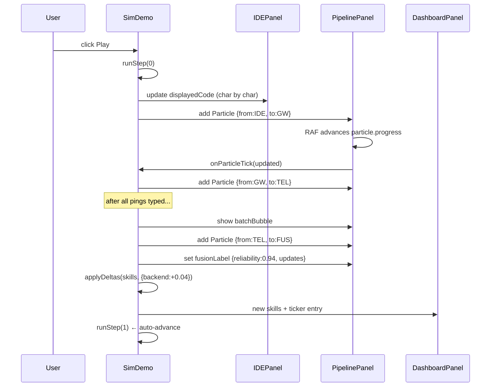

# Sim Mode — Architecture

## Phase 1 (implemented) vs Phase 2 (planned)

### Phase 1 — self-contained frontend demo ✅

Everything runs in the browser. No backend services required. The pipeline is simulated with animated React state; no real API calls are made. This is the version currently live at `/sim`.

```
┌─────────────────────────────────────────────────────┐
│  Browser tab — /sim                                  │
│                                                      │
│  ┌──────────────┐  ┌─────────────────┐  ┌─────────┐ │
│  │  IDE Panel   │  │ Pipeline Panel  │  │ Dash    │ │
│  │  (IDEPanel)  │  │ (PipelinePanel) │  │ Panel   │ │
│  └──────────────┘  └─────────────────┘  └─────────┘ │
│          ↑                   ↑               ↑       │
│          └───────── SimDemo.tsx ──────────────┘      │
│              (state machine + step runner)           │
└─────────────────────────────────────────────────────┘
```

**What is real:** typing animation, particle animation, radar morphs, skill math, fraud detection logic

**What is faked:** every HTTP call — no actual Telemetry, Fusion, or THG service is contacted

### Phase 2 — backend-connected (not yet built)

The original architecture doc described connecting to real backend services (same services, different cadence). That remains the long-term goal. See [[13 - Yet to Implement/Simulation - Mode Switch + Seed Data]].

---

## Phase 1 file map

```
frontend-nextjs/src/
├── app/sim/
│   └── page.tsx                  ← route entry, server component
├── components/sim/
│   ├── SimDemo.tsx               ← main orchestrator, 'use client'
│   ├── IDEPanel.tsx              ← fake VS Code editor
│   ├── PipelinePanel.tsx         ← SVG node graph + particles
│   └── DashboardPanel.tsx        ← radar + ticker
└── lib/sim/
    ├── types.ts                  ← all TypeScript types
    └── demoScript.ts             ← personas, code snippets, 7-step recipe
```

## SimDemo.tsx — the orchestrator

`SimDemo.tsx` is a single `'use client'` component that owns all sim state and runs the demo.

**State shape:** `SimState` (see `lib/sim/types.ts`)

| Field | Purpose |
|:------|:--------|
| `stepIdx` | which step of the script we're on |
| `playing` | auto-advance vs manual |
| `caption` | current narrator text |
| `persona` | `'alice'` or `'bob'` |
| `displayedCode` | current IDE content |
| `pingFlash` | triggers LIVE badge pulse |
| `activeNode` | highlighted pipeline node |
| `particles` | RAF-animated particle list |
| `fusionLabel` | Fusion result overlay |
| `batchBubble` | batch ID text in pipeline |
| `skills` | current `SkillMap` |
| `ticker` | last 3 skill changes |

**Step runner:** `runStep(idx)` is an async function that processes one demo step's actions (load file → type → ping → batch → fusion → THG → reflect) using `setTimeout`-chained promises. A `stopRef` cancels in-flight steps when the user pauses or jumps.

**Particle engine:** `PipelinePanel` runs a `requestAnimationFrame` loop that advances particle `progress` from 0→1 over 500ms and calls back `onParticleTick` to update SimDemo's state.

## Key design decisions

### No Monaco

The IDE panel is a custom `<div>` styled to match VS Code dark theme, with a hand-written Python/TypeScript tokenizer. This eliminates the Monaco SSR complications, removes a heavy dependency, and lets us control every pixel. For investor demos, visual fidelity is indistinguishable.

### No backend calls

Phase 1 is fully self-contained. A backend outage does not break the demo. The fraud detection logic, skill math (Bayesian blend), and decay simulation all run as JavaScript arithmetic in the browser, mirroring the real server-side logic.

### Single component orchestrates everything

Rather than a WS bus + subscriber pattern, Phase 1 uses a direct React state machine. When Phase 2 wires in the real backend, we swap `runStep()` to call real APIs and subscribe to WS events, but the rendering layer (`IDEPanel`, `PipelinePanel`, `DashboardPanel`) stays unchanged.

## Data flow — Phase 1



## What's faked vs real — Phase 1

| Element | Phase 1 | Phase 2 |
|:--------|:--------|:--------|
| IDE typing animation | Faked (scripted) | Faked (scripted) |
| Pipeline particles | Faked (visual only) | Visual overlay on real WS events |
| Fusion computation | Faked (JS arithmetic) | Real Fusion service |
| Skill updates | Faked (hardcoded deltas) | Real THG writes |
| Fraud detection demo | Faked (forced flag) | Real anomaly detection |
| Batch cadence | N/A (instant sim) | Real service at 10s override |
| Hardware lock | N/A (no extension) | Pre-seeded sim whitelist row |
