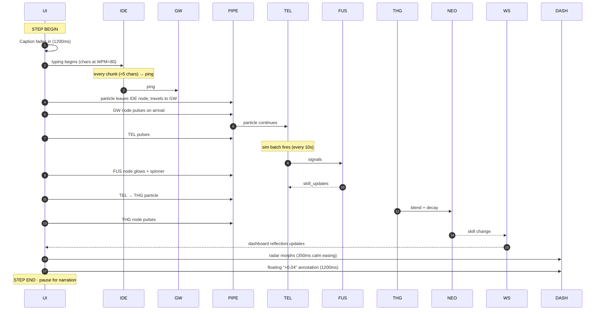

# Sim Mode — Screen Choreography

## The layout (1920 × 1080, designed for projection)

```
┌──────────────────────────────────────────────────────────────────────────────┐
│  ADT · LIVE DEMO     [persona: alice]    [▶ Play] [⏸] [⏭] [⏮]    sim badge  │
├───────────────────┬──────────────────────────────┬───────────────────────────┤
│                   │                              │                           │
│   IDE (Monaco)    │   Pipeline                   │   Dashboard reflection    │
│   ~ 38% width     │   ~ 32% width                │   ~ 30% width             │
│                   │                              │                           │
│   def fetch_user( │   ┌──┐    ┌──┐    ┌──┐       │   ┌─ radar ─┐             │
│       user_id):   │   │ID│●→ │GW│●→ │TEL│       │   │ ⟨...⟩    │             │
│     return ...    │   └──┘    └──┘    └──┘       │   │ backend  │             │
│                   │                ↓             │   │  0.78 →  │             │
│   class Repo:     │                              │   │  0.82 ▲  │             │
│     ...           │              ┌──┐            │   └──────────┘             │
│                   │              │FUS│ ⟨pulse⟩   │                           │
│                   │              └──┘            │   What just changed:      │
│                   │                ↓             │   • backend +0.04          │
│                   │              ┌──┐    ┌──┐    │   • database +0.01         │
│                   │              │THG│●→ │UI│   │                           │
│                   │              └──┘    └──┘    │   primary driver:         │
│                   │   "Fusion · v2.0-top-tier"   │     telemetry             │
│                   │   "reliability: 0.94"        │   secondary:              │
│                   │                              │     semantic snippets     │
├───────────────────┴──────────────────────────────┴───────────────────────────┤
│  Step 3 of 6 · Alice demonstrates backend skill via a FastAPI endpoint        │
│  Narrator (closed captions): "Watch — as Alice types real FastAPI code, ..." │
└──────────────────────────────────────────────────────────────────────────────┘
```

## Beat sheet (per step)

A "step" is one scripted unit of action. The Demo Driver moves through 6 steps in a 5-minute demo.



## Motion budget

| Element | Duration |
|:--------|:--------:|
| Caption fade in/out | 1200 ms |
| Particle across one edge | 500 ms |
| Node pulse | 600 ms |
| Radar morph | 350 ms |
| Floating annotation | 1200 ms |
| Step gap (silence for narration) | 3000 ms |

Total per step ≈ 8–10 s. Six steps ≈ 60 s of action + narration → ~5 min demo.

## Captions

Each step has a narrator caption (closed-caption strip at bottom):

```
Step 1: "Alice opens VS Code with the ADT extension installed. Her ext_id is locked to her machine."
Step 2: "She starts editing a FastAPI endpoint. Her keystrokes form a snippet."
Step 3: "Every 10 seconds (sped up from 5 minutes in prod), Telemetry batches her pings."
Step 4: "Fusion ingests the batch. CodeBERT scores the snippet's intent — clearly backend."
Step 5: "The Twin's backend confidence moves: 0.78 → 0.82. THG is updated."
Step 6: "Alice's dashboard radar reflects the change in real time."
```

Voiceover optional — caption is the source of truth.

## Step controls

- `▶ Play` — auto-advance through all steps
- `⏸ Pause` — freeze
- `⏭ Next step`
- `⏮ Previous step`
- `↻ Restart` — back to step 1, reset radar to baseline

## Pipeline visualization details

- **Nodes** are pill-shaped boxes with short labels: `IDE`, `Gateway`, `Telemetry`, `Fusion`, `THG`, `Dashboard`
- **Edges** are bezier curves
- **Particles** are small circles that travel along edges (use SVG `<animateMotion>` or a tiny canvas loop)
- **Pulse** = scale 1 → 1.08 → 1, opacity dip, glow inset for 600 ms
- **Stage badges** float above active nodes: "v2.0-top-tier", "reliability 0.94", "batch BATCH-..."

## Sub-pages for sub-flows

- [[Sim Mode - Embedded IDE Panel]] — Monaco config + typing engine
- [[Sim Mode - Telemetry Stream]] — per-keystroke ping logic
- [[Sim Mode - Fusion Live View]] — what we surface during the FUS pulse
- [[Sim Mode - THG Live Update]] — graph node visualization on THG pulse
- [[Sim Mode - Dashboard Reflection]] — the right panel
- [[Sim Mode - Investor Script]] — the actual recipe to demo
