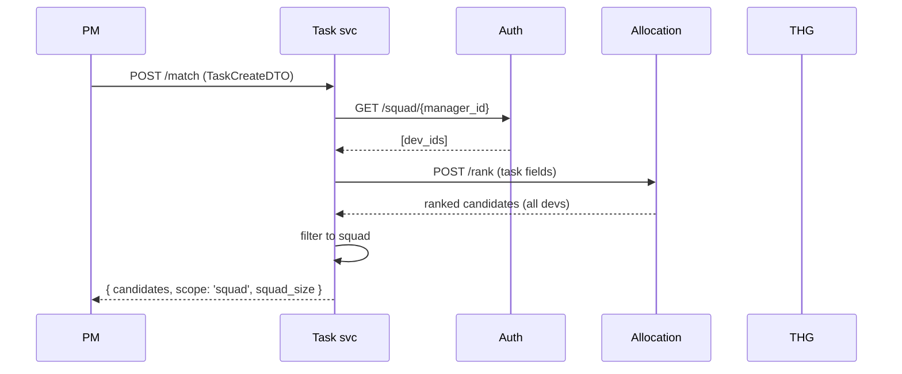

# Task Service

## Identity

| | |
|:---|:---|
| Port | `8008` → `8000` |
| Hostname | `task-service` |
| Code | `backend/task/` |
| Entry | `backend/task/app/main.py` |
| Health | `GET /api/v1/task/health` |

## Responsibilities

- **Task creation** with squad-scoped candidate matching
- **Assignment** (idempotent, via THG)
- **Weekly Verification Engine** — assessment lifecycle (planned)
- **BGSC feedback** — bounded skill growth via assessment outcomes

## Routes

### `tasks` router — `prefix /api/v1/task`

| Method | Path | Handler | Purpose |
|:-------|:-----|:--------|:--------|
| POST | `/match` | `match_candidates(TaskCreateDTO)` | Squad-scoped preview ranking |
| POST | `/create` | `create_task(TaskCreateDTO)` | Persist + return top 3 candidates |
| POST | `/{task_id}/assign` | `assign_task(task_id, TaskAssignDTO)` | THG ASSIGNED_TO edge |
| GET | `/user/{user_id}` | `get_user_tasks(user_id)` | Tasks for one dev |
| GET | `/all` | `get_all_tasks()` | Not yet dynamically implemented |

### `assessment` router — `prefix /api/v1/task/assessment` (stub)

Planned endpoints:

- `POST /generate` — manager issues assessment
- `POST /submit` — single-attempt locked
- `GET /result/{user_id}/{assessment_id}` — read-only
- Internally invokes BGSC to mutate THG with bounded delta

## Models / DTOs

`shared/models/task.py`:

- `TaskCreateDTO {title, description, required_skills, created_by, ...}`
- `TaskAssignDTO {dev_id}`
- `TaskReviewDTO {task_id, status, notes}`
- `TaskDocument` — stub

## Services / Business logic

### `AllocationClient`, `THGClient`, `FusionClient`, `AuthClient` (`app/api/clients.py`)

Thin wrappers over httpx — see [[02 - System Architecture/Service Communication Matrix#Task → other]].

### `match_candidates` flow

### `create_task` flow

Same as `match`, plus:

1. Generate `task_id`
2. `POST {THG}/task/create` — graph node + REQUIRES_SKILL edges
3. Return top 3 candidates for PM to choose from

### `assign_task` flow

`POST {THG}/record-assignment` — idempotent. THG handles the MERGE of `ASSIGNED_TO`.

## Database

`tasks` collection (Mongo) for richer task metadata beyond what fits as graph properties (long description, attachments URLs, status timeline). Not currently used in code — see Known gaps.

## Env vars

| Name | Purpose |
|:-----|:--------|
| `THG_URL` | task & assignment writes |
| `ALLOCATION_URL` | ranking |
| `FUSION_URL` | (future: re-vectorize on description edit) |
| `MONGO_URI` | tasks collection |
| `REDIS_URL` | future cache |

## Outbound calls

See [[02 - System Architecture/Service Communication Matrix#Task → other]].

## Background tasks

None today. Weekly Verification will need APScheduler or a delayed-queue.

## Known gaps

- **`tasks` Mongo collection unused** — graph stores only `title, description, required_skills`. Long descriptions, comments, status timelines need Mongo. ([[13 - Yet to Implement/Backend - Task - Mongo Tasks Collection]])
- **Assessment router empty** — whole feature is stubbed. P0 for "verified growth" claim.
- **BGSC math not in code** — see [[07 - Algorithms/BGSC Feedback]] for the design; implementation pending.
- **No status field** — task lifecycle (open → in_progress → done → reviewed) isn't modeled.
- **`/all` not implemented** — manager dashboards need this.

---

## Testing

**Test location:** `backend/task/test/`

### Integration tests (`pytest -m integration`)
- `test/integration/test_routes.py` — health, match preview (422 on missing body), create task (422 on missing body)

### Postman
**Task Service** folder — match preview, create task (valid + incomplete body), health check.

### Known edge cases surfaced during testing
- `match` and `create` both call Allocation + THG + Auth in sequence — if any downstream service is down, the task service returns a 500 rather than a partial result
- Assessment anti-cheat: a user can only submit each test once; the uniqueness check is on `(user_id, test_id)` pair in MongoDB — duplicate key error on second submission
