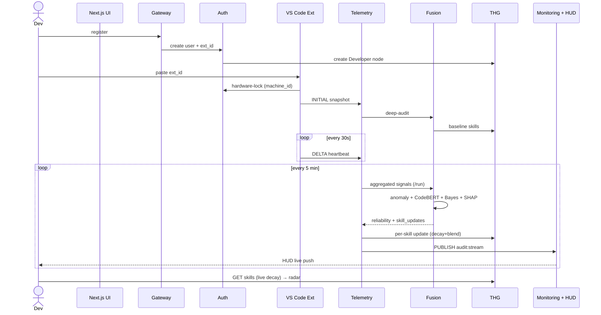

# Adaptive Developer Twin (ADT) — Seminar Companion

> A complete, presentation-ready explanation of the Adaptive Developer Twin platform: the problem it solves, the motivation behind it, its end-to-end workflow, every service and algorithm, all data tables, the THG graph schema, and — most importantly — why the data it produces can be **trusted, audited, and not manipulated**.

---

## Table of Contents

1. [The One-Line Pitch](#1-the-one-line-pitch)
2. [Problem Statement](#2-problem-statement)
3. [Motivation — Why This Problem, Why Now](#3-motivation--why-this-problem-why-now)
4. [What Issues It Resolves (Impact)](#4-what-issues-it-resolves-impact)
5. [Where It Is Useful — Application Areas](#5-where-it-is-useful--application-areas)
6. [Core Objectives & Core Functions](#6-core-objectives--core-functions)
7. [System Architecture — The Big Picture](#7-system-architecture--the-big-picture)
8. [Why These Databases — MongoDB + Neo4j AuraDB + Redis](#8-why-these-databases--mongodb--neo4j-auradb--redis)
9. [The Complete Workflow (End-to-End)](#9-the-complete-workflow-end-to-end)
10. [The 9 Services Explained](#10-the-9-services-explained)
11. [The 10 Pillar Algorithms Explained](#11-the-10-pillar-algorithms-explained)
12. [All the Data Tables](#12-all-the-data-tables)
13. [The THG (Talent / Twin Hyper-Graph) Schema](#13-the-thg-talent--twin-hyper-graph-schema)
14. [Reliability & Trust — Can This Data Be Manipulated?](#14-reliability--trust--can-this-data-be-manipulated)
15. [Honest Limitations](#15-honest-limitations--maturity-of-the-build)
16. [Seminar Talking Points / TL;DR](#16-seminar-talking-points--one-slide-summary)

---

## 1. The One-Line Pitch

> **ADT is a hardware-anchored, server-fused, graph-native "source of truth" about engineering capability** — it builds a live *Neural Twin* of every developer from the code they actually write, without asking them to self-report anything.

Each Twin continuously models four things:

- **Skill strength** per domain — `backend, frontend, devops, ml, database, neo4j, testing, security`
- **Skill confidence** — *how sure* the system is about each strength
- **Influence** — the developer's graph-centrality in the org's knowledge network
- **Velocity & burnout risk** — derived from behavioral telemetry windows

---

## 2. Problem Statement

**How does an engineering organization know what its developers are actually good at — reliably, continuously, and without bias?**

Today the answer comes from three broken sources:

| Source | Why it fails |
|:-------|:-------------|
| **Self-reported skills** (resumes, "I'm a senior backend dev") | Unverifiable, inflated, static — a snapshot from the day someone was hired |
| **Manager intuition** | Subjective, political, biased toward the visible/loud, blind to quiet contributors |
| **Productivity trackers** | Measure *typing*, not *skill*; feel like surveillance; punish the wrong things |

The result: the most consequential engineering decisions — **who builds what, who mentors whom, who gets the stretch role, who is at risk of burning out** — are made on *vibes, politics, and outdated paperwork* instead of evidence.

> **The core problem ADT attacks:** *Engineering capability inside an organization is invisible, self-reported, and untrustworthy — and every decision built on top of it inherits that unreliability.*

---

## 3. Motivation — Why This Problem, Why Now

Three structural shifts make this the right problem at the right time:

1. **AI code generation is a productivity multiplier.** When everyone can ship more code, *raw output* stops differentiating people. **Skill differentiation matters more than ever** — and self-reported skill has never been less reliable.

2. **Remote-first work destroyed the tacit signal.** The hallway conversation, the over-the-shoulder code review, the "ask Priya, she knows Kubernetes" — that informal knowledge graph is gone. A *digital twin* re-creates that signal **without surveillance**.

3. **The org graph is the new resume.** Influence *inside* a company — who other people depend on for knowledge — is one of the strongest predictors of impact and promotion potential. With behavioral data, PageRank-style centrality finally has the substrate to be meaningful.

**The bet:** If we build a Twin that developers *want* to be measured by — because it surfaces their growth and unlocks opportunities — we win. If it feels like surveillance, we lose. Every design decision in ADT is made through that lens.

---

## 4. What Issues It Resolves (Impact)

| Pain today | What ADT delivers |
|:-----------|:------------------|
| Skill data is self-reported and stale | A **live, evidence-backed** skill profile that updates every 5 minutes from real work |
| Task allocation is guesswork | **Mathematically-ranked** task↔developer fit (CSA-Matching) with explainable reasoning |
| Knowledge silos / bus-factor risk is invisible | **Influence graph (PageRank)** surfaces "knowledge hubs" and single points of failure |
| Burnout is noticed *after* someone quits | **Predictive burnout/velocity-decay scoring** (VDA) flags trends *before* they manifest |
| "Trust me, I'm a senior" is unverifiable | Scores are **hardware-anchored, server-fused, and audit-logged** — tamper-resistant by design |
| Mentoring pairs are ad-hoc | Graph suggests **high-influence ↔ low-influence** pairings on specific skills |
| Reviews are subjective and political | A **shared, factual baseline** for "is this person growing in the direction they claim?" |

**The headline impact:** *Engineering decisions grounded in evidence, not politics.*

---

## 5. Where It Is Useful — Application Areas

- **Enterprise engineering orgs** — squad staffing, internal mobility, promotion evidence, succession planning.
- **Consulting / services firms** — bench management; match the right engineer to the right client engagement by verified skill.
- **Remote & distributed teams** — re-create the lost "who-knows-what" signal without monitoring screens.
- **Engineering management & HR analytics** — objective, aggregated capability insight; early burnout intervention.
- **Hiring & onboarding** — evaluate a candidate's skill profile's *projected influence* against an existing org; measure ramp-up of new hires.
- **Learning & development** — show developers concrete, evidence-backed growth and skill-gap targets; auto-match mentors.
- **Academic / bootcamp settings** — track genuine skill acquisition over a cohort rather than relying on exam scores alone.

---

## 6. Core Objectives & Core Functions

### The two core objectives (the founding framing)

1. **Allot the right task to the right developer.** The Allocation Engine consumes the THG and ranks candidates by *mathematical fit*, not seniority or who-shouted-loudest.
2. **Audit the developer — not surveil them.** Answer *"is this person growing in the directions they claim?"* with **evidence, not vibes.**

### Core functions

| Function | Owning component |
|:---------|:-----------------|
| **Passive telemetry capture** — keystrokes, WPM, files, snippets, idle, commands | VS Code Extension |
| **Anti-spoofing** — bind each telemetry source to one physical machine | SHA-HWID Anchor (Auth) |
| **Stream → signal conversion** — turn noisy 30 s pings into meaningful 5-min windows | SWEF-Ingestion (Telemetry) |
| **Semantic + structural code understanding** | CodeBERT + SCM-Audit (Fusion) |
| **Fraud / bot detection** | Reliability Score Model (Fusion) |
| **Evidence fusion** — combine all signals into one strength + confidence per skill | Bayesian Skill Fusion (Fusion) |
| **Skill decay over time** — skills fade if not exercised | Temporal Decay Model (THG) |
| **Influence ranking** — find knowledge hubs | EVC-Influence / PageRank (THG) |
| **Task↔dev matching** | CSA-Matching (Allocation/Task) |
| **Burnout prediction** | VDA-Oversight (Analytics) |
| **Real-time auditability** | Async-Redis-WS + Audit Log (Monitoring) |
| **Explainability of every score change** | SHAP Explainability (Fusion) |

### What ADT explicitly is **NOT** (the anti-claims)

- ❌ A keystroke productivity tracker for HR to punish slow typers
- ❌ A code-quality linter or static analyzer
- ❌ A code-review tool
- ❌ A surveillance product — telemetry windows are configurable, and the developer **always sees their own data**

---

## 7. System Architecture — The Big Picture

ADT is a **microservices architecture**: 9 independent backend services behind a single API Gateway, three purpose-built data stores, a VS Code extension as the *sole* telemetry source, and a Next.js dashboard.

```
Developer types in VS Code
    │
    ▼
VS Code Extension  ──(SHEC-handshake + encrypted heartbeat every 30 s)──▶
    │
    ▼
API Gateway (:8000)   ← CORS + IP whitelist + routing
    │
    ├── Auth Service        (:8001)  — identity, hardware lock, sessions
    ├── Telemetry Service   (:8002)  — ingest, SWEF sliding-window, batch queue
    ├── Fusion Service      (:8003)  — CodeBERT + SCM-Audit + reliability scoring
    ├── THG Service         (:8004)  — Neo4j Neural Twin, PageRank influence
    ├── Allocation Engine   (:8005)  — vector-space candidate ranking
    ├── Analytics Service   (:8006)  — leaderboard, composite scores, VDA burnout
    ├── Monitoring Service  (:8007)  — system health, runtime config, audit log
    └── Task Service        (:8008)  — task creation, CSA-matching, assessments

Persistence
    ├── MongoDB Atlas   — users, telemetry, batches, audit logs (document store)
    ├── Neo4j AuraDB    — skill graph, influence map, Neural Twin (graph store)
    └── Upstash Redis   — real-time pub/sub for the Live Audit HUD (ephemeral)
```

### The three architectural pillars of reliability

1. **Hardware Anchoring** — every telemetry packet originates from a hardware-bound extension; account-sharing is defeated.
2. **Server-side fusion** — *all* behavioral analysis runs in the backend "black box." Developers **cannot** tamper with their own scores; they never compute them.
3. **Identity isolation** — developers, managers, and tech staff live in **separate database collections**. Privilege escalation is *physically impossible* without DB-level access.

---

## 8. Why These Databases — MongoDB + Neo4j AuraDB + Redis

ADT deliberately uses **three different databases**, each chosen for a job the others would do badly. This "polyglot persistence" is one of the most defensible design decisions in the project — and a great seminar talking point, because the *shape of the data dictates the store*.

### The one-line rationale

| Store | What it natively excels at | Why ADT needs exactly that |
|:------|:---------------------------|:---------------------------|
| **MongoDB Atlas** (document) | Flexible, schema-evolving documents + high-volume time-series writes | Telemetry shape keeps evolving; millions of heartbeat records need cheap, fast, schema-light inserts |
| **Neo4j AuraDB** (graph) | Relationships as first-class citizens; native graph algorithms | The Twin *is* a graph — skills, influence, mentoring, task-fit are all **relationship** questions |
| **Upstash Redis** (in-memory) | Sub-millisecond latency + pub/sub | Real-time Live Audit HUD + ephemeral sessions need instant fan-out, not durable storage |

### Why MongoDB (and not a SQL database like Postgres)?

1. **The telemetry shape is still evolving.** Every aggregation choice in SWEF is under quarterly review; new behavioral signals (copy-paste count, error ratios, commit counts) get added over time. A rigid SQL schema would force a migration for every new field. MongoDB's **BSON document model absorbs schema change for free** — `telemetry_raw` and `telemetry_batches` can grow new fields without `ALTER TABLE` pain.
2. **It's a write-heavy, time-series workload.** At 30-second heartbeats × thousands of developers, the system ingests a constant firehose of append-only records. MongoDB handles **high-volume document inserts** with horizontal scale (sharding) far more naturally than a normalized relational schema with foreign keys.
3. **The data is naturally document-shaped.** A telemetry batch — with its nested `aggregated_signals`, `fusion_result`, `top_files` map, and `language_distribution` — is *one self-contained document*. In SQL this would explode into 5–6 joined tables; in Mongo it's a single read/write. The same is true for a user profile (with its arrays of `strong_domains` and `github_project_urls`) and an audit entry (with arbitrary `before`/`after`/`details` blobs).
4. **It enables identity isolation cleanly.** The security model deliberately uses **three separate collections** (`users`, `managers`, `tech_staff`). Mongo makes spinning up isolated, independently-indexed collections trivial — collection boundaries *are* part of the privilege-escalation defense.
5. **Async-native drivers.** ADT's services are async FastAPI; Mongo's **Motor** async driver (pool 5–50) fits the non-blocking I/O model without thread-pool gymnastics.
6. **Atlas = zero-ops managed cloud.** Free shared tier, built-in network whitelisting, automatic backups — no database server to run locally.

> **The trade-off (honestly):** Mongo gives up strict relational integrity and joins. ADT accepts this because telemetry doesn't need cross-row transactions — and the *one* place relationships genuinely matter (skills/influence) is handled by Neo4j instead.

### Why Neo4j AuraDB (and not store skills as rows in Mongo)?

**Because the Neural Twin is fundamentally a graph, and graph questions are slow and ugly in a document/relational store.**

1. **Relationships are the product, not metadata.** The core entities — `Developer`, `Skill`, `Manager`, `Task` — are connected by meaningful, property-carrying edges (`HAS_SKILL` carries strength/confidence/decay timestamp; `MANAGES` defines squads; `REQUIRES_SKILL` carries weight). In Neo4j these are **first-class, indexed, traversable** objects. In Mongo they'd be foreign-key-style references you'd have to manually stitch together in application code on every read.
2. **The flagship algorithm is a native graph algorithm.** **EVC-Influence is PageRank** over the Developer↔Skill graph. Neo4j's GDS library runs `gds.pageRank` over 10k developers in ~200 ms. Implementing PageRank by hand over Mongo documents would mean loading the entire graph into memory and iterating — re-inventing exactly what Neo4j gives you natively.
3. **Multi-hop queries are cheap.** "Who is in this manager's squad?" = one `MANAGES` hop. "Find a high-influence backend mentor for this low-influence junior" = a graph traversal. "Which developers can cover this task's required skills?" = pattern match on `REQUIRES_SKILL` + `HAS_SKILL`. These multi-hop relationship queries are Neo4j's home turf; in SQL they're recursive-join nightmares, and in Mongo they're N+1 application-side loops.
4. **Decay-on-read lives naturally in Cypher.** The temporal decay `strength × exp(-0.1 × days)` is computed **inside the query** at read time — no background job, every read is current. Cypher's expressiveness makes this a one-liner.
5. **The graph model avoids duplicate state.** There is deliberately **no `Squad` node** — a squad is just "the set of developers `MANAGES`-linked to a manager." The graph lets the org structure *emerge* from relationships instead of being redundantly stored.
6. **AuraDB = managed graph cloud + graceful degradation.** Free managed instance, and when the GDS plugin isn't available on the free tier, the **Native Cypher Fallback** (Pillar 10) substitutes a skill-density approximation — so the system degrades gracefully rather than failing.

> **The architectural invariant:** *only the THG service writes to Neo4j.* Every other service requests skill changes via the THG REST API. This keeps the graph's integrity centralized and auditable.

### Why both together? (the synthesis)

The two stores divide along a clean line: **MongoDB owns the *facts* (events, profiles, audit), Neo4j owns the *relationships and analytics* (the Twin).**

```
MongoDB (facts / events)              Neo4j (relationships / the Twin)
  • who registered                      • Developer ──HAS_SKILL──▶ Skill
  • every raw heartbeat                 • Manager ──MANAGES──▶ Developer
  • every 5-min aggregate               • Task ──REQUIRES_SKILL──▶ Skill
  • fraud flags, audit trail            • PageRank influence ranking
  • tasks, assessments, config          • decay-applied skill reads
            │                                       ▲
            └──── Fusion turns facts into ──────────┘
                  skill updates, written to THG
```

The flow is: **raw facts land in Mongo → Fusion analyzes them → the *conclusions* (skill strengths) are written into the Neo4j graph → the graph answers the relationship/ranking questions the dashboards ask.** Using one store for both would mean either (a) a document store doing slow, hand-rolled graph traversal, or (b) a graph store choking on a firehose of time-series writes it was never designed for. Each database does only what it's best at.

### And Redis — the third store

Redis isn't durable storage; it's the **real-time nervous system**. Every state mutation publishes to the `audit:stream` channel (sub-millisecond pub/sub) → Monitoring's WebSocket pushes it to the Tech Admin's Live Audit HUD instantly. It also holds **ephemeral** state with explicit TTLs: registration drafts (`reg_session:{id}`, 24 h) and sessions. By design, *nothing in Redis needs disaster recovery* — it's transient by definition.

### What ADT deliberately does **not** use (and why)

| Tech | Why not (for now) |
|:-----|:------------------|
| **Postgres** | Mongo's flexibility around the evolving telemetry shape outweighs strict-schema benefits |
| **Kafka** | docker-compose simplicity wins for the MVP; Redis streams cover current scale. Revisit at ~100k developers |
| **Elasticsearch** | Mongo full-text + Neo4j full-text indexes already cover current search needs |

---

## 9. The Complete Workflow (End-to-End)

One developer's full lifecycle through the system, in four phases:

### Phase 1 — Registration
1. Developer fills `/register` on the Next.js UI.
2. Gateway → **Auth**: validates input, hashes password (bcrypt), generates a unique `extension_id`.
3. Auth writes to `users` and `whitelist` collections, then calls **THG** `POST /create-dev` to create the `Developer` node.
4. If GitHub URLs were supplied, Auth fires a background **Fusion** `/analyze-project` to seed baseline skills.
5. Returns `{ user_id, extension_id }` to the developer.

### Phase 2 — Onboarding (Hardware Lock)
1. Developer installs the VS Code extension and pastes the `extension_id`.
2. Extension reads `vscode.env.machineId` (an SHA-256 derived from CPU + motherboard data) and POSTs `(extension_id, machine_id)` to **Auth** `/hardware-lock`.
3. Auth stores `whitelist[extension_id].machine_id` **only if currently null** — first lock wins; this is the **SHA-HWID Anchor**.
4. Extension zips the workspace, uploads the snapshot, and sends an `INITIAL` ingest.
5. **Fusion** runs a *deep audit* (AST + CodeBERT) on the snapshot and writes **baseline skills** to THG.

### Phase 3 — Steady State (the heartbeat loop)
```
loop every 30 s:                          loop every 5 min (BatchProcessor):
  Extension collects WPM, keystrokes,       Telemetry pulls unprocessed raw (≤10k)
    files, idle, a code snippet             groups by user, aggregates → signals (SWEF)
  → SHEC handshake (state-hash check)       → Fusion /run:
  → POST /telemetry/ingest (DELTA)              anomaly check → CodeBERT semantic
  → Telemetry validates extension              → Bayesian fuse → SHAP explanation
    via Auth, INSERT telemetry_raw          → returns {reliability, skill_updates}
                                            → per skill: THG /update (decay + blend)
                                            → INSERT telemetry_batches + audit_logs
                                            → PUBLISH audit:stream (Redis) → HUD push
```
> Crucially: if the batch's **reliability score** falls below the fraud threshold, THG writes are **skipped** and a `fraud_flag` is logged. Bad data never reaches the Twin.

### Phase 4 — Consumption (reads)
- **Developer dashboard** → THG `GET /skills/{user_id}` (with *live decay* applied at read time) → renders the 8-axis skill radar.
- **Project Manager** → CSA-Matching ranks candidates for a task; VDA shows squad burnout risk; influence graph shows knowledge hubs.
- **Tech Admin** → Live Audit HUD streams every system action in real time; system-health across all 9 services; runtime config editor.

### The full sequence (canonical reference)


---

## 10. The 9 Services Explained

| Port | Service | Responsibility | Key algorithms it owns |
|:----:|:--------|:---------------|:-----------------------|
| 8000 | **Gateway** | Single entry point; CORS, IP whitelist, routing to all services | — |
| 8001 | **Auth** | Identity, registration, polymorphic login, hardware lock, extension validation, sessions | SHA-HWID Anchor |
| 8002 | **Telemetry** | Ingests heartbeats, SHEC handshake, the BatchProcessor (sliding-window aggregation), batch queue | SWEF-Ingestion |
| 8003 | **Fusion** | The "brain": semantic + structural code analysis, fraud detection, evidence fusion, explanations | CodeBERT, SCM-Audit, Reliability Score, Bayesian Fusion, SHAP |
| 8004 | **THG** | The Neural Twin store on Neo4j: skill writes (decay + blend), influence ranking, leaderboards | Temporal Decay, EVC-Influence (PageRank), Native Cypher Fallback |
| 8005 | **Allocation** | Vector-space candidate ranking; task-text vectorization | CSA-Matching, Hungarian optimization |
| 8006 | **Analytics** | Leaderboards, composite scores, burnout & velocity-decay prediction | VDA-Oversight |
| 8007 | **Monitoring** | System health across the mesh, runtime config, append-only audit log, real-time pub/sub feed | Async-Redis-WS |
| 8008 | **Task** | Task creation/assignment, weekly assessments, skill-mutation guardrails | BGSC-Feedback, CSA-Matching |

---

## 11. The 10 Pillar Algorithms Explained

### Pillar 1 — CodeBERT (Fusion): *the semantic brain*
Maps a code snippet to a probability distribution across the 8 skill domains.
- Uses Microsoft's `microsoft/codebert-base` to embed each snippet into a **768-dimensional vector**.
- At startup, 8 hand-curated **domain centroids** are precomputed (mean of labeled samples).
- Inference = embed snippet → **cosine similarity** against each of the 8 centroids → `{backend: 0.82, frontend: 0.05, ...}`.
- **Why centroid + cosine (vs fine-tuned classifier or LLM-per-call):** zero training, deterministic, fast (~50 ms/snippet after a ~6 s cold start), and cheap. The "sweet spot for V1."

### Pillar 2 — SCM-Audit AST (Fusion): *the structural complement*
"Source Code Management Audit." Walks the workspace and extracts **structural** facts that semantics alone misses:
- File-extension distribution, framework footprints (`package.json`, `Dockerfile`, `helm/`, `terraform/`), class/async density, test ratio, import graph.
- A deterministic **taxonomy table** maps signals → skills (e.g., `*.py + Dockerfile + helm/ → backend, devops`).
- **Why both AST *and* CodeBERT:** AST catches breadth (a lone `helm/` folder is a strong devops signal); CodeBERT catches *intent*. They complement; Fusion blends them.

### Pillar 3 — SWEF-Ingestion (Telemetry): *stream → signal*
"Sliding Window Event Fusion." Turns noisy 30 s pings into one meaningful **5-minute aggregate** (tumbling window, per-user).
- `avg_wpm` **excludes idle (zero-WPM) pings** — a developer thinking/reading isn't a "slow typer." Idle is preserved *separately* for burnout analysis.
- `top_files` merged by time-spent (cap 20); `language_distribution` normalized to 1.0; `code_snippets` capped at 10 to bound CodeBERT cost.
- **Each aggregation choice is a fairness choice** — re-audited quarterly.

### Pillar 4 — SHA-HWID Anchor (Auth): *the anti-spoofing lock*
A cryptographic lock binding one `extension_id` to one physical machine.
- `vscode.env.machineId` is itself an SHA-256 of stable hardware IDs (CPU, NIC MAC, etc.).
- First `/hardware-lock` sets the lock; any later mismatch → **403**.
- **Optional "extra strong" mode:** `anchor_hash = SHA-256(machine_id ‖ ext_id ‖ server_salt)` — so even a leaked `machine_id` alone doesn't help an attacker.
- **Defeats:** credential sharing, config cloning, reinstall-to-wipe. The *only* legitimate machine switch is a tech-admin unlock — fully audit-logged.

### Pillar 5 — BGSC-Feedback (Task): *bounded growth & self-correction*
Guardrails so skill scores change only for good reasons:
- **Per-batch delta cap** (e.g. ±0.10) — one outlier batch can't reshape the Twin.
- **Single-attempt assessments** — a test passes/fails once; result writes a bounded delta; the token is deleted to prevent retakes.
- **Confidence-modulated weight** — a low-reliability batch impacts the score proportionally less.
- Every mutation logs `before` AND `after`, so any bad signal is **reversible**.
- *Without BGSC,* a false-positive fraud flag, a flaky network sending 10 INITIAL syncs, or a malicious manager issuing 50 assessments could all corrupt the Twin. *With it,* nothing moves the Twin more than X/day.

### Pillar 6 — EVC-Influence / PageRank (THG): *find the knowledge hubs*
A weighted PageRank over the bipartite Developer↔Skill graph, edges weighted by `strength × confidence`.
- A dev with many high-strength edges to skills *others* also hold strongly scores high — a "hub."
- Powers **mentoring matches**, **bus-factor analysis**, and **hiring-fit projection**.
- Damping factor 0.85, 20 iterations; filtered to `:Developer` nodes (bipartite graphs otherwise inflate skill nodes).

### Pillar 7 — CSA-Matching (Allocation/Task): *mathematically optimal staffing*
"Cosine Skill Affinity." Vectorizes both task and developer into skill space.
- **Task vector** = explicit `required_skills` (canonical) augmented by semantic analysis of the title/description.
- **Developer vector** = `{skill: strength × confidence}` with decay applied.
- Match = **cosine similarity**, then blended: `score = 0.6·match + 0.2·mean_confidence + 0.2·baseline`.
- For batch staffing, builds an `N_tasks × M_devs` matrix and runs the **Hungarian algorithm** (`scipy.optimize.linear_sum_assignment`) for the **globally optimal** assignment — greedy leaves value on the table.

### Pillar 8 — VDA-Oversight (Analytics): *predict burnout before it happens*
"Velocity Decay Analytics." A **linear regression** over a rolling 14-day window of behavioral features:
- Inputs: daily idle, keystrokes, error ratio, commits, unique files touched, WPM variance, working-hours density.
- Outputs a `burnout_score`, `velocity_decay_score`, a `horizon`, and **SHAP-style driver attribution**.
- **Why linear, not deep:** explainability (managers see *why*), sample efficiency (burnout events are rare), and stability.
- **Ethics-gated:** the score is shown to the **developer first**; manager surfacing requires opt-in and is aggregated. *"Burnout score 0.7" is a suggestion, never authorization to act."*

### Pillar 9 — Async-Redis-WS (Monitoring): *real-time auditability*
Non-blocking Redis pub/sub feeding the **Live Audit HUD**. Every state mutation across every service publishes to the `audit:stream` channel; Monitoring's WebSocket subscriber pushes it to the Tech Admin HUD in real time.

### Pillar 10 — Native Cypher Fallback (THG): *resilience*
When the Neo4j **GDS plugin** (needed for `gds.pageRank`) isn't available — e.g., on AuraDB Free — the system silently substitutes a hand-written **skill-density approximation** (`sum(strength × confidence)`). Not true PageRank, but ranks similarly in the common case. The platform degrades gracefully instead of failing.

### Supporting models (not numbered pillars, but central)
- **Bayesian Skill Fusion** — the mathematical heart of Fusion. Models each skill as a **Beta(α, β)** distribution; mean = strength, narrowing variance = confidence. Each evidence stream updates `(α, β)` weighted by its reliability. *One batch sharpens certainty without dominating the score.*
- **Temporal Decay Model** — `decayed = strength · e^(−0.1·days_since_update)`. Half-life ≈ 7 days; ~zero after 30 idle days. Applied **at read time** (no background job). On write, a **decay-then-blend** keeps a returning dev honest.
- **Reliability Score Model** — the fraud gate (see §14).
- **SHAP Explainability** — every score change carries a human-readable, *templated* (deterministic) rationale.

---

## 12. All the Data Tables

ADT spans **three stores**: MongoDB (documents), Neo4j (graph — see §13), and Redis (ephemeral).

### MongoDB collections

| Collection | Owner | Purpose | Key indexes |
|:-----------|:------|:--------|:------------|
| `users` | Auth | Developer accounts (PII, role, domains, machine lock state) | `user_id`, `username`, `email`, `extension_id` (all unique) |
| `managers` | Auth | PM / senior_manager / hrm accounts | `user_id`, `username`, `email` (unique) |
| `tech_staff` | Auth | tech_admin / tech_support accounts | `user_id`, `username`, `email` (unique) |
| `whitelist` | Auth | Extension-ID → machine_id hardware lock registry | `extension_id` unique, `(extension_id, machine_id)` |
| `telemetry_raw` | Telemetry | Every 30 s heartbeat record (pre-aggregation) | `(user_id, timestamp)`, `extension_id`, `processed`, `batch_id` sparse |
| `telemetry_batches` | Telemetry | 5-min aggregated windows + fusion result | `batch_id` unique, `(user_id, window_start)`, `status` |
| `tasks` | Task | Tasks + required-skill vectors | `task_id` unique, `assigned_to` sparse, `created_by`, `status` |
| `project_analyses` | Fusion | Deep-audit baseline skill signals from GitHub/workspace | `(user_id, analyzed_at)` |
| `weekly_tests` | Task | Issued assessments + outcomes (BGSC) | `(user_id, week_number)` |
| `system_config` | Monitoring | Runtime config (heartbeat interval, working hours, fraud threshold, IP whitelist) | `_id = "global"` |
| `audit_logs` | Monitoring | **Append-only** record of every mutation + privileged read | `timestamp desc`, `(user_id, timestamp)`, `action` |

#### `users` document (the central record)
```json
{
  "user_id": "uuid4", "extension_id": "uuid4 (unique)",
  "name": "...", "username": "^[a-zA-Z0-9_]+$", "email": "lowercased",
  "phone_number": "...", "gender": "Male|Female|Other",
  "password_hash": "bcrypt", "role": "developer",
  "experience_level": "Intern|Junior|Mid|Senior|Lead|Principal",
  "strong_domains": ["backend", "..."], "github_project_urls": ["..."],
  "registered_at": "ISO", "is_active": true,
  "project_analysis_status": "pending|running|done|failed",
  "machine_id": null, "last_known_state_hash": null, "last_sync_at": null
}
```

#### `telemetry_raw` (one heartbeat) — key fields
| Field | Notes |
|:------|:------|
| `extension_id`, `machine_id` | Identify the dev; `machine_id` **must** match the lock |
| `sync_type` | `INITIAL` (full snapshot) / `DELTA` (regular ping) / `FINAL` (shutdown) |
| `wpm` (0–300), `keystrokes`, `commands_executed`, `idle_seconds` | Behavioral counts |
| `active_file`, `diff_payload`, `git_branch` | Context (paths, not full contents) |
| `code_snippet` | ±10 lines around cursor, 4 KB cap, sanitized |
| `languages_used` | `{langId: seconds}` |
| `processed`, `ingested_at`, `batch_id` | Lifecycle bookkeeping |

#### `telemetry_batches` (one 5-min window) — aggregated signals
`avg_wpm` (idle excluded), `wpm_values[]`, `total_keystrokes`, `total_commands`, `total_errors`, `total_errors_fixed`, `total_commits`, `total_idle_seconds`, `top_files{}` (cap 20), `language_distribution{}` (normalized), `code_snippets[]` (cap 10), `total_copy_paste` — plus the `fusion_result` (reliability check + skill updates) and `status`.

`batch_id` format: `BATCH-{YYYYMMDDHHMM}-{user_id[:8]}`.

#### `tasks`
```json
{ "task_id": "...", "title": "...", "description": "...",
  "required_skills": {"backend": 0.8, "frontend": 0.3},
  "status": "open|in_progress|done|reviewed|cancelled",
  "created_by": "...", "assigned_to": null, "due_at": null, "review_notes": null }
```

#### `audit_logs` (the trust backbone)
```json
{ "ts": "ISO", "action": "skill_update|task_assigned|fraud_flag|...",
  "by": "user_id | service_name", "source": "telemetry|fusion|thg|task|auth|monitoring",
  "user_id": null, "dev_id": null, "batch_id": null, "task_id": null,
  "before": {...}, "after": {...}, "details": {...} }
```
Logged actions include: every `skill_update`, `fraud_flag`, `extension_locked/unlocked`, `task_*`, `assessment_*`, `system_config_changed`, `data_explorer_write`, `handshake_mismatch`, and every login (success/failure).

### Redis keys & channels (ephemeral)
| Key / Channel | TTL | Purpose |
|:--------------|:----|:--------|
| `reg_session:{id}` | 24 h | Partial registration draft |
| `session:{user_id}` *(planned)* | 1 h | Active session (post-JWT) |
| `whitelist:cache:{ext_id}` *(planned)* | 5 m | Cached extension validation |
| **Channel** `audit:stream` | — | Every service publishes here → Monitoring WS → Live HUD |

**Key rules:** always namespaced (`feature:scope:id`), explicit TTLs, **no PII in keys**, JSON values.

---

## 13. The THG (Talent / Twin Hyper-Graph) Schema

The THG is the **Neural Twin** itself — a Neo4j property graph. The THG service is its **sole writer**.

### Nodes & relationships
```mermaid
erDiagram
    Developer ||--o{ HAS_SKILL : has
    Skill     ||--o{ HAS_SKILL : "held by"
    Manager   ||--o{ MANAGES : manages
    Developer ||--o{ MANAGES : "managed by"
    Developer ||--o{ ASSIGNED_TO : "assigned to"
    Task      ||--o{ ASSIGNED_TO : "has assignee"
    Task      ||--o{ REQUIRES_SKILL : requires
    Skill     ||--o{ REQUIRES_SKILL : "required by"

    Developer { string id PK; string name; string bio; string gender; string primary_domain; datetime created_at }
    Manager   { string id PK; string name; datetime created_at }
    Skill     { string name PK }
    Task      { string id PK; string title; string description; datetime created_at }
    HAS_SKILL { float strength; float confidence; datetime updated; float prev_strength }
    MANAGES   { datetime assigned_at }
    ASSIGNED_TO { datetime at }
    REQUIRES_SKILL { float weight }
```

| Element | Meaning |
|:--------|:--------|
| **`Developer`** node | One per developer; mirrors the `users` identity in graph space |
| **`Skill`** node | One per domain (8 total): backend, frontend, devops, ml, database, neo4j, testing, security |
| **`Manager`** / **`Task`** nodes | Org structure + work items |
| **`HAS_SKILL`** edge | **The heart of the Twin** — carries `strength`, `confidence`, `updated` (for decay), `prev_strength` (for change-detection) |
| **`MANAGES`** edge | Defines a "squad" implicitly (no separate Squad node — avoids duplicate state) |
| **`ASSIGNED_TO`** / **`REQUIRES_SKILL`** | Task allocation graph |

### Constraints & indexes
```cypher
CREATE CONSTRAINT developer_id FOR (d:Developer) REQUIRE d.id IS UNIQUE;
CREATE CONSTRAINT manager_id   FOR (m:Manager)   REQUIRE m.id IS UNIQUE;
CREATE CONSTRAINT skill_name   FOR (s:Skill)     REQUIRE s.name IS UNIQUE;
CREATE CONSTRAINT task_id      FOR (t:Task)      REQUIRE t.id IS UNIQUE;
CREATE INDEX dev_primary_domain FOR (d:Developer) ON (d.primary_domain);
CREATE INDEX has_skill_strength FOR ()-[r:HAS_SKILL]-() ON (r.strength);
```

### The canonical write — *the only place strengths mutate* (decay-then-blend)
```
days     = (now - r.updated).days          # clamped ≥ 0
decayed  = r.strength * exp(-0.1 * days)    # temporal decay
r.strength   = (decayed + new_strength) * 0.5   # 50/50 blend — one batch = 1 vote of 2
r.confidence = new_confidence
r.updated    = now
```
A returning developer who does one strong batch after 2 weeks lands around `(0.25 + 0.8)/2 = 0.525`, **not** the full 0.8. Assessments use a separate **delta** path (explicit, not noisy) governed by BGSC.

### The canonical read — *decay applied live, no background job*
```cypher
MATCH (d:Developer {id: $dev_id})-[r:HAS_SKILL]->(s:Skill)
RETURN s.name AS name,
       r.strength * exp(-0.1 * duration.inDays(date(r.updated), date()).days) AS strength,
       r.confidence AS confidence
ORDER BY strength DESC
```

### Influence (PageRank with native fallback)
```cypher
// Preferred (GDS plugin):
CALL gds.pageRank.stream({ nodeProjection:'Developer',
  relationshipProjection:{ HAS_SKILL:{orientation:'UNDIRECTED', properties:'strength'} },
  relationshipWeightProperty:'strength' })
YIELD nodeId, score RETURN gds.util.asNode(nodeId).id, score ORDER BY score DESC;

// Fallback (no GDS): skill-density approximation
MATCH (d:Developer)-[r:HAS_SKILL]->(:Skill)
RETURN d.id, sum(r.strength * r.confidence) AS influence ORDER BY influence DESC;
```

---

## 14. Reliability & Trust — Can This Data Be Manipulated?

This is the most important section for a seminar, because ADT's entire value proposition is that it is **the *least-manipulable* source of truth** about engineering capability. Trust is engineered in **layers** — no single layer is perfect, but defeating *all* of them at once is hard.

### 13.1 — "Can a developer fake their own scores?"

| Attack | Defense |
|:-------|:--------|
| Share one `extension_id` across the team | **SHA-HWID Anchor** — locked to one physical machine; mismatch → 403 |
| Reinstall VS Code to wipe local state | Lock lives **server-side**, not on the client |
| Clone config to a colleague's laptop | Different `machine_id` → rejected |
| Write a bot that fakes keystrokes | **Reliability Score Model** — a 6-signal fraud detector (below) |
| Paste the same code repeatedly | **Snippet-variety** check (Jaccard similarity) flags repetition |
| Run a constant-rate typing script | **Keystroke-padding** + **human-jitter** checks (bots have ~0 variance/autocorrelation ≈ 1) |
| Send 10 strong INITIAL syncs in a row | **BGSC** per-batch & per-day delta caps |

**The fraud gate (Reliability Score Model):** every batch is scored 0–1 on six behavioral signals — keystroke padding (timing variance), human jitter (burst-pause autocorrelation), snippet variety, command-to-keystroke ratio, idle balance, and working-hours alignment. These are combined with a **weighted geometric mean** (which lets one very-bad signal drag the whole score down — *we'd rather flag a real human than pass a bot*). Below the threshold (default 0.5):

> **THG writes are skipped, a `fraud_flag` is written, and the tech admin is alerted.** Fraudulent data **never reaches the Twin.**

And even above the threshold, evidence is **reliability-discounted**: `c_effective = confidence × reliability_score`. A reliability of 0.0 (clear fraud) gives the evidence **zero** effect.

### 13.2 — "Can a developer just compute a favorable score and send it?"
**No.** Developers *never* compute their own scores. The extension only sends **raw behavioral counts** (WPM, keystrokes, snippets). *All* scoring — semantic analysis, fraud detection, fusion, decay — happens **server-side in the Fusion "black box."** There is no client-side score to tamper with.

### 13.3 — "Can one good or bad day swing the score wildly?"
**No — by mathematical design.**
- **Bayesian fusion** treats each batch as evidence weighted by sample size; one batch *sharpens confidence* without *dominating strength*.
- **BGSC delta caps** bound how much any single batch (or day) can move a score.
- **Decay-then-blend** (50/50) means every new window is "1 vote among 2" — a sustained trend moves the score; a single outlier can't.

### 13.4 — "Can a malicious *manager* game a developer's score?"
- A manager issuing 50 assessments to inflate a junior is blocked by **BGSC single-attempt enforcement** (each assessment writes once, bounded) and **per-day delta caps**.
- Managers **cannot edit THG skills directly** (see the RBAC matrix).
- **Identity isolation** (three separate collections: `users`, `managers`, `tech_staff`) means a manager cannot become a developer or vice-versa without operationally-visible, DB-level moves.

### 13.5 — "Can anyone tamper with the audit trail to hide manipulation?"
The audit log is the foundation of trust, so it is **append-only by construction**:
- The `AuditLogger` exposes **no `update`/`delete` methods**.
- The MongoDB role used by services has **insert + find only** — no update/delete privilege at the database level.
- **Tamper-evident hash chain (design):** each entry stores `prev_hash` and `entry_hash = SHA-256(content ‖ prev_hash)`. Any mutation **breaks the chain from that point forward** and is immediately detectable by a verification job.
- **Every** state mutation across **every** service is logged with `before`/`after` — and streamed live to the Tech Admin HUD, so manipulation is visible in real time, not discovered months later.

### 13.6 — "How do you know the data isn't *biased*?"
Bias is treated as a first-class design concern, not an afterthought:
- **Fairness is explicit in aggregation.** Every SWEF choice (excluding idle from WPM, counting commits, capping `top_files`) is acknowledged as a *fairness trade-off* and scheduled for **quarterly re-audit**. None is claimed to be "the only correct choice."
- **Explainability everywhere (SHAP).** Every score change carries a deterministic, templated rationale — *which* source drove it, by how much, and whether reliability damped it. Disputes become *conversations against shared facts*, not unfalsifiable complaints.
- **Confidence is a first-class number.** ADT never reports a strength without a confidence. Noisy or thin evidence yields *low confidence*, which downstream consumers (CSA-Matching, leaderboards) explicitly weight — so the system **knows what it doesn't know.**
- **VDA is suggestion, never action.** Burnout/velocity scores are shown to the **developer first**, aggregated for managers, and *never* an authorization to discipline. "A score is not the truth."
- **Hard ethical floors.** ADT will *never* build per-keystroke manager graphs, "inactive" alerts, sub-day activity heatmaps, or disciplinary auto-reports. The developer can **pause, inspect, export, erase, and disconnect** their own data at any time.

### 13.7 — Why people can trust the *data*, summarized
1. **It comes from real work**, not self-report — captured passively from the actual code written.
2. **It is anchored to hardware** — you can't outsource or share your telemetry.
3. **It is fraud-gated** — bot/automation signatures are detected and discarded before they touch the Twin.
4. **It is fused, not replaced** — Bayesian math + decay + BGSC make scores stable and outlier-resistant.
5. **It is computed server-side** — no client-tamperable score exists.
6. **It is fully audited** — every change is append-only, hash-chainable, and streamed live.
7. **It is explainable** — every change says *why*, deterministically.
8. **It is consent-based and developer-first** — designed to be *wanted*, not feared.

### Layered defense — the core idea
> *Any single layer can be beaten. All of them at once is hard.*
> Hardware anchoring fixes ~95% of casual cheating; anomaly detection catches scripted fraud; Bayesian fusion + BGSC neutralize outliers and gaming; the append-only audit log + SHAP make everything inspectable; identity isolation + RBAC stop privilege abuse; and ethical floors keep humans in the loop.

---

## 15. Honest Limitations / Maturity of the Build

For academic integrity in a seminar, it's worth being precise about *design vs. implemented*. The **architecture, schemas, data contracts, security model, and the deterministic pieces** (decay, blend, CSA cosine math, hardware lock, audit logging, the full microservice mesh) are built and tested (**97/97 backend + 29/29 extension tests passing**, 58 endpoints covered by Postman). Several **ML-heavy algorithms are specified in detail with reference math but are currently stubs** pending labeled-data calibration — notably the anomaly detector, the full Bayesian fuser, the SCM-Audit parser, and VDA. This is the standard "scaffold-then-calibrate" path: the contracts and guardrails exist so the models can be dropped in without re-architecting. Presenting it as *"a production-grade architecture with a calibration roadmap"* is both accurate and honest.

Other acknowledged gaps (all tracked): gateway-signed RBAC is not yet enforced (headers are currently trust-on-faith in dev), service-to-service auth is open inside the mesh, the audit hash-chain and retention policies are designed but not wired, and the batch-processor limit (10k records/tick) needs lifting for large orgs.

---

## 16. Seminar Talking Points / One-Slide Summary

- **What:** A live "Neural Twin" of every developer, built from the code they actually write.
- **Why:** Engineering capability is invisible, self-reported, and untrustworthy — and every staffing, mentoring, and promotion decision inherits that unreliability.
- **How:** A VS Code extension passively streams hardware-anchored telemetry → 9 microservices run it through 10 algorithms → a Neo4j graph holds the Twin → dashboards turn it into decisions.
- **The magic numbers:** 8 skill domains · 768-d CodeBERT embeddings · 5-min windows · 7-day skill half-life · 6-signal fraud gate · PageRank influence · Hungarian-optimal allocation.
- **The trust story:** hardware-anchored + server-fused + fraud-gated + Bayesian-stabilized + append-only-audited + SHAP-explainable + consent-based. *No single layer is perfect; all of them together are the point.*
- **The vision:** Engineering decisions grounded in **evidence, not politics** — and a Twin developers *want* to be measured by.

---

*Document generated from the ADT technical specification (`docs/` Obsidian vault). For deep dives, see `docs/07 - Algorithms/`, `docs/06 - Data Models/`, and `docs/08 - Security & Compliance/`.*
